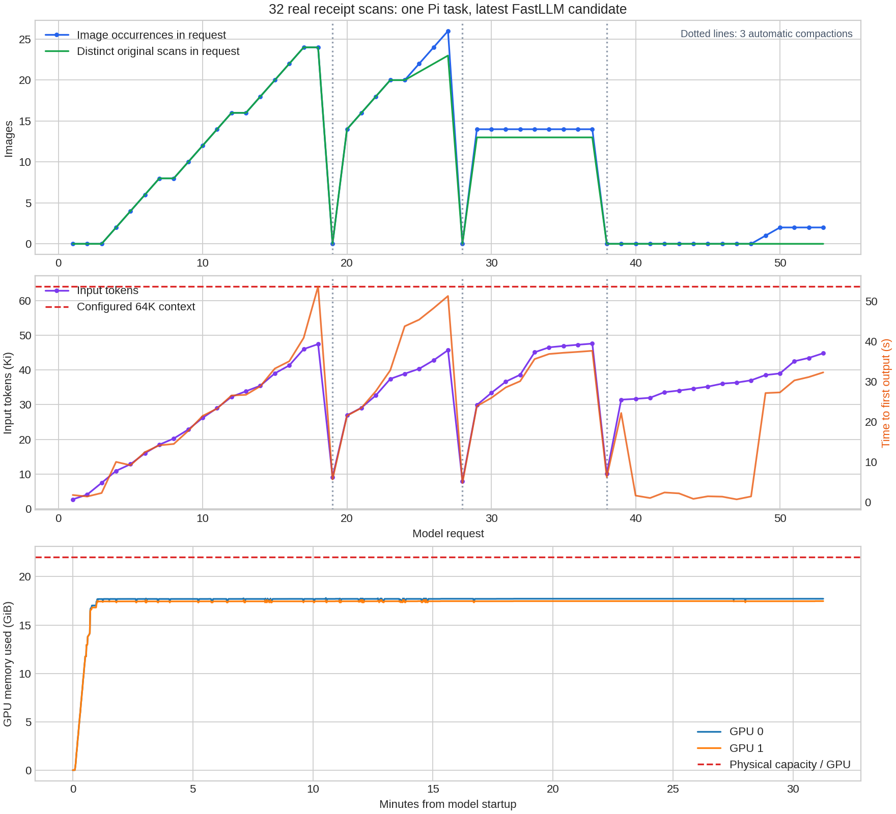

# Qwen3.8-27B-FP8：双 2080 Ti 的 32 图完整任务

2026-09-25 使用独立 Pi 0.84.4 测试最新候选，累计处理 32 张真实收据，完成对账、网页生成、部署和浏览器检查。任务在 1823.60 秒后自然结束，无 OOM、API 错误或人工续写；独立验收 **350/351，严格未全通过**，保留了一项日期识别差异。

| 配置 | 值 |
|---|---|
| GPU | 2 × RTX 2080 Ti，每卡 22 GiB |
| 模型 | Qwen3.8-27B-FP8 |
| 推理 | TP2、MTP3、Graph OFF、max_batch=1 |
| 上下文 / 内存 | 65536 token、gpu_mem_ratio=0.80、kv_cache_limit=3g、chunked_prefill_size=1024 |
| 采样 | temperature=1.0、top_k=20、top_p=0.95 |
| Pi | thinking high，read/bash/edit/write，单次用户提示，无额外扩展或 skills |
| 输出预算 | 初始 32768，随后由 Pi 按上下文夹紧；3600 秒实验时限未触发 |
| 被测源码 | `6c67951b459475c03523d6f6021effbd7f17ee20` |
| 隔离 native SHA256 | `e988ab0b3570a502c68f269b7f6c847b7e538185b5354e8a351b2cb6124feff2` |

图片来自 [SROIE 参赛团队公开仓库](https://github.com/zzzDavid/ICDAR-2019-SROIE/tree/27be4271b251c256f695acbade9a801bffe85994/data)，固定该 revision。从源编号 000～035 中，在推理前选取前 32 个不同商户/日期/金额组合且金额标注有效的样本，以种子 20260925 打乱，保留原始扫描字节。公开数据不能排除训练集重叠。另构造含缺失、重复、金额不符各 4 项的账本；未向模型提供隐藏标注。

任务要求四批各读 8 张原图，每批保存提取结果后再读下一批；读完全部 32 张后，回读 R001/R017、R005/R021、R010/R026、R016/R032 四对，核对金额并生成完整明细、汇总及商户分组。随后实现带搜索、异常过滤、原图链接和 JSON 下载的本地网页，部署至 loopback，执行浏览器检查、回读桌面及移动截图，写 README 后结束。未使用 OCR 或外部网络，也未给模型人工纠错提示。

| 检查项 | 实测 |
|---|---|
| 逐图覆盖 / 指定回读 | 32/32 原图，8/8 回读，分批保存顺序正确 |
| 图片工具结果 | 42 次：32 次初读、8 次回读、2 张网页截图 |
| 单请求图片峰值 | 26 个图片片段，包含重复；不同原始收据峰值为 24 张 |
| API 输入峰值 | 48721 token |
| 自动压缩 | 3 次，均完成并自动继续 |
| API / 工具完整性 | 53/53 HTTP 200 和完整 SSE；75/75 工具调用有对应执行和返回 |
| 自然结束 | 最终 `stop`、`agent_settled`、idle；无 length、超时或外部续写 |
| 两卡显存峰值 | 18220 / 18002 MiB，即 17.79 / 17.58 GiB |
| 首输出等待 | 中位 23.91 秒，最长 53.66 秒，包含思考输出的首个流式文本 |
| 独立验收 | 商户 32/32、金额 32/32、日期 31/32；全部检查 350/351 |

覆盖通过图片工具返回内容与实际 HTTP 图片 payload 的 SHA256 对应验证。Pi 压缩会移除旧图片，因此这是累计 32 张分轮处理，不能当作 32～48 张全部同时保留于上下文的验证。三个压缩请求只发送文本；图中的低点并非完整任务压缩后的上下文长度。

Pi 三次压缩的前后 token 估计分别为 51139→21246、49854→22682、54100→19722，与服务端 API usage 口径不同。53 个请求包括 50 次任务推理和 3 次摘要；49 次以 tool_calls 结束，3 次摘要和最后一次任务回复以 stop 结束。多模态请求文本前缀命中均为 0，纯文本仍可命中。默认 512 MiB 视觉 embedding 缓存记录 357 次命中、142 次未命中，对应 499 个请求图片片段；没有做缓存容量 A/B，不能将全部等待归因于视觉缓存。

对账结果为收据 1830.45、账本 1833.45、差额 -3.00；matched 20、missing 4、duplicate 4、amount_mismatch 4，全部正确。四对回读金额差额为 293.10、-5.90、-12.50、84.90。R001 初读把手写人名当作商户，模型在指定回读中自行改正了批次记录和最终报告。

唯一独立验收失败为 R013：输出 `06/03/2016`，标注为 `06/03/2018`。扫描字迹较淡，发票号以 `20180306` 开头也支持 2018；模型未注明年份不确定，最终还据此称其为“2016 stray”。保留原始输出及该失败，不因流程结束或网页测试通过而声称内容全对。商户核验忽略大小写、空白和标点；R014 褪色商户别名、R029 标注 TED→TEO 的修正在模型运行前已记录。

独立浏览器验收覆盖 32 条明细、搜索及异常过滤组合、空结果、JSON 下载内容一致、390px 页面无横向溢出、主要控件可见、无 JS 异常，以及全部原图 URL 的字节哈希。桌面和移动截图原始尺寸为 1280×3703、390×9458，Pi 实际交付模型时缩为 691×2000、82×2000；回读移动长截图不等于模型看清全部细节，功能结论由独立浏览器检查支持。原始收据也可能由工具缩放；R013 实际交付尺寸仍为 1080×1527。

两次普通工具错误由模型自行处理：复制时包含不存在的 PNG 通配符，但 JPG 已复制；模型自写网页测试误算行数并取错链接元素，之后修改测试重跑。独立 oracle 另行验证网页，没有直接采用模型自测通过作为结论。

实验保留一轮无效环境尝试：提示承诺提供 Pillow，复用的浏览器环境实际缺少它，读完 8 张后观察者终止。建立私有依赖环境后从新工作区和模型进程重跑，未安装或升级生产依赖。正式 oracle 运行前还修正过 oracle 的分组规则：任务只要求忽略大小写和空白，原判定误剥了标点；未修改任务或模型输出。两项均保留记录。

本轮仅为一个独立 Pi、32 张收据任务，尚未覆盖 48 图、Harness、并发和其他图像类型。未修改或部署生产包；测试结束后模型与网页服务已关闭，两卡各 1 MiB、无计算进程。完整原始请求、SSE、RPC、资源采样、标注及产物保存在实验目录 `many-image-agent-20260925`；归档大小 902781274 字节，SHA256 为 `9d36ef965f6389f152ce508db97527b8527cd50619640cd002cf016c33cdcbfe`。本页仅保存结果与曲线，不随代码仓库分发原始扫描和日志归档。
