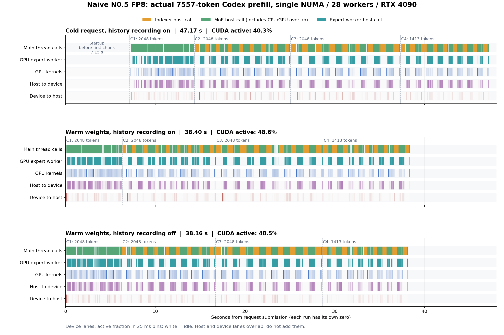
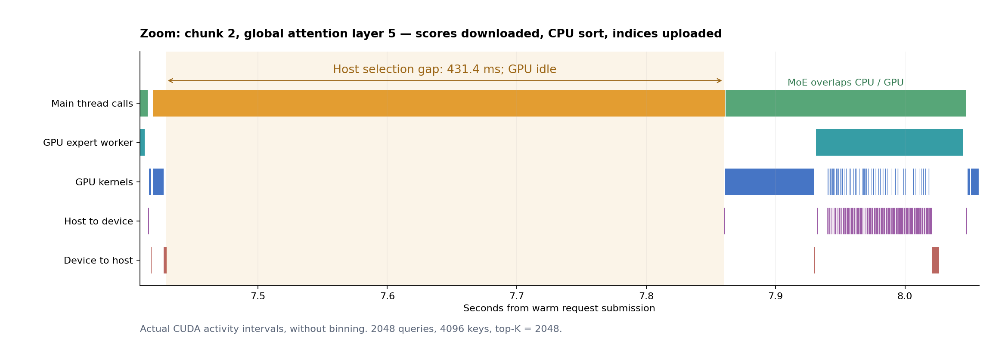
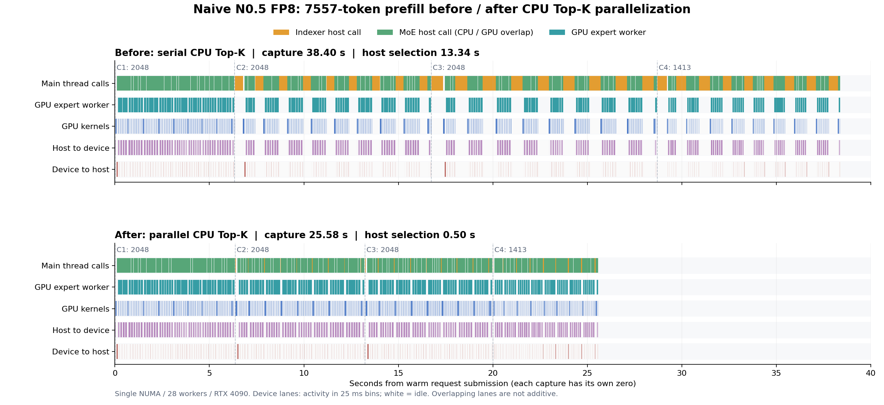
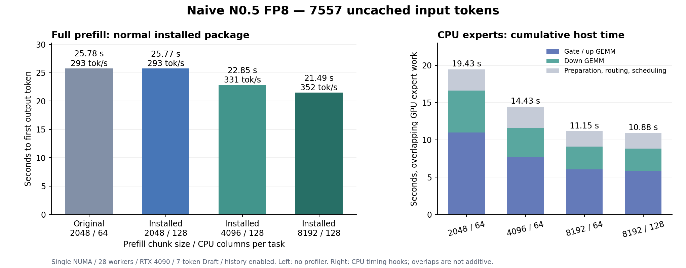

# Naive-N0.5-Flash-FP8 混合推理

## 编译与启动

```bash
bash install.sh
FT_NUMAS=1 numactl -C 0-31 -m 0 \
  ftllm server ~/hfmodels/Naive-N0.5-Flash-FP8 \
  --device cuda --moe_device numa
```

`-C` 指定 CPU 编号；小写 `-c` 指定 NUMA 节点，不能在这台双路机器上使用 `-c 0-31`。
默认线程数会考虑 `FT_NUMAS` 和进程 CPU affinity，并给推理控制线程预留 CPU。
本机使用上述命令时自动选择 28 个 NUMA 工作线程，也可以显式指定 `--threads 28`。
不要让忙等工作线程占满 `-C` 指定的全部 CPU；本机 32 个工作线程会造成严重调度争抢。
保持 `--dtype auto`，保留 checkpoint 的 FP8 专家权重。激活和 KV cache 默认使用 BF16。
完整的 `model-00001-of-00049.safetensors` 等分片可以直接加载，无需手动补索引文件。
长 prefill 默认自动分配 CPU/GPU 专家；如需关闭 GPU 专家 prefill，在启动前设置
`FT_GPU_PREFILL=0`。此开关在进程初始化时读取。

本机 24 GiB 单卡、长请求可追加 `--chunked_prefill_size 8192`。同一实际
7557-token 输入的安装版预热首 token 时间由约 25.77 秒降至 20.81–21.49 秒，详细配置、
连续输出验证与显存实测见文末的分块调优记录。默认分块仍为 2048。

双卡部署现已接入同层专家并行：使用 `--device cudapp=2` 时，稠密层和注意力仍按层
串行分布，但长 prefill 的专家同时交给 CPU 和两张 GPU。保留上述单 NUMA 配置，
追加 `--chunked_prefill_size 8192`；带相同 7-token Draft 的 7557-token 实测首 token
中位数由每层单 GPU 专家辅助的 22.07 秒降到 17.00 秒。接入细节和同进程对照见文末
“Naive 接入通用多卡专家辅助”记录。前面的双卡串行及缓存实验发生在此次接入之前。

## 实现范围

- CUDA 执行稠密层、路由、注意力及输出投影；专家权重保存在 NUMA。decode 专家由 CPU 执行，长 prefill 按路由负载分给 CPU 与各辅助 GPU 并行执行。
- 支持 Q/K 192 维、V 128 维、前 64 维的部分 GPT-NeoX RoPE，以及不同全局/滑窗 RoPE 参数。
- 滑窗注意力保留 127 个历史 token，计入 attention sink 和 value scaling。
- 全局层支持 FP8 indexer、因果约束及稳定的 top-2048 选择；索引键保存在对应请求的 KV cache 中。
- NUMA 专家使用动态 W8A8：每 128 个激活使用独立 FP32 缩放系数，在 GEMM 中应用激活和权重的缩放，并对齐原始实现的 BF16 舍入顺序。参考 FP8 内核使用的 FP32 → FP16 向零截断 → FP8 舍入也在 NUMA 路径中保留。
- 默认以 2048 token 分块 prefill，可用 `--chunked_prefill_size` 覆盖；每次 Forward 处理一条序列。跨请求前缀复用使用模型专用的 CPU KV 归档，HTTP 请求由现有调度器处理。

当前稀疏索引在 GPU 计算分数、在 CPU 并行做稳定 top-k。完整模型验证覆盖到 7557-token 输入及 7588-token 缓存复用，尚未验证配置中的 1M 上下文。

## 工具调用与跨请求前缀缓存

默认启动自动根据 Naive 的 XML 模板选择 `qwen3_coder` 工具解析器，支持 `tools`、
工具结果消息和流式增量；`tool_choice=required` 或指定函数时复用 XML 工具选择引导。
也可以通过已有的 `--tool_call_parser` 显式覆盖解析器。
Python 接口也会把工具历史中的 JSON 参数字符串转换为模板所需的对象。
请求通过 `chat_template_kwargs.enable_thinking=true` 开启思考时，思考内容放入
`reasoning_content`，工具调用仍放入 `tool_calls`；默认启动不开启思考。

MoE 启动默认启用 `--cache_history true`；可用 `--cache_history false` 关闭。
完成或中止请求时，仅记录已经执行 Forward 的 token，排除尚未计算 KV 的最后一个输出。
后续请求按 token ID 匹配最长公共前缀，支持相同请求、追加工具结果、较短请求和分支请求。
相同请求仍保留一个输入 token 重新计算 logits。

归档在 CPU 分块保存滑窗裁剪前的 K/V，以及全局层打包的索引键；命中时全局层恢复完整
前缀，滑窗层只恢复边界前所需的 127 个 token，并恢复绝对位置和调度状态。
不可变归档块可在分支请求之间共享，当前请求的 KV 独立分配。
恢复过程只操作 CPU 内存，不等待其他请求的 GPU Forward。

归档最多保留 5 条记录，每条上限 8 GiB、合计上限 40 GiB，按最近使用顺序淘汰；
每个活动请求最多另建一条归档。超出单条容量后只缓存已保存的前缀，其余输入正常计算。
缓存仅按实际保存的 token 分配，无需额外的容量环境变量。
带 draft 的原始 FP8 模型每 token 约占 233216 字节，8 GiB 可保存约 36800 个 token；
Codex 的系统提示和工具定义也计入输入。多条记录分别保留，自动标题请求不会挤掉主会话记录。
该模型的归档始终使用 CPU 内存，不受 `--cache_fast` 影响，不额外常驻 GPU KV 副本。
API 的 `usage.prompt_tokens_details.cached_tokens` 表示本次命中的输入 token 数。

### 本地 Codex CLI

`/v1/models` 的 Naive 模型目录提供 `none`（关闭思考）和 `low`（开启思考），默认 `none`。
Naive 的 `low` 是思考开关，没有较短的思考 token 预算；Codex 自动生成会话标题时也会
继承此设置。交互速度优先时保留 `none`。首次长提示仍需完整 prefill，后续请求通过
历史缓存复用前缀。

Codex 的自动标题请求有 30 秒超时，长 prefill 时排队生成可能超时并在下一轮重试。
以下命令通过 `X-FastLLM-Codex-Title-Mode: local` 显式启用本地标题：服务端仅匹配
Codex 的标题提示和对应 JSON schema，从用户请求提取不超过 36 字的标题，直接返回，
不进入模型队列。标题是请求文本的摘要标签；普通对话、工具调用和其他结构化输出仍由
模型生成。不带此请求头时保留模型生成标题的行为。

获取当前服务的模型目录并启动客户端：

```bash
curl --noproxy '*' -fsS http://127.0.0.1:8080/v1/models -o /tmp/naive-n05-models.json &&
NO_PROXY=127.0.0.1,localhost no_proxy=127.0.0.1,localhost \
codex --no-daemon -m naive-n05 \
  -c model_provider=fastllm \
  -c model_catalog_json=/tmp/naive-n05-models.json \
  -c model_reasoning_effort=none \
  -c cli_auth_credentials_store=ephemeral \
  -c features.plugins=false -c features.remote_plugin=false -c features.apps=false \
  -c web_search=disabled -c check_for_update_on_startup=false \
  -c analytics.enabled=false \
  -c model_providers.fastllm.name=FastLLM \
  -c model_providers.fastllm.base_url=http://127.0.0.1:8080/v1 \
  -c model_providers.fastllm.wire_api=responses \
  -c model_providers.fastllm.requires_openai_auth=false \
  -c 'model_providers.fastllm.http_headers={"X-FastLLM-Codex-Title-Mode"="local"}' \
  -c model_providers.fastllm.supports_websockets=false \
  -c model_providers.fastllm.request_max_retries=0 \
  -c model_providers.fastllm.stream_max_retries=0
```

仅关闭 `remote_plugin` 不会关闭插件目录的其他远程查询；此命令关闭整个插件功能。
`cli_auth_credentials_store=ephemeral` 让这个本地客户端不读取持久化 ChatGPT 登录凭据，
避免发送前等待远程用户设置查询超时；不会删除已有登录、技能或会话记录。
`NO_PROXY` 与 `no_proxy` 保证本地 API 直连。代码或配置更新后应重启服务和 Codex，
并重新获取模型目录；旧进程与旧目录文件不会自动加载修改。

2026-09-30 使用 Codex 0.159.2、`workspace-write` 和 `on-request` 实测：原服务参数、
已安装的 Python 包、不设置额外缓存容量环境变量时，发送到服务端为 0.11–0.16 秒。
冷启动自动标题请求在 0.45 秒完成，首条消息提交后 0.70 秒已保存到客户端数据库；
7557-token 主请求首次 prefill 仍约 47 秒。后续短回复为 0.71–1.31 秒，实际执行
`printf fastllm_ok` 并返回工具结果为 5.04–6.28 秒；连续四轮只有一次标题请求。
44 项 API 回归及原生历史缓存测试通过，逐次数据见
[Codex 交互验证](benchmarks/naive_n05_codex.json)。

`tools/naive_n05_flash_bench.py` 默认关闭历史缓存来测量完整 prefill；增加
`--cache_history true` 可测试复用，并在结果中查看 `cached_input_tokens`。

### 缓存与工具实测（2026-09-29）

沿用 CPU 0–31、单 NUMA、28 线程、RTX 4090；排除模型加载和预热，直接记录首个
输出 token 的时间。以下为单次测量；2057 token 使用重复拼接输入。

| 请求 | 输入 token | 命中 token | 首 token |
| --- | ---: | ---: | ---: |
| 短请求，缓存关闭 | 54 | 0 | 0.929 s |
| 短请求，开启缓存但未命中 | 54 | 0 | 0.938 s |
| 重复短请求 | 54 | 53 | 0.106 s |
| 长请求，开启缓存但未命中 | 2057 | 0 | 6.073 s |
| 重复长请求 | 2057 | 2056 | **0.129 s** |
| 分支请求，滑窗边界 | 148 | 128 | 0.486 s |
| 分支请求，分块边界 | 2057 | 2048 | 0.307 s |

重复长请求一行关闭 logits 采集；其开启 logits 的对应测量为 0.135 s。
缓存减少的是前缀 prefill，未命中的后缀和后续 decode 仍需计算。

开启缓存但不命中时，短样例的 logits 与关闭缓存逐位一致；在 2048-token 边界
恢复后，分支请求的 logits 也与完整重算逐位一致。任意边界会改变计算批大小和
浮点累加顺序，结果不保证逐位一致。缓存命中后与原始 FP8 参考比较：54-token
样例 5 个位置最大 KL 为 **0.02859**，2057-token 样例 2 个位置为 **0.002745**，
最大绝对 logits 差分别为 2.0、3.9375，7 个位置的 top-1 均相同。

完整模型通过自动调用、流式 `required`、指定函数、双工具调用、`none` 和工具结果
回传测试。工具回传的一组请求命中 344 token；实际 HTTP 服务中两个并发工具结果
请求各命中 284 token，分别正确回答 25°C、26°C。默认配置的非流式和 SSE 请求均
返回正确工具调用。开启思考的真实模型输出也成功解析工具；最后补充的思考字段分离
通过响应生成器回归验证，覆盖单字符流式分块及思考截断。

逐次时间、命中数、logits 误差和 API 结果见
[缓存与工具验证数据](benchmarks/naive_n05_flash_history.json)。

## DSpark 推测解码

支持配套的 `Naive-N0.5-Flash-FP8-Draft` checkpoint，沿用现有命令行参数：

```bash
FT_NUMAS=1 numactl -C 0-31 -m 0 \
  ftllm server ~/hfmodels/Naive-N0.5-Flash-FP8 \
  --device cuda --moe_device numa --threads 28 \
  --draft ~/hfmodels/Naive-N0.5-Flash-FP8-Draft --draft_tokens 7
```

Draft 使用 5 层 BF16 Qwen3 骨干、1024-token 滑窗、学习的 mask embedding 和
vanilla Markov head。目标模型的 8 个中间层输出经投影成为 draft 上下文；目标模型的
embedding 和输出头共享。DSpark 从 anchor 所在的第 0 个位置开始预测，7 个位置均可
作为候选，与仅使用后续 mask 位置的 DFlash 不同。
默认置信度阈值为 0.5，可用已有的 `--speculative_dspark_confidence_threshold` 调整。

随机采样采用[标准拒绝采样](https://arxiv.org/abs/2211.17192)：候选来自完整归一化的
draft 分布 `q`，以 `min(1, p(token)/q(token))` 接受；拒绝时从归一化的
`max(p-q, 0)` 采样，全部接受则额外从目标模型分布采样一个 token。
目标和 draft 均应用温度、top-k、top-p、重复惩罚及最低生成长度限制。
贪心分布是此算法的退化情形。拒绝后的 KV 和中间特征按实际接受长度回退。

验证阶段的线性层使用与逐 token decode 相同的归约顺序，避免 BF16 舍入改变路由并
逐层放大。历史缓存同时归档 draft 的投影特征，命中后只恢复最后 1023 个位置；
请求提前结束时不把未输出的候选发布到前缀缓存。
需要工具名称/参数约束或工具正文采样的请求，以及要求返回 logits 的请求，使用逐 token
目标推理；这些请求仍可使用 draft 上下文归档和前缀缓存。

NUMA FP8 W8A8 内核按行数选择小块及打包路径，小块共享最多 8 行的权重解码，
同时复用多列的激活读取；较大块复用 8 行 × 32 列的 BF16 点积。
不均匀专家组使用现有分组任务队列并优先处理较大的组。优化覆盖不同 token 行数和尾块，
不依赖固定的候选数量。

### 验证结果（2026-09-29）

EPYC 9374F、CPU 0–31、单 NUMA、28 线程、RTX 4090，候选上限 7、置信度阈值 0.5。
以下为两条路径均运行过完整回答后的第二组配对结果；并发 1，排除加载和首 token，
普通解码与推测解码使用相同权重、输入及贪心采样参数。

| 编程任务 | 输出 token | 普通解码 token/s | 推测解码 token/s | 加速比 | 候选接受率 |
| --- | ---: | ---: | ---: | ---: | ---: |
| 合并闭区间 | 100 | 17.19 | 24.44 | 1.42× | 79.8% |
| 二分查找首个匹配 | 105 | 17.88 | 29.76 | 1.66× | 95.8% |
| 最小字典序拓扑排序 | 163 | 17.39 | 23.53 | 1.35× | 75.1% |

三题的贪心输出与普通解码逐 token 相同。随机采样另测 `top_k=50, top_p=0.95,
temperature=0.8`，本轮候选接受率为 79.8%–87.5%。18 份普通/推测、贪心/随机采样
输出全部通过独立代码测试，合计 48,948 项检查（区间合并每份 504 项、二分查找每份
7500 项、拓扑排序每份 154 项）。

这些是稳态结果。专家权重按需整理，首次访问新专家仍可能很慢：本轮完全冷的第一道题
首 token 为 216.89 s；第一次推测生成为 12.90 token/s，再次执行为 24.44 token/s。
复现脚本因此分别预热普通和推测两条路径，原始记录保留全部预热及首次执行数据。
开启推测解码不等于消除冷启动成本，短任务第一次执行不保证提速。

- 标准拒绝采样进行 100 万次独立采样检验，覆盖分布相同、完全不相交、部分重叠和贪心
  分布；输出频率及接受率均通过检查。
- 在 87、127、2057 token 前缀后分别验证 8 个位置，整块验证与逐 token 目标推理的全部
  logits 逐位一致，24 个位置的最大绝对差和 KL 均为 0。
- Draft 骨干使用原 checkpoint 的 Torch 实现独立对照，1030-token 合成上下文跨过滑窗
  边界；输出余弦相似度为 0.998645、RMSE 为 0.169031。相同输入下参考实现自身
  BF16 与 FP32 的 RMSE 为 0.170619。此测试验证骨干和上下文缓存，不是完整模型 logits 对照。
- 跨请求分别复用 118、1199、2056 个 token，24-token 输出与关闭缓存、首次记录时均相同，
  最后一项同时跨过 2048-token 分块 prefill 边界。
- 原生 AVX512BF16、AVX2 回退、CPU/GPU 混合 MoE、非因果 draft 注意力及历史缓存回归通过。

不均匀路由的单层 NUMA FP8 微基准：hidden=4096、intermediate=2048、64 个专家，
每行选择 8 个专家，其中 4 个公共专家，其余按固定种子独立选择。排除初始化和权重整理，
预热 3 轮后计时 40 轮；基线为 `7aeb14b3`。重复使用单层权重，不能代替完整模型测速。

| 行数 | 优化前 ms | 优化后 ms | 耗时减少 |
| ---: | ---: | ---: | ---: |
| 1 | 0.771 | 0.674 | 12.6% |
| 2 | 1.217 | 1.071 | 12.0% |
| 4 | 2.057 | 1.823 | 11.4% |
| 7 | 3.306 | 2.806 | 15.1% |
| 8 | 3.556 | 3.076 | 13.5% |
| 12 | 5.219 | 4.405 | 15.6% |
| 16 | 5.495 | 5.001 | 9.0% |
| 32 | 8.961 | 8.004 | 10.7% |
| 64 | 14.244 | 12.262 | 13.9% |

逐项数值与复现输入见 [DSpark 验证数据](benchmarks/naive_n05_speculative.json)。

### 复现与验证

开启 `UNIT_TEST` 后编译以下目标。配对基准在同一个进程内加载同一组目标和 draft 权重，
每题分别完整生成普通和推测回答预热，再交替测量两条路径，关闭历史缓存，记录各 token
时间、候选接受率和完整输出。生成后的代码在独立子进程执行测试。
代码检查工具也接受已保存的汇总报告
`--report docs/benchmarks/naive_n05_speculative.json`，可直接复验其中的生成代码。

```bash
cmake -S . -B build-fastllm -DUNIT_TEST=ON
cmake --build build-fastllm -j16 --target naive_n05_speculative_bench \
  numas_fp8_moe_bench speculative_sampling_test naive_n05_draft_test
python3 tools/naive_n05_speculative_check.py \
  --model ~/hfmodels/Naive-N0.5-Flash-FP8 --write-cases /tmp/naive-cases.json
FT_NUMAS=1 FT_THREADS=28 numactl -C 0-31 -m 0 \
  build-fastllm/naive_n05_speculative_bench \
  ~/hfmodels/Naive-N0.5-Flash-FP8 ~/hfmodels/Naive-N0.5-Flash-FP8-Draft \
  /tmp/naive-cases.json /tmp/naive-results.json
python3 tools/naive_n05_speculative_check.py \
  --model ~/hfmodels/Naive-N0.5-Flash-FP8 \
  --report /tmp/naive-results.json --output /tmp/naive-code-checks

# 不均匀路由：7 行、64 个专家、每行选 8 个，其中 4 个为公共专家。
FT_NUMAS=1 FT_THREADS=28 FT_GPU_PREFILL=0 numactl -C 0-31 -m 0 \
  build-fastllm/numas_fp8_moe_bench 7 40 64 4

# 使用原 checkpoint 自带的 Torch 实现导出 draft 骨干参考。
python3 tools/naive_n05_draft_fixture.py \
  --draft ~/hfmodels/Naive-N0.5-Flash-FP8-Draft --output /tmp/naive-draft-fixture
build-fastllm/naive_n05_draft_test /tmp/naive-draft-fixture
ctest --test-dir build-fastllm --output-on-failure \
  -R '^(speculative_sampling|naive_n05_history|naive_n05_attention|numas_fp8_eager_moe(_avx2|_hybrid)?)$'
```

## 服务验证

已验证完整模型预热、`/v1/models`、非流式和 SSE 流式 `chat/completions`。
关闭思考模式的算术请求返回 `42`；中文解释题能持续输出关于瑞利散射的回答。
短请求 → 2057 token 长请求 → 相同短请求的测试中，两次短请求的 logits 完全一致。
测试服务验证后已关闭。

## Logits 对照

工具 `tools/naive_n05_flash_logits.py` 导出未经采样处理的 logits，按相同 token 前缀比较。
`reference` 使用 checkpoint 自带的 Transformers 模型代码和原始 FP8 eager experts；专家逐层搬到 GPU，适合显存不足以容纳整个模型的机器。
参考环境验证使用 Transformers 5.17、PyTorch 2.10.0+cu128、kernels 0.16.0 和 accelerate。

先用模型 tokenizer 生成一份输入 token ID JSON，例如 `[151644, ...]`，两个后端使用同一文件：

```bash
FT_NUMAS=1 numactl -C 0-31 -m 0 \
  python3 tools/naive_n05_flash_logits.py fastllm \
  ~/hfmodels/Naive-N0.5-Flash-FP8 --device cuda --moe_device numa \
  --input-ids input.json --output fastllm.npz --steps 3

python3 tools/naive_n05_flash_logits.py reference \
  --model ~/hfmodels/Naive-N0.5-Flash-FP8 --device cuda:0 \
  --input-ids input.json --output reference.npz --steps 3 \
  --teacher-forcing fastllm.npz

python3 tools/naive_n05_flash_logits.py compare reference.npz fastllm.npz
```

两个采集命令均可增加 `--repeat-to 2057`，验证跨过 2048 个索引候选后的稀疏注意力。
比较输出包括 MAE、RMSE、最大绝对误差、余弦相似度、概率分布 KL、top-1 和 top-10 重合数。
如果生成 token 已分叉，必须使用 `--teacher-forcing` 对齐后续输入，工具会拒绝比较不同前缀的 logits。

## 实测 Logits 误差（2026-09-29）

使用原始 FP8 checkpoint 的全部 152576 维 logits；每一步比较相同输入前缀。
普通中文样例使用 teacher forcing，避免措辞分叉后比较不同上下文。
下表记录 32 线程基线；28 线程的数值复测结果见下方性能诊断章节。

| 输入 token / 场景 | 步数 | MAE 范围 | 最小余弦相似度 | 最大 KL(ref‖actual) | top-1 相同 |
| --- | ---: | ---: | ---: | ---: | ---: |
| 49 / 短提示（思考模式） | 3 | 0.2564–0.3763 | 0.987641 | 0.0128486 | 3/3 |
| 2057 / 长提示（稀疏注意力） | 2 | 0.3641–0.3837 | 0.978290 | 0.0019284 | 2/2 |
| 54 / 中文解释（相同前缀） | 5 | 0.0580–0.2221 | 0.994752 | 0.0216329 | 5/5 |

上述 10 个位置的最大绝对 logits 误差为 3.0625。CPU 和原始 CUDA FP8 GEMM 的累加存在数值差异，经过多层 MoE 后仍有残余误差。
表中 top-1 使用 `np.argmax`；中文样例第 3 步，两个后端均有 ID 100827 和 104401 两个候选并列最高分，运行时的 tie-breaking 顺序不同，因此使用相同前缀进行对照。
完整逐步 RMSE、最大绝对误差、top-10 重合数、输入 ID 和参考版本记录在 [验证数据](benchmarks/naive_n05_flash.json) 中。

## 性能诊断与线程数

在 EPYC 9374F、CPU 0–31、单 NUMA、RTX 4090 上，原先 32 个工作线程的生成速度为
0.43–0.45 token/s。开启同步逐算子计时后，7 步 decode 平均每步 2.308 秒，其中
`MergeMOE` 2.281 秒（98.85%），普通 `Linear` 合计仅 14.17 毫秒。
Nsight 采集的一次 54 token prefill 加 7 步 decode 中，GPU kernel 总时间 118.68 毫秒，
设备拷贝总时间 4.60 毫秒。

根因是 NUMA 工作线程忙等占满了指定的 32 个 CPU，推理控制线程需要与它们争抢执行时间。
原默认值未考虑 `FT_NUMAS=1`，按双 NUMA 计算出 56 个线程，再被 affinity 限制到 32。
现在按实际启用的 NUMA 数量计算，并在 affinity 范围内为控制线程预留 CPU；上述配置自动选择 28 个线程。
`install.sh` 也会在安装前同步 Python 工具文件，保证只改 Python 时不再安装旧副本。

相同完整尺寸的单层 MoE 微基准（hidden=4096、intermediate=2048、8 个 FP8 专家、
重复使用权重、12 轮）从 32 线程的 44.00 毫秒降至 28 线程的 1.25 毫秒。
这项微基准用于定位调度问题，完整模型速度应以独立端到端测试为准。

本文阶段耗时与固定专家数调参结果是优化期间的历史记录，对应的临时计时、张量导出和
手动分配入口已清理。当前版本的速度和 CUDA 波形可用下文的 benchmark/Nsight 命令复测。

### 完整模型复测（关闭 profiler）

| 输入 / 输出 token | 32 线程首 token | 28 线程首 token | 32 线程生成速度 | 28 线程生成速度 |
| --- | ---: | ---: | ---: | ---: |
| 54 / 32 | 6.75 s | 2.95 s | 0.433 token/s | 12.557 token/s |
| 54 / 16 | 6.69 s | 2.95 s | 0.449 token/s | 12.550 token/s |
| 2057 / 8 | 190.42 s | 110.74 s | 0.427 token/s | 11.463 token/s |

单进程、并发 1，直接记录运行时 token 返回时间；不包含模型加载时间，也没有开启 logits 导出、调试追踪或历史前缀缓存。
2057 token 为重复拼接的测试输入。本次数值复测覆盖 54 token 中文样例的 5 个输出位置，
与原始 FP8 参考比较：MAE 0.070–0.290，最大绝对误差 2.625，最大 KL 0.02489，top-1 一致 5/5。
与此前 32 线程基线相比，生成 token 相同，但 logits 不逐位一致，最大绝对差为 1.46875。
逐 token 时间、算子统计和微基准数据见 [性能诊断数据](benchmarks/naive_n05_flash_performance.json)。

## 回归测试

开启 CMake `UNIT_TEST` 后：

```bash
cmake -S . -B build-fastllm -DUNIT_TEST=ON
cmake --build build-fastllm --target naive_n05_attention_test naive_n05_history_test numas_fp8_eager_moe_test -j16
ctest --test-dir build-fastllm -R 'naive_n05_(attention|history)|numas_fp8_eager_moe' --output-on-failure
```

CUDA 测试覆盖部分 RoPE、GQA、滑窗边界、attention sink、稀疏因果掩码、FP8/BF16 indexer 与分数相同时的稳定选择。
NUMA 测试以独立标量参考覆盖 W8A8 量化、FP8 次正规数、BF16 舍入、专家分组和请求规模变化，同时运行 AVX512 与 AVX2 路径。

新增的 `naive_n05_history_test` 验证真实请求初始化和缓存钩子，覆盖精确重复、短请求、
任意公共前缀、127/128 滑窗边界、跨块恢复、分支互不影响、多模态隔离、关闭清空、
命中与重复记录时的 LRU 更新，以及 CPU 恢复不等待 Forward 锁。
工具解析回归可运行 `python3 -m unittest discover -s test/toolcall -p 'test_qwen*.py'`。
Naive 思考与工具混合输出回归：
`python3 -m unittest discover -s test/api -p 'test_naive_n05_tools.py'`。


## Nsight Systems 定位与算子优化（2026-09-29）

本轮对比使用相同的 28 线程、CPU 0–31、NUMA 0、RTX 4090。每次采集只包含
54 token prefill 和 7 步 decode，排除加载与预热；未开启逐算子 CUDA 同步。
下面的图来自 `.nsys-rep` 导出的实际 kernel/memcpy 起止时间，横轴保持相同比例。
黄色标出超过 0.3 ms 的 GPU 空档，主要对应 CPU 专家层。


7 步 decode 的平均间隔从 84.59 ms 降到 54.89 ms，GPU kernel 与拷贝的并集时间
约 14.66 → 14.57 ms；长空档合计从 68.04 ms 降到 38.67 ms。
这组数字来自 profiler；下面单独列出关闭 profiler 的生成速度。

### 热点与修改

| 每层 decode 阶段 | 优化前 | 优化后 | 修改 |
| --- | ---: | ---: | --- |
| 输入 FP8 量化 | 0.0720 ms | 0.0030 ms | SIMD amax、FP16 RTZ 和 E4M3 RNE 编码 |
| SwiGLU + 下投影输入量化 | 0.4623 ms | 0.0103 ms | BF16 SiLU 查表，按行分给现有 NUMA 线程 |
| gate/up GEMM | 0.5047 ms | 0.4481 ms | 激活只解码一次，避免每个输出列重复转换 |
| down GEMM | 0.2683 ms | 0.2440 ms | 同上；prefill 时 4 个 token 共用权重读取与转换 |
| NUMA MoE 合计 | 1.4164 ms | 0.7928 ms | 包含任务准备、调度、路由舍入与归并 |

- gate/up 与 down 每层、每个 decode token 的有效权重数据量约 207.6 MB，按上述
  时间计算约 **269 → 300 GB/s**。prefill 的分块复用同时减少了重复读取权重的次数。
- SwiGLU/量化按一次处理的逻辑读写量计算约 **0.75 → 33.34 GB/s**。
  原路径受到标量转换、逐元素 `exp` 和串行执行限制；新路径保留原模型的 BF16 舍入步骤。
- 短 full attention 与 128-token 滑窗 attention 的 score、softmax、value 合并成一个
  CUDA kernel，分数留在共享内存。该 trace 的 kernel launch 减少 768 次，attention
  GPU 总耗时约 **8.13 → 7.64 ms**，包含 prefill 和 decode。
- 原非融合 softmax 的共享内存存在先读 maximum、随后覆盖 denominator 的同步遗漏。
  独立 CUDA harness 的 racecheck 捕获该问题；补上屏障后 racecheck 为 0 hazards，
  memcheck 为 0 errors。长 full/sparse attention 继续保留独立算子路径。

大尺寸 GPU BF16 GEMV 已达到约 **0.94–0.96 TB/s** 的有效权重读取带宽：
`q_proj` 的 100.7 MB 约 107.5 µs，`lm_head` 的 1.25 GB 约 1.307 ms。
试验减少其 block 同步，对大矩阵没有明显收益，因此保留原实现。
RMSNorm、路由等小张量算子的 GB/s 主要受启动延迟和有限并行度影响，不能按大矩阵的带宽比例推算提速。

**带宽口径：** 当前驱动拒绝访问 GPU 性能计数器（`ncu: ERR_NVGPUCTRPERM`），
上述均为逻辑数据量除以实测时间，不是 DRAM 硬件计数器读数或实测峰值利用率；
CPU 数字也可能包含缓存命中，GEMM 阶段包含调度等待。

### 最终速度与数值验证

以下测试关闭 nsys 和所有算子计时，排除模型加载、预热与 logits 导出；并发 1。
硬件及启动配置与本节基线相同，2057 token 为重复拼接输入。

| 输入 / 输出 token | 优化前首 token | 优化后首 token | 优化前生成速度 | 优化后生成速度 |
| --- | ---: | ---: | ---: | ---: |
| 54 / 32 | 2.952 s | 1.010 s | 12.557 token/s | 18.318 token/s |
| 54 / 16 | 2.946 s | 1.008 s | 12.550 token/s | 18.290 token/s |
| 2057 / 8 | 110.738 s | 32.066 s | 11.463 token/s | 16.110 token/s |

短提示生成速度提升约 46%，长提示约 41%；长提示首 token 耗时缩短约 71%。
剩余主要时间在 NUMA 专家矩阵乘法和 GPU 稠密投影，当前线程数和单 NUMA 配置下仍有约
39 ms/token 的 CPU 阶段与约 15 ms/token 的 GPU 阶段。

性能计时结束后，另行导出全部 152576 维 logits，与原始 FP8 参考比较相同 token 前缀：

| 输入 / 场景 | 步数 | MAE 范围 | 最大绝对误差 | 最大 KL(ref‖actual) | top-1 相同 |
| --- | ---: | ---: | ---: | ---: | ---: |
| 54 / 中文解释 | 5 | 0.0699–0.2905 | 2.625 | 0.024890 | 5/5 |
| 49 / 短提示 | 3 | 0.2152–0.5446 | 4.375 | 0.002829 | 3/3 |
| 2057 / 稀疏注意力 | 2 | 0.3477–0.4279 | 3.6875 | 0.007812 | 2/2 |

其中中文解释的 5 步 logits 与优化前已保存的 **28 线程** capture 逐位相同；
49/2057 token 样例没有优化前的 28 线程 capture，表中直接比较原始 FP8 参考，
不声称这些样例与优化前逐位相同。10 个位置的 top-1 全部相同，最小余弦相似度 0.98025；
这些有限样例不能代表全量精度评估或更长上下文。

`bash install.sh` 已完成，安装库与构建库 SHA256 相同。NUMA 的 AVX512/AVX2 回归以及
CUDA 注意力回归均通过；测试增加了量化边界、不同 GEMM 行数与尾块、decode、54-token
prefill 和融合边界 256/257 等情况。

### 复现采集

`input.json` 为同一份 tokenizer 生成的输入 token ID 数组。测速工具只统计运行时返回的
生成 token；不导出 logits，不包含加载与预热时间，使用并发 1、greedy。

```bash
# 普通速度测试；不要同时运行其他模型或微基准。
FT_NUMAS=1 numactl -C 0-31 -m 0 \
  python3 tools/naive_n05_flash_bench.py \
  ~/hfmodels/Naive-N0.5-Flash-FP8 --device cuda --moe_device numa \
  --bench-input-ids input.json --bench-report speed.json

# 仅采集预热后的 54 token 输入和 8 token 输出（其中 7 步 decode）。
FT_NUMAS=1 numactl -C 0-31 -m 0 \
  /usr/local/cuda/bin/nsys profile --trace=cuda,nvtx --sample=none --cpuctxsw=none \
  --capture-range=cudaProfilerApi --capture-range-end=stop \
  --force-overwrite=true -o naive-profile \
  python3 tools/naive_n05_flash_bench.py \
  ~/hfmodels/Naive-N0.5-Flash-FP8 --device cuda --moe_device numa \
  --bench-input-ids input.json --bench-report profile.json \
  --bench-profile --bench-output-tokens 8 --bench-runs 1
```

长提示可增加 `--bench-repeat-to 2057`。原始 trace 保存在本机
`/tmp/naive-opt-baseline.nsys-rep` 和 `/tmp/naive-opt-final-profile.nsys-rep`。
完整测量数据、逐 token 时间和 logits 指标见
[Nsight 与优化验证数据](benchmarks/naive_n05_flash_nsys.json)。


## Prefill 专项优化（2026-09-29）

上一节的 32.1 秒首 token 使用 128-token 分块。256 个专家、每 token 选 8 个专家时，
每个分块平均只有 4 行分给同一专家，无法充分复用权重。原点积内核按输出列计算，
同一权重每处理 4 行还需重新转换，计算中有大量横向归约。

新增 AVX512 BF16 prefill 内核：

- 将当前 128 元素量化块中的 16 个输出列临时转置，让 SIMD 的 16 个 lane 分别累加不同输出列。
- 一次处理最多 8 个输入行，全部专家输入行共用已转换的权重；64 列任务仅需要 16 KiB 权重暂存。
- 每个 128 元素块依次应用 FP32 激活缩放和权重缩放，保持原 W8A8 的量化与 BF16 舍入步骤。
- 专家输入不足 16 行时沿用原点积内核，避免短提示承担权重转置开销。
- 路由乘法及输出 BF16 舍入按行交给现有 NUMA 线程池，消除大 prefill 中的串行遍历。
- 默认分块从 128 改为 2048，使专家 GEMM 能处理更多行，同时与稀疏注意力 top-2048 边界一致。

单改分块和改内核分别测量，排除模型加载和首次预热；以下是调参阶段的 2057-token
重复输入，输出 2 token。表中的 packed 内核尚未加入并行路由舍入，门槛为 4 行：

| 专家内核 | prefill 分块 | 首 token 时间 | 输入 token / 首 token 秒 |
| --- | ---: | ---: | ---: |
| 原 4 行点积 | 128 | 32.063 s | 64.15 |
| 原 4 行点积 | 512 | 27.446 s | 74.95 |
| 原 4 行点积 | 1024 | 26.676 s | 77.11 |
| 原 4 行点积 | 4096（整段） | 27.849 s | 73.86 |
| 新 packed GEMM | 128 | 31.965 s | 64.35 |
| 新 packed GEMM | 512 | 18.550 s | 110.89 |
| 新 packed GEMM | 1024 | 15.449 s | 133.15 |
| 新 packed GEMM | 2048 | 14.052 s | 146.38 |

这说明仅扩大分块收益有限；新内核需要足够的专家输入行才能发挥作用。
2048 分块随后重复测试为 13.296 秒（154.71 token/s）。此输入跨过稀疏索引边界，
4096 分块需要在整段中执行索引操作，因此不继续增大默认值。


### 最终默认配置

已通过 `bash install.sh` 编译并安装。仍使用单 NUMA、CPU 0–31、28 个工作线程和一张
RTX 4090；无需额外启动参数。下表关闭算子计时和 profiler，并发 1，排除加载和首次预热。
“prefill token/s”采用输入 token 数除以首 token 时间，包含输出首 token 所需的计算。

| 输入 / 输出 token | 首 token 时间 | prefill token/s | decode token/s |
| --- | ---: | ---: | ---: |
| 54 / 32 | 0.946 s | 57.07 | 18.43 |
| 54 / 16 | 0.949 s | 56.88 | 18.36 |
| 512 / 8，重复输入 | 4.209 s | 121.63 | 17.32 |
| 2057 / 8，重复输入，第一次 | 13.616 s | 151.07 | 15.81 |
| 2057 / 8，重复输入，第二次 | 12.841 s | 160.19 | 15.24 |
| 2057 / 8，自然技术文档 | 13.414 s | 153.34 | 15.79 |

相同的 2057-token 重复输入从上一版 **32.066 秒、64.15 token/s** 提升至
**12.84–13.62 秒、151–160 token/s**，约 2.4–2.5 倍。自然文档来自本说明的文本，
经模型 tokenizer 编码并加对话模板；精确输入 ID 保存在下面的 JSON 中。

另行开启 CPU 阶段计时：2048-token 分块每个 MoE 层的路由舍入由 12.258 ms 降至
1.545 ms，归并与输出转换由 3.141 ms 降至 2.398 ms。gate/up 和 down GEMM 合计
仍约 237 ms/层，是当前 prefill 的主要耗时；此计时包含线程调度等待，不能作为硬件带宽计数。

### 最终 logits 回归

仍使用原始 FP8 参考和全部 152576 维 logits，在相同输入与生成前缀下比较；未导出 logits
的速度测试和精度采集分开执行。新的 GEMM 改变了块内浮点累加顺序，结果不保证逐位相同。

| 输入 / 场景 | 步数 | MAE 范围 | 最大绝对误差 | 最小余弦相似度 | 最大 KL(ref‖actual) | argmax 相同 |
| --- | ---: | ---: | ---: | ---: | ---: | ---: |
| 54 / 中文解释 | 5 | 0.0706–0.2874 | 2.4375 | 0.995705 | 0.047084 | 4/5 |
| 49 / 短提示 | 3 | 0.2516–0.4199 | 2.9063 | 0.987962 | 0.011003 | 3/3 |
| 2057 / 稀疏注意力 | 2 | 0.3545–0.5151 | 3.3750 | 0.979773 | 0.002847 | 2/2 |

中文解释第 3 步，参考 token 100827 和 104401 的 logit 均为 21.0；新实现分别为
20.875 和 21.0，因此 `np.argmax` 不同，但选择的 104401 仍属于参考最高分候选集合。
10 个测试位置均满足这一条件；以上是有限样例的数值回归，不代表全量模型质量评估。

AVX512 和 AVX2 的 NUMA MoE 回归、CUDA 注意力回归均通过。GEMM 测试覆盖内核切换
门槛、8 行 tile 的所有尾行、非对齐输出列区间和不足 128 元素的量化尾块，并与 FP64 点积
参考比较；MoE 测试与独立标量量化、BF16 舍入参考比较。安装库与构建库 SHA256 一致。

[Prefill 测速、阶段计时与精度数据](benchmarks/naive_n05_flash_prefill.json) 保存了输入 ID、
逐 token 时间、分块对照、最终默认配置和各步 logits 指标。可用上面的测速工具增加
`--bench-repeat-to 2057 --bench-output-tokens 8` 复测，默认已采用 2048 分块。

## CPU/GPU 并行专家 prefill（2026-09-29）

### 实现与调度

进一步检查共享库反汇编发现，prefill CPU 内核循环中反复调用 `__tls_get_addr`。
现在在循环外取得临时矩阵指针。相同 64 行、8 专家、hidden=4096、intermediate=2048
的单层微基准由 8.05 ms 降到 6.93 ms；该微基准权重可以命中缓存，不代表完整模型速度。

长 prefill 新增 CPU/GPU 并行执行：

- 专家 FP8 权重仍驻留 NUMA；根据当前层的路由行数，把较忙的专家交给同一张 GPU。
  自动选择让 CPU 和 GPU 的预计完成时间接近的专家数，最多 96 个；输入不足 256 token
  时保持原 CPU 专家路径。没有使用第二个 NUMA 节点或第二张 GPU。
- GPU 临时接收选中专家的 FP8 权重，用 cuBLAS BF16 Tensor Core 计算各个独立的
  128 元素块。FP8 先转为**未缩放的 BF16**，每块点积后依次应用 FP32 激活缩放和权重缩放。
  保留 FP32 → FP16 RTZ → FP8 的量化边界、BF16 SiLU 查表及路由乘法的逐步舍入。
- GPU 工作线程与 NUMA 工作线程同时执行，写入互不重叠的路由结果。等待两边完成后，
  按专家 ID 升序进行 FP32 归并，最后统一舍入到 BF16，避免先舍入两个部分和造成额外误差。
- CUDA 暂存和页锁定输出缓冲区按容量复用，释放模型时显式清理；不额外常驻完整专家权重副本。
  CUDA 计算或分配失败时回退到完整 CPU 路径。启动前设置 `FT_GPU_PREFILL=0`
  可以关闭 GPU 专家 prefill；正常启动不需要新增参数。

相同 2057-token 输入的调参结果：GPU 固定处理 32／64／96 个专家时首 token 分别为
7.643／7.392／9.392 秒，自动分配为 **6.02 秒**。固定 32 的测试也是首次运行此长输入，
其缓存状态与后续测试不同；最终结论采用自动分配的连续两次测量。

### 最终整模型速度

仍使用 CPU 0–31、28 个工作线程、`FT_NUMAS=1`、单张 RTX 4090。以下计时关闭 profiler
和算子计时，排除加载与首次预热，并发 1；prefill 速度为输入 token 数除以首 token 时间。

| 输入 / 输出 token | 首 token 时间 | prefill token/s | decode token/s |
| --- | ---: | ---: | ---: |
| 54 / 32 | 0.924 s | 58.43 | 18.36 |
| 54 / 16 | 0.923 s | 58.52 | 18.36 |
| 512 / 8，重复输入 | 2.794 s | 183.22 | 17.23 |
| 2057 / 8，重复输入，第一次 | 6.023 s | 341.50 | 15.97 |
| 2057 / 8，重复输入，第二次 | 6.020 s | 341.70 | 15.96 |
| 2057 / 8，自然技术文档 | 6.847 s | 300.43 | 15.25 |

相对上一版 151–160 token/s，重复输入再提高 **2.1–2.3 倍**；自然文档由 153.34
提高到 300.43 token/s。相对最初 64.15 token/s 的 prefill 版本，重复输入约提高 5.3 倍。

独立开启阶段计时后，2048-token 分块平均每层约 39.2 个专家、10388 条路由交给 GPU。
CPU 工作约 99.27 ms，GPU 工作（包含传输、CUDA 调度及结果回传/散布）约 91.30 ms，
两边并行后的层耗时约 101.21 ms。这些是主机阶段时间，未将其解释为硬件带宽计数。

### 数值与回归

全部 152576 维 logits、相同输入和生成前缀下，与原始 FP8 参考比较：

| 输入 / 场景 | 步数 | MAE 范围 | 最大绝对误差 | 最大 KL(ref‖actual) | argmax 相同 |
| --- | ---: | ---: | ---: | ---: | ---: |
| 54 / 中文解释 | 5 | 0.0706–0.2874 | 2.4375 | 0.047084 | 4/5 |
| 49 / 短提示 | 3 | 0.2516–0.4199 | 2.9063 | 0.011003 | 3/3 |
| 2057 / 稀疏注意力 | 2 | 0.4015–0.4824 | 3.8750 | 0.000737 | 2/2 |

短提示的 logits 与上一版逐位相同。中文解释中 argmax 不同的位置仍是上节所述的参考
并列最高候选；10 个位置均选择了参考最高分候选之一。长输入的块内累加顺序不同，
不保证逐位一致。此处仍是有限输入的数值回归，不代表完整质量评估。

AVX512、AVX2、CUDA 注意力和新增的 CPU/GPU 混合 MoE 回归通过。新增测试直接调用
CUDA 专家函数，并逐路由与独立标量参考比较，防止自动回退掩盖 CUDA 错误；覆盖
256/257 token、不同激活与权重量化块缩放以及长输入后再运行短输入。

完整输入 ID、逐 token 时间、调参数据和逐步精度指标保存在
[CPU/GPU 并行 prefill 数据](benchmarks/naive_n05_flash_hybrid_prefill.json)。


### Nsight 波形对照

在同一个已预热的进程中，先关闭 GPU 专家、再启用自动分配，各采集 2057-token prefill。
这是清理临时开关前的采集；当前复测两种配置需分别启动进程，设置 `FT_GPU_PREFILL=0/1`。
CPU 对照已包含本轮的 TLS 指针优化；以下仅统计到第二个输入分块的 `lm_head` 完成，
排除了随后生成的 decode token。

| Nsight 区间 | 首 token 时间 | GPU 活动时间 | 活动时间 / 墙钟时间 |
| --- | ---: | ---: | ---: |
| CPU 专家，含 TLS 优化 | 11.700 s | 0.915 s | 7.8% |
| CPU/GPU 并行专家 | 6.063 s | 4.109 s | 67.8% |

GPU 活动时间是 kernel 与 memcpy 时间区间的并集，不是 SM 利用率或 DRAM 性能计数器。
并行路径的 H2D 传输量约 49.44 GB，DMA 活动时间 1.857 秒，有效传输速率约
26.62 GB/s；D2H 约 8.95 GB、0.394 秒、22.72 GB/s。此时计算与传输已填入原先
等待 CPU 的大段 GPU 空闲时间。CUDA 专家位于独立流，图中绿色表示专家 CUDA kernel。


原始采集位于 `/tmp/naive2-prefill-profile.nsys-rep`；对应 SQLite 路径和各 kernel 的统计已记录在
上述 JSON。带 profiler 的数字用于分析波形，最终速度采用前面关闭 profiler 的独立测量。

## 代码清理后的复测

移除了逐层张量导出、MoE 阶段计时、固定 GPU 专家数调参入口及重复的 prefill 开关，
统一使用现有 `FT_GPU_PREFILL`。同时清理了无用头文件、宏和计时变量；模型数值路径与
自动专家分配策略保持原样。测速、Nsight 采集和 logits 比较工具保留。

`bash install.sh` 编译安装成功，4 项 CPU/CUDA/混合 MoE 回归全部通过。
在相同的 28 线程、单 NUMA、单 GPU 配置下，54/49/2057 token 三组输入共 10 个输出位置
的全部 152576 维 logits 与清理前保存结果**逐位一致**。

| 输入 / 输出 token | 首 token 时间 | prefill token/s | decode token/s |
| --- | ---: | ---: | ---: |
| 54 / 32 | 0.927 s | 58.24 | 18.15 |
| 2057 / 8，重复输入 | 5.972 s | 344.46 | 14.79 |

这是关闭 profiler、排除加载和短/长输入预热后各一次测量。逐 token 时间、库校验值及
数值一致性记录见上述 JSON 的 `cleanup_verification`。

## 仅量化 MoE 专家的 NVFP4 导出

`tools/naive_n05_export_nvfp4.py` 将原始 FP8 专家反量化后，导出为 E2M1 权重、
每 16 列一个 E4M3 缩放值和每矩阵一个 FP32 缩放值。采用就近舍入，平局取偶数；
这是权重量化实验，未做激活校准或量化感知训练。推理使用 BF16 激活。
注意力、路由、首层稠密 MLP、词嵌入及输出头原样复制。

导出需要有 CUDA 的 PyTorch 和 safetensors，输出目录必须不存在：

```bash
python tools/naive_n05_export_nvfp4.py \
  --model ~/hfmodels/Naive-N0.5-Flash-FP8 \
  --output ~/hfmodels/Naive-N0.5-Flash-MoE-NVFP4

FT_NUMAS=2 numactl -C 0-63 -m 0,1 \
  ftllm server ~/hfmodels/Naive-N0.5-Flash-MoE-NVFP4 \
  --device cuda --moe_device numa --threads 40
```

运行时自动识别 safetensors 中的 NVFP4 格式，使用与 Qwen4 相同的紧凑 E4M3 NUMA
布局；无需设置新的环境变量。`nvfp4_export.json` 记录量化方法、采样权重误差和全部
非专家张量的 SHA256。此次导出含 36,096 个专家矩阵；472 个非专家张量的字节校验
全部通过。权重分片从 293.465 GiB 缩至 170.025 GiB，减少 42.1%。

导出器的小规模回归无需加载完整模型，覆盖舍入、全零专家、分块缩放和非专家
字节一致性。使用已安装 PyTorch 和 safetensors 的 Python 运行：

```bash
python -m unittest discover -s test -p test_naive_n05_export_nvfp4.py -v
```

### 八卡 CUDA 专家推理

CUDA 专家使用现有的紧凑 `NVFP4_BLOCK_16_E4M3_PACKED` 行布局：每行保存
4 字节原始 FP32 全局缩放，每 16 个权重保存 8 字节 FP4 数据和 1 字节原始 E4M3
分块缩放，行末对齐到 4 字节。保留一份 GPU 专家权重，模型文件无需重新导出。
CPU/NUMA 专家继续使用原始紧凑布局。

Gate 和 Up 各行保留自己的全局缩放，避免归一化到同一最小值造成溢出。
CUDA MoE 支持默认 BF16 和 FP16 激活，沿用原生 FP32 分块缩放路径的点积顺序、
归约、SwiGLU 和路由舍入。内核按需解码 FP8 并乘行全局缩放，不缓存展开的 FP32
分块缩放。测试用两种布局的同一权重检查输出逐 bit 一致。
8 张 32 GiB RTX 5090 可以使用普通设备映射把 48 层分配到八卡：

```bash
ftllm server ~/hfmodels/Naive-N0.5-Flash-MoE-NVFP4 \
  --device '["cuda:0","cuda:1","cuda:2","cuda:3","cuda:4","cuda:5","cuda:6","cuda:7"]' \
  --moe_device '["cuda:0","cuda:1","cuda:2","cuda:3","cuda:4","cuda:5","cuda:6","cuda:7"]' \
  --max_batch 1 --mtp 0 --tokens 8192 --chunked_prefill_size 512 \
  --cuda_slab 288 --cache_history false
```

这是按层分配，不是张量并行。对该 checkpoint 的 3028 亿个专家参数，紧凑专家数据
连同行全局缩放约占 158.992 GiB；相比每块保存 FP32 缩放的 12 字节布局，
减少约 52.508 GiB。
实际进程显存还包含稠密权重、KV cache、工作区和分配器开销。

`cuda_nvfp4_compact_moe_test` 用独立 FP64 参考检查原始 FP4/FP8 解码、不同 Gate/Up
全局缩放、零与最大分块缩放，以及 BF16/FP16 的多种路由批次，并与 FP32 分块
缩放布局逐 bit 对比。开启 `UNIT_TEST`
后可编译并运行：

```bash
cmake --build build-fastllm --target cuda_nvfp4_compact_moe_test -j16
ctest --test-dir build-fastllm --output-on-failure -R '^cuda_nvfp4_compact_moe$'
```

八卡整模型短请求实测显存约 19.7–23.9 GiB/卡，中文解释和代码生成普通解码约 51.4–55.4 token/s。生成的二分查找函数通过 980 项独立检查，2977-token 输入跨越滑窗边界后仍正确回答。与已验证 FP32 分块缩放版本比较，9 个位置的全部 152576 维 logits 均有限，top-1 全部一致，最大 KL 为 0.012838。这些是有限输入的数值与短请求验证，不代表完整质量评估或长上下文吞吐。

### NVFP4 实测（投影优化前）

本节保留量化导出时的对比；投影优化后的 NVFP4 速度见
[投影优化实测](naive_n05_nvfp4_profile.md#投影优化实测)。

双 NUMA、共 40 个工作线程、CPU 0–63、RTX 4090，并发 1。与此前 FP8 双 NUMA
测量使用同一组输入，普通和推测路径分别预热后交替运行两轮，下表采用第二轮。
推测候选上限为 7，置信度阈值为 0.5；decode 吞吐不包含首 token。

| 编程任务 | FP8 普通 | NVFP4 普通 | FP8 推测 | NVFP4 推测 |
| --- | ---: | ---: | ---: | ---: |
| 区间合并 | 19.85 | 27.42 | 32.25 | 36.19 |
| 二分查找 | 20.24 | 29.15 | 39.44 | 42.93 |
| 拓扑排序 | 20.45 | 28.91 | 31.03 | 33.42 |

单位：token/s。普通解码提高 38.2–44.0%，推测解码提高 7.7–12.2%。三组贪心
答案在 FP8/NVFP4、普通/推测及两轮之间全部一致；18 份贪心与采样代码通过全部
48,948 项执行检查。首次冷请求 TTFT 为 44.574 秒，decode 为 8.46 token/s，未计入稳态。

**长输入 prefill 变慢**：2057-token 重复输入，普通模式由 8.530 秒增加到
12.075 秒，推测模式由 8.542 秒增加到 12.101 秒，约 170 输入 token/s，吞吐下降
29.4%。该次测试使用的版本不支持紧凑 NVFP4 + BF16 的 GPU 专家 prefill，专家由 CPU 执行；
FP8 双 NUMA 基线的专家 prefill 也使用 CPU。短编程提示 TTFT 为 0.82–0.91 秒。

精度检查使用同一固定续写前缀、全部 152576 维 logits，与当前 FastLLM FP8 版本
比较，而非另行运行原始 Transformers 参考。87/127/2057-token 三组输入共 24 个
位置，平均 KL(FP8‖NVFP4) 为 0.04912，最大 0.21582；平均 RMSE 为 0.42205，
最大绝对差为 4.625；top-1 相同 23/24。该结果是有限输入的量化误差测量。

另做 NVFP4 整块验证与逐 token 推理比较：87/127-token 前缀的 16 个位置逐位一致；
2057-token 前缀的 8 个位置最大绝对差为 1.125、最大 KL 为 0.01504，top-1 均一致。
因此此版本的长上下文推测验证不能宣称与逐 token 推理严格数值等价。

完整输入、逐 token 时间、接受率、量化误差和代码检查见
[NVFP4 测量数据](benchmarks/naive_n05_nvfp4.json)。原始 FP32 logits 与日志保存在
`/tmp/naive-nvfp4-numa2-40`。基准工具的验证 case 可设置 `logits_output`，导出逐 token
目标 logits 的行优先 FP32 文件，形状由结果中的 `verify_tokens` 和 `vocab_size` 给出。

普通解码与推测验证的 Nsight 波形、相同 8-token 前缀的逐算子对比和优化优先级见
[NVFP4 推测验证分析](naive_n05_nvfp4_profile.md)。

## 投影优化后的 FP8 速度（2026-09-30）

使用当前已安装版本及原始 `Naive-N0.5-Flash-FP8`，双 NUMA 共 40 个工作线程、
CPU 0–63、内存节点 0/1、RTX 4090、并发 1。普通与推测路径分别预热后交替
运行两轮，推测候选上限 7、置信度阈值 0.5，关闭 profiler 和跨请求前缀缓存。
下面为第二轮 decode 吞吐，不含首 token：

| 编程任务 | FP8 普通 token/s | FP8 推测 token/s | 投影优化前 FP8 推测 token/s |
| --- | ---: | ---: | ---: |
| 区间合并 | 19.88 | 43.48 | 32.25 |
| 二分查找 | 20.07 | 53.93 | 39.44 |
| 拓扑排序 | 20.73 | 41.68 | 31.03 |

推测解码比此前测量提高 34.3–36.7%。第一轮推测分别为 43.45、53.89、41.67
token/s，与第二轮接近；普通解码两轮为 19.77–20.73 token/s。三组任务两轮的
生成 token、接受数、候选数和轮数与优化前相同。接受率分别为 83/104（79.81%）、
91/95（95.79%）、133/177（75.14%）。

2057-token 重复输入在预热后重新计算全部 KV，首 token 为 **8.530 秒**，
按输入长度除以首 token 时间约 **241 输入 token/s**。首次长输入为 17.930 秒，
未计入稳态。进程的首次冷请求首 token 为 221.054 秒，随后冷解码为 2.10
token/s；以上表格排除了这段权重准备过程，加载模型的时间也不在 TTFT 内。

同配置、相同输入的当前 NVFP4 推测参考为 49.83、60.22、45.98 token/s，
来自 2026-09-29 的独立进程测量。完整输入、两轮逐 token 时间、接受率、二进制
校验及对比数据见 [FP8 当前速度测量](benchmarks/naive_n05_fp8_current.json)，
原始文件位于 `/tmp/naive-fp8-current`。

## 优化前的单 NUMA、7557-token 实际 Codex 输入 prefill 波形（2026-09-30）

使用已安装的 FP8 模型和 Draft，单 NUMA、内存节点 0、CPU 0–31、28 个工作线程、
RTX 4090（CUDA ordinal 0，PCI `0000:41:00.0`）。输入为实际 Codex Responses 请求
经过相同 chat template 得到的 7557 个 token，分块为 2048/2048/2048/1413。每次请求
只生成一个目标 token，用于测量 prefill 到首 token，不包含持续推测解码。模型加载和
工厂内单 token warm-up 在测量之外。每次请求前清空历史，三组均重新计算全部 KV，
`cached_input_tokens=0`、`missed_input_tokens=7557`。

| 状态 | 无 profiler 首 token | Nsight 首 token |
| --- | ---: | ---: |
| 进程内首次异步请求，记录历史 | 46.811 秒 | 47.158 秒 |
| 进程内预热后，记录历史 | 38.390 秒 | 38.398 秒 |
| 进程内预热后，不记录历史 | 37.660 秒 | 38.152 秒 |

每个条件各测一次；全部六次首 token 一致。关闭历史记录的差值为 0.25–0.73 秒，
当前测量不支持把历史记录视为主要耗时。首次请求在进入第一个 `RunTarget` 分块前
另有 7.15 秒启动段，尚未细分，不能直接归因为权重转换。



预热且记录历史的 Nsight 时间线中，CUDA kernel、memcpy、memset 的活动区间取
并集为 **18.659 秒，占请求时间 48.6%**；单独 kernel 并集为 **7.408 秒**。这里
统计的是设备有活动的时间比例，不是 SM 占用率。设备行按 25 ms 时间桶显示活动
比例；主机函数范围与设备执行存在重叠，不能逐行相加。

优化优先级如下：

1. **索引 Top-K 的 CPU 串行选择**：后面三个分块的 9 个全局注意力层，共 27 次
   `FastllmCudaNaiveIndexer`，主机函数累计 13.787 秒。分数 D2H API 返回到索引
   H2D API 开始之间累计 **13.340 秒**，其中 GPU 活动仅 0.016 秒。测量时实现位于
   `src/devices/cuda/models/naive-n05-kernels.cu`，逐 query 行串行执行 `iota` 和
   `partial_sort`。优先使用线程池按行并行，每个工作线程独立排序缓冲，保留分数
   相同优先较早 key 的规则和最终索引顺序；之后可评估精确 GPU Top-K，消除分数
   回传与索引上传。此处的 13.34 秒是当前串行段耗时，不是已验证的加速收益。
2. **GPU 专家权重重复搬运和串行提交**：188 次 GPU 专家辅助调用共处理 9751 个
   专家任务，每个任务的 gate/up 和 down 权重重新 H2D。累计权重 **253.060 GB**
   （十进制），设备拷贝 **9.455 秒**；全部 H2D 为 259.477 GB、9.754 秒。
   `src/devices/cuda/models/naive-n05-experts.cu` 的 `Gemm` 每次调用都搬权重，
   当前同一 stream 内依次拷贝、解包和 GEMM。值得评估 pinned staging、双缓冲
   与拷贝/计算重叠、受显存上限约束的热点专家缓存，并在索引优化后比较更大的
   prefill 分块。GPU 专家主机函数累计 19.480 秒，期间 CUDA 活动并集 14.320 秒；
   差值还包含主机提交、输出散射等，未使用 CPU 采样进一步归因。
3. **注意力融合**：注意力 GPU kernel 累计 **2.812 秒**，其中长/稀疏路径的
   `AttentionScores` 为 1.114 秒、`AttentionValues` 为 0.866 秒。2048-query、
   64-head、top-K 2048 的 FP32 scores 中间张量约 1 GiB。融合 scores、softmax、
   values 可减少中间张量和访存；需保持 sink、causal mask 与 BF16 舍入语义。



局部图为预热请求第二分块的第 5 层，2048 queries、4096 keys：主机选择阶段
**431.4 ms**，期间 GPU 空闲。紧随其后的 `MergeMOE` 主机范围包含此前排队的
注意力完成、输入回传以及并发 CPU/GPU 专家工作。整次请求 `MergeMOE` 主机范围
累计 22.663 秒，其中 GPU 专家 worker 启动前 2.435 秒、worker 范围 19.480 秒、
worker 结束后 0.747 秒；因此不能把 22.663 秒全部归为 CPU 专家计算，或再与
注意力、GPU 专家时间相加。

采集使用临时 `LD_PRELOAD` NVTX 标记已有函数，不增加算子间 CUDA 同步；设备
操作通过 CUDA runtime correlation ID 关联到发起它的主机范围。环境中
`perf_event_open` 不可用，本次未采 CPU 指令栈或内存带宽。完整输入和 token IDs
未写入文档数据。可分享的测量数据及矢量图见
[测量 JSON](benchmarks/naive_n05_flash_prefill_7557.json)、
[完整 SVG](benchmarks/naive_n05_flash_prefill_7557.svg)、
[局部 SVG](benchmarks/naive_n05_flash_prefill_7557_zoom.svg)。原始 Nsight 报告位于
`build-fastllm/prefill-profile-20260930/prefill.nsys-rep`，可用 Nsight Systems GUI 打开。

## CPU Top-K 并行优化实测（2026-09-30）

`FastllmCudaNaiveIndexer` 的主机 Top-K 阶段已按 query 行并行，复用现有线程池，
每个工作线程独立排序缓冲。采用步进分配行以平衡不同因果长度的工作量，并遵守
线程池当前激活区间。原来的比较器和 `partial_sort` 保留，分数相同仍优先较早
key；32 行以内的小批量和 decode 在调用线程计算，不启动并行任务。

同一实际 7557-token 输入、单 NUMA/28 线程/RTX 4090、全部重新计算 KV，
无 profiler 的对照如下。优化后测量两次独立加载的进程，第二次使用最终重新
编译、安装并核对库哈希的版本：

| 状态 | 优化前 | 优化后第一进程 | 最终安装版本 | 最终版本耗时减少 |
| --- | ---: | ---: | ---: | ---: |
| 首次异步请求，记录历史 | 46.811 秒 | 33.817 秒 | 33.886 秒 | 27.6% |
| 预热后，记录历史 | 38.390 秒 | 25.490 秒 | 25.687 秒 | 33.1% |
| 预热后，不记录历史 | 37.660 秒 | 24.701 秒 | 24.872 秒 | 34.0% |

每个进程每种条件各一次，模型加载不计入首 token 时间。预热且记录历史的
输入吞吐由约 197 提高到约 294 token/s。全部请求
`cached_input_tokens=0`、`missed_input_tokens=7557`，首 token 与旧版一致。



Nsight 中 27 次主机选择段累计由 **13.340 秒降到 0.495 秒**，约为原来的
1/27；完整预热请求由 38.402 秒降到 25.582 秒。CUDA 活动并集仍为约 18.65 秒，
活动时间占请求的比例从 48.6% 提高到 72.9%。这些比例不代表 SM 占用率。

正确性验证包含 FP8/non-FP8 分数、并列分数、因果 key 范围、`-1` 补位、
串行与并行逐项对照，以及线程池激活区间从非零线程开始的情况。另用优化前
共享库与最终共享库检查 2048×4096、2048×6144、1413×7557 和 1×7557 的索引
选择，每种尺寸分别使用普通分数和全部并列分数，**22,568,960 个索引逐项一致**。
`naive_n05_attention`、`numas_fp8_eager_moe_hybrid` 最终回归通过。

优化后的波形进一步标记了 CPU 专家阶段：188 次 CPU 专家范围累计 19.560 秒，
GPU 专家辅助范围累计 19.548 秒，两者并发、完成时间接近。GPU 辅助函数结束
晚于 CPU 专家结束的正差累计只有 0.375 秒。其主机回填范围约 3.314 秒，大部分
与 CPU 专家计算重叠。若保持当前 CPU 工作量和专家分工，单独缩短 GPU 搬运或
回填的收益会受 CPU 限制；进一步优化需同时考虑 CPU 专家计算与分工比例。
本次最终生产改动为 Top-K 并行化。

详细数据、最终安装库哈希和索引对照哈希见
[优化测量 JSON](benchmarks/naive_n05_flash_prefill_topk_parallel.json)，
矢量波形见 [对照 SVG](benchmarks/naive_n05_flash_prefill_topk_parallel.svg)。优化后
原始 Nsight 报告保存在 `build-fastllm/prefill-opt-20260930/prefill.nsys-rep`。

## Prefill 分块与 CPU 任务粒度调优（2026-09-30）

保持同一实际 7557-token 输入、单 NUMA、28 工作线程、RTX 4090、BF16 激活，
并加载 7-token DSpark Draft。每次完整请求清空历史，再开启历史记录，全部
`cached_input_tokens=0`。扩大分块减少不同块重复搬运专家权重的次数，并让更多
CPU 专家达到按多行复用权重的 GEMM 路径。

| 配置 | 预热首 token 时间 | 输入吞吐 |
| --- | ---: | ---: |
| 2048 分块、64 列 CPU 任务 | 25.13–25.60 秒 | 295–301 token/s |
| 4096 分块、64 列 CPU 任务 | 22.51–23.22 秒 | 325–336 token/s |
| 8192 分块、64 列 CPU 任务，尺寸已预热 | 20.37–20.47 秒 | 369–371 token/s |
| 8192 分块、128 列 CPU 任务 | 20.43–20.45 秒 | 370 token/s |

表中第一、第二行包含一次无插桩进程与同一加载进程中的对照；后两行暂为 CPU
函数计时插桩进程的对照。首次扩大到 8192 时为 22.62 秒，包含更大工作区的
分配，后续才降到约 20.4 秒。模型加载不计入以上时间。8192 时观察到 GPU
显存占用约 21465 MiB，本次整模型输入长度为 7557。

CPU FP8 eager prefill 的 gate/up 与 down 任务已从每个任务 64 列增至 128 列，
仅在输入至少 256 行时启用；复用每个任务的激活解码，减少调度任务数。2048
分块的同进程对照约节省 0.4–0.9 秒；8192 时 CPU 专家已经更早结束，完整
请求收益很小。256 列没有带来稳定的额外收益，因此保留 128 列。

原来的 2048 分块、8192 分块、以及 8192 加 128 列任务三组连续生成的
32 个贪心 token 全部一致。新增 255、256、257 行 CPU 回归覆盖任务粒度切换
边界，原生 CPU、AVX2 回退、CPU/GPU 混合、attention、历史缓存五项测试通过。

本机启动命令可用：

```bash
FT_NUMAS=1 numactl -C 0-31 -m 0 \
  ftllm server /home/tf/hfmodels/Naive-N0.5-Flash-FP8 \
  --device cuda:0 --moe_device numa --threads 28 \
  --draft /home/tf/hfmodels/Naive-N0.5-Flash-FP8-Draft --draft_tokens 7 \
  --cache_history true --max_context_length 32768 \
  --chunked_prefill_size 8192
```

测量数据见 [分块调优 JSON](benchmarks/naive_n05_flash_prefill_chunk_tuning.json)。
本轮未保留宽 SIMD tile、激活行填充或长 attention 融合实验；长 attention
融合在 157,401,088 字节输出逐位一致的情况下，在实际大尺寸中反而慢约 13%。

### 最终安装版验证

重新编译、安装并核对共享库哈希后，另起一个正常 `ftllm` 进程，不带实验 shim
或计时插桩；默认分块仍是 2048，通过启动参数或模型接口选择更大的分块。

| 最终安装版条件 | 首 token 时间 | 输入吞吐 |
| --- | ---: | ---: |
| 8192 分块，首次请求 | 31.823 秒 | 237 token/s |
| 8192 分块，预热后，输出 1 token | 21.495 秒 | 352 token/s |
| 4096 分块，预热后，输出 1 token | 22.852 秒 | 331 token/s |
| 2048 分块，预热后，输出 1 token | 25.770 秒 | 293 token/s |
| 8192 分块，继续预热后，输出 32 token | 20.808 秒 | 363 token/s |

以上完整请求都重新计算 7557 个 token。相对同进程 2048 配置，8192 使预热
首 token 时间减少约 17–19%。首次请求仍需 31.82 秒；分块调优没有消除首次
大批量计算时的初始化成本。CPU 任务粒度的改动没有在默认 2048 的安装版
完整请求上观察到稳定收益，因此主要加速来自显式选择 8192 分块。



安装版的 32-token 贪心输出与原版 2048 配置逐 token 一致。紧接着追加请求，
复用 7588 个 token，只计算 2 个输入 token，首 token 为 **0.241 秒**。
首次扩大分块、尺寸预热和缓存命中是不同条件，以上分别列出。
最终共享库 SHA-256 与完整原始测量数值记录在调优 JSON 中；矢量图见
[分块对照 SVG](benchmarks/naive_n05_flash_prefill_chunk_tuning.svg)。


## 普通 decode 的长上下文优化

普通解码（`--max_batch 1 --mtp 0`）会自动使用以下路径，无需额外环境变量：

- 滑窗层在原分配上一次搬移 K/V 后缀，保留容量，避免每 token 重复申请、释放显存。
  容量可能保留到最近一次 prefill 分块的大小。草稿验证期间仍保留回退所需的完整缓存。
- 单 query Indexer 在 GPU 上执行稳定 Top-K：分数降序、同分时位置升序，正负零视为
  同分，只选择因果范围内的位置，不足部分填 `-1`。多 query 的 prefill 继续使用 CPU 路径。
- 超过 256 个位置的单 query attention 按 key 和输出维度分块，提高 GPU 并行度，
  保持原来的逐项累加顺序及 BF16 舍入。短 attention 和多 query 路径保持原行为。

常规 `naive_n05_decode_test` 覆盖 60 组稳定 Top-K 和 240 组连续滑窗追加/裁剪，
检查缓存内容、显存指针及容量。attention 测试包含独立标量参考，history 测试检查
前缀恢复、分支隔离和滑窗行为。`--quick` 提供 24 组 decode 抽样用于 sanitizer。

```bash
cmake --build build-fastllm --target naive_n05_decode_test naive_n05_attention_test naive_n05_history_test -j16
ctest --test-dir build-fastllm --output-on-failure -R '^naive_n05_(decode|attention|history)$'
```

### 整模型性能记录（2026-10-01）

完整 Naive-N0.5-Flash-MoE-NVFP4 checkpoint，8 张 RTX 5090 按层分配，BF16 激活/KV、
紧凑 NVFP4 专家，16 线程，prefill 分块 512，关闭历史及前缀缓存。
以下为代码整理前已验证实现的实测，基线不含本节 decode 优化：

| 输入 token | 基线 decode | 优化后 decode | 提升 | 优化后首 token |
| --- | ---: | ---: | ---: | ---: |
| 7,565 | 31.72 token/s | 46.51 token/s | 46.6% | 18.79 秒 |
| 16,351 | 30.48 token/s | 45.80 token/s | 50.3% | 42.98 秒 |
| 32,727 | 29.15 token/s | 45.14 token/s | 54.9% | 94.05 秒 |

每版独立进程按 A→B 顺序测试，各长度预热一次、正式三次取中位数；无 profiler。
输入通过扩充同一代码任务的技术背景获得，输出均为相同的 69 token，代码通过 980
项检查，缓存命中为零且无截断。这是长上下文性能测试，不是理解质量评估。
32K 时最高单卡显存采样峰值约 24.70 GiB（500 ms 采样，非分配器精确高水位）。

此前 7.5K ABBA 复测得到 31.73 → 46.42 token/s。对应 Nsight 稳态采样中，每 token
全局 attention GPU 时间从 4.473 降至 1.309 ms，CPU 索引选择/准备区间从 4.412 ms
降为零，156 次 malloc 和 156 次 free 均消除。GPU Top-K 自身增加了工作量，原地
滑窗仍需搬移数据；没有按单项消融分配整体收益。追踪有可能丢事件的警告，区间
关键计数稳定；吞吐来自独立的无 profiler 请求。

完整配置、库哈希、重复范围及验证记录见
[CUDA decode 测量数据](benchmarks/naive_n05_cuda_decode.json)。


## 单行 RMSNorm 与专家选择优化

普通解码自动按形状选择以下 CUDA 路径，无需环境变量：

- 单行、4096 通道的 BF16 RMSNorm 将输入和 FP32 权重保留在寄存器中，展开固定
  次数的循环，保持原有逐线程累加顺序，以及乘权重前后的两次 BF16 舍入。
- 单行、256 专家选 8 使用 warp Top-K，复用 512 专家选 10 的固定形状实现。
  并列分数重建原 64 线程归并顺序；非有限值、归一化及路由缩放沿用原处理。
- 多行 prefill 和其他维度保留原调度；通用选择核的 `MAXK=50` 布局保留。
  5120 维通用 RMSNorm 的 `FASTLLM_CUDA_RMSNORM_DECODE` 属于另一条仍在使用的路径。

整理后的代码统一维度常量，去掉多余的候选结构转换，保留原向量加载布局。CUDA 13.1 重建后，
4096 维 RMSNorm、256/top8 选择，以及 512/top10 的普通和融合 softmax 两个核的
SASS 指令及控制编码与整理前一致。实际库接口各 672 组 RMSNorm/路由对照通过，
包含回退形状；有限结果、路由索引和权重逐 bit 相等，RMSNorm NaN 按分类核验。
memcheck、racecheck、synccheck 各抽查两项各 112 组，均无错误或 hazard。

### 整模型性能

以下为整理前优化实现的实测，基线 `b0a7ede3` 已包含上一节的长上下文修复。
完整 Naive checkpoint、8 张 RTX 5090 按层分配、CUDA 13.1、`--max_batch 1 --mtp 0`，
16 线程、prefill 分块 512、tokens/context 65536，历史及前缀缓存关闭。

| 场景 | 基线 decode | 优化后 decode | 提升 |
| --- | ---: | ---: | ---: |
| 短中文（56 输入） | 55.54 token/s | 58.81 token/s | 5.89% |
| 短代码（80 输入） | 54.18 token/s | 57.21 token/s | 5.58% |
| 7,565 输入代码 | 46.44 token/s | 48.55 token/s | 4.53% |
| 32,727 输入代码 | 45.13 token/s | 47.15 token/s | 4.48% |

前三项为无 profiler 的 ABBA 四独立进程，每个 case/进程预热一次、正式三次；每版
六个正式样本。32K 是补充 A/B，每版一次预热、一次正式样本，不与 ABBA 样本量混算。
首 token 时间基本不变。生成文本跨版一致，代码输出均为 69 token，并通过 980 项检查；
这属于固定任务性能与回归测试，不代表全面质量评估。

32K Nsight Systems 的 14 个内部解码步中，每 token 的 97 次 RMSNorm 从合计
0.861 ms 降至 0.140 ms，47 次专家选择从 0.521 ms 降至 0.163 ms，共省约
1.079 ms。前后仍为 1141 个核/token，无 CUDA malloc/free。基线波形来自此前对
同一基线库的采集；吞吐采用上述无 profiler 测量，不使用含停采集/导出开销的请求速度。

完整库哈希、重复范围及验证记录见
[单行小算子测量数据](benchmarks/naive_n05_small_kernels.json)。

## 单 query 滑窗 Attention 优化

因果滑窗为 128、Q/K 维度为 192、V 维度为 128 时，单 query 自动选择专用 CUDA 核。
要求连续 K/V、没有稀疏 indices、保留键数为 1–128 且 `pastLength == keys - 1`。
输出按四个 32 维片分工，模型中的线程块数从 64 增至 256；Q 保存在寄存器，V 由线程
协作预取到共享内存。保持原 QK 点积顺序、256-lane softmax 归约树、BF16 舍入及按
slot 顺序的 FP32 FMA；块同步从 21 次减至 6 次。多 query prefill 和其他形状保留原路径。

窗口、维度、线程及输出片宽使用内核与调度共享的编译期常量，无新增环境开关。
CUDA 13.1 / `sm_120f` 重建后，该源文件全部 17 个 CUDA 函数（含回退与 CUB）
的 SASS 指令及控制编码与整理前一致。实际库 368 组逐 bit 对照、2 组 CUDA Graph、
含 24 种单 query 窗口边界组合的 CPU 参考单测通过；memcheck、racecheck、synccheck
各 44 组 API 对照及 2 组 Graph 检查均为零错误、零 hazard。

### 整模型性能

以下为整理前 SWA 优化实现的实测，基线 `c3de61cd` 已含前面的 RMSNorm/专家选择优化。
完整 Naive-N0.5-Flash-MoE-NVFP4、8 张 RTX 5090 按层执行、CUDA 13.1、
`--max_batch 1 --mtp 0`，16 线程、prefill 分块 512、tokens/context 65536，关闭缓存。

| 场景 | 基线 decode | 优化后 decode | 提升 |
| --- | ---: | ---: | ---: |
| 短中文（56 输入） | 58.85 token/s | 61.01 token/s | 3.67% |
| 短代码（80 输入） | 57.23 token/s | 59.71 token/s | 4.34% |
| 7,565 输入代码 | 48.57 token/s | 50.59 token/s | 4.15% |
| 32,727 输入代码 | 47.15 token/s | 49.05 token/s | 4.04% |

无 profiler 的 A1旧→B1新→B2新→A2旧四独立进程；每个进程、每个场景先预热一次。
每版短输入和 7.5K 各 6 个正式样本，32K 各 2 个；测速时无并发编译、GPU 探针或
NVML 轮询。60 次请求中，同场景的新旧输出全部相同，代码检查 980 项通过。
本轮整理后只重做机器码与正确性验证，没有重跑整模型吞吐；这是固定任务的性能与
回归测试，不代表全面质量评估。

32K Nsight Systems 取 14 个内部解码步：每 token 的 39 次 SWA 从 1.180 ms 降至
0.419 ms，单次 30.25→10.74 μs（耗时减少 64.5%），合计节省 0.761 ms/token。
GPU 核总时间 17.531→16.761 ms，仍为 1141 个 kernel/token，无 CUDA malloc/free。
基线波形来自此前同一基线库；原生吞吐仅取上表，不能用 profiler 请求速度代替。
热缓存 Graph 的 17.08→6.60 μs 微基准独立保存，不当作真实模型算子时间。

配置、逐次范围、库哈希和整理后机器码核验见
[SWA 解码测量数据](benchmarks/naive_n05_swa_decode.json)。

## 单 token packed NVFP4 MoE 解码优化

BF16 激活、packed E4M3 块缩放、hidden 4096/intermediate 2048、top-8 时，
索引式单 token MoE 自动使用专用 gate/up + SwiGLU 与 down + reduce 核。
每行 FP32 缩放只加载一次，gate/up 复用四个输入值，省去固定尺寸不需要的尾部处理。
保留伪 BF16 权重转换、原点积与 64 线程归约加法顺序、BF16 舍入位置，以及逐专家
FP32 权重乘法舍入和按 slot 累加顺序。归约改用一次共享内存配对加 warp shuffle，
gate/up 整块同步从 7 次降至 1 次，down 从 8 次降至 2 次。

整理后，形状、packed 行布局与线程参数由内核和调度共享编译期常量，无新增环境开关。
多 token、其他形状和数据格式保留原路径；这些路径仍被使用，不作为冗余删除。
CUDA 13.1 / `sm_120f` 重建后，该 MoE 源文件全部 142 个 CUDA 函数（含两个新核）
的 SASS 指令及控制编码与整理前完全一致。

整理后重跑实际库 140 组逐 bit 对照、5 组 CUDA Graph、20 组 FP64/native-layout
参考回归，以及 memcheck 的 13 组/5 Graph 检查，全部通过。整理前已通过三种
sanitizer，各 13 组/5 Graph、零错误与 hazard；本次未重复 racecheck/synccheck。
新增 top-8 用例暴露的 direct/indexed 舍入差异在原基线也能复现：direct 路径可以
融合专家权重乘加，indexed 路径先舍入乘积。原有 direct 测试保留，新增 top-8
对比 indexed FP32-scale 路径与独立 FP64 参考，本轮不改 direct 路径。

### 整模型性能

以下为整理前优化实现的实测，基线 `707c591e` 已包含前面的 SWA、RMSNorm 和专家选择优化。
完整 Naive-N0.5-Flash-MoE-NVFP4，8 张 RTX 5090 按层执行（非张量并行），
CUDA 13.1，`--max_batch 1 --mtp 0`，16 线程、prefill 分块 512、context/tokens 65536，
关闭历史与前缀缓存。

| 场景 | 基线 decode | 优化后 decode | 提升 |
| --- | ---: | ---: | ---: |
| 短中文（56 输入） | 61.05 token/s | 67.95 token/s | 11.30% |
| 短代码（80 输入） | 59.70 token/s | 66.36 token/s | 11.14% |
| 7,565 输入代码 | 50.59 token/s | 55.34 token/s | 9.40% |
| 32,727 输入代码 | 49.07 token/s | 53.46 token/s | 8.95% |

无 profiler 的 A1旧→B1新→B2新→A2旧四独立进程，每个场景先预热一次。
每版短输入/7.5K 各 6 个正式样本，32K 各 2 个，共 60 次请求、40 个正式样本；
测速期间无编译、GPU 探针、profiler 或 NVML 轮询。输出跨版本一致，代码检查
980 项通过。整理后未重跑整模型吞吐；这是固定任务性能与回归测试，不代表全面质量评估。

32K NSYS 分析第 52–65 共 14 个内部解码步，每 token 的 gate/up 与 down 各 47 次：
gate/up 从 78.74 降至 53.85 μs，down 从 42.25 降至 30.59 μs；合计从 5.687 降至
3.969 ms/token，耗时减少 30.21%，节省 1.718 ms。GPU 核总时间 16.762→15.065 ms，
其他算子合计变化约 0.020 ms；仍为 1141 个 kernel/token，无 CUDA malloc/free。

NCU 在 GPU 0/7 第 51 步采样 22 次 MoE 调用，全部单 pass，不清空缓存、不调整时钟，
调用计数与 NSYS 匹配。实际 DRAM 带宽 gate/up 从 893–1032 提高到 1259–1439 GB/s，
down 从 806–919 提高到 1125–1370 GB/s；峰值利用率分别为 71.38–81.61% 和
63.73–77.67%。这些是代表调用区间，带宽使用 NCU 自身的计数时间计算。
旧波形/计数来自此前同一基线库；原生速度仅取 ABBA，不使用 profiler 请求吞吐。

配置、逐次范围、库哈希与整理后验证记录见
[MoE 解码测量数据](benchmarks/naive_n05_moe_decode.json)。

## BF16 NVFP4 grouped Marlin（2026-10-01）

CUDA 的 packed E4M3 NVFP4 专家现在优先使用仓库内 grouped Marlin W4A16，
覆盖 prefill 和普通 decode，无新增 vLLM/PyTorch 依赖或环境开关。
仅标准无 bias SwiGLU、支持的形状及可无损编码的 scale 使用此路径。
权重首次准备时检查每个 gate/up/down 的 global 在全部行保持一致，保留原 FP4 和
E4M3 block scale。gate/up 在输出首次 BF16 舍入前各自应用原始 global，
down 使用原始 global，并在归约时用 FP32 路由分数加权。
BF16 Marlin 的 global 指数补偿为 `2^119`。Tensor Core 累加与中间舍入和原生
SIMT 路径不同，不承诺逐 bit 等价。

源权重独立分配，成功重排后释放；prefill/decode 共用一份 canonical 布局。
显存不足以并存一层两种布局时使用 CPU staging。模型析构时清理 Marlin cache，
准备失败且源权重仍在时保留原生回退；源布局释放后不允许静默回退。

完整 Naive NVFP4、8×RTX 5090 按层执行、CUDA13.1/sm120f，
`--max_batch 1 --mtp 0`、chunk512、16线程、context65536，关闭历史和前缀缓存。
原生A1/A2先测，修订后的Marlin C1/C2随后测（同一会话，非交错）；
每版两个进程，短/7.5K各4次正式请求、32K各2次，
另有各场景预热。模型加载和预热不计入下表。

| 输入 token | 原生 TTFT/s | Marlin TTFT/s | TTFT 加速 | 原生 decode tok/s | Marlin decode tok/s | decode 变化 |
| ---: | ---: | ---: | ---: | ---: | ---: | ---: |
| 56 | 0.2793 | 0.0778 | 3.59× | 67.96 | 66.89 | -1.56% |
| 80 | 0.3966 | 0.0937 | 4.23× | 66.39 | 65.14 | -1.87% |
| 7565 | 18.7200 | 6.6319 | 2.82× | 55.41 | 54.43 | -1.76% |
| 32727 | 94.7551 | 47.0238 | 2.02× | 53.48 | 52.65 | -1.55% |

12组真实层回放包含GPU路由、两个GEMM、激活与归约；prefill中位数
13.8238→1.9685 ms，
配对倍率中位数6.867×。算子native对照为此前同库同输入测量，
上表为本轮原生完整模型测量。解码变化也保留在表中，不由微基准外推。
18组BF16/FP16与FP64参考、18个Graph、12组真实层Graph、memcheck/synccheck及
显存受限重排通过。固定代码生成通过980项检查；10个teacher-forced位置的完整词表
logits有9/10个top-1相同，最大KL为0.19025634。
Top-1分歧在开头换行token；中文生成措辞可能不同，代码功能检查通过。
这些检查不构成广泛的模型质量评估。

测量与接入元数据见 [JSON](benchmarks/naive_n05_marlin.json)。


## 2026-10-01 Prefill GPU Top-K

完整 Naive NVFP4 / 8×RTX 5090 按层，CUDA 13.1、BF16 激活与 KV、chunk 512、max_batch 1、MTP 0、16 CPU 线程、禁用 history/prefix cache。基线为已接入 Marlin 的版本，A/B/B/A 四进程，共 48 请求、28 正式采样。

| 输入 tokens | 原 TTFT (s) | GPU Top-K TTFT (s) | 首 token 加速 | 原 / 新 decode (tok/s) |
|---:|---:|---:|---:|---:|
| 56 | 0.0779 | 0.0777 | 1.002× | 66.864 / 66.897 |
| 80 | 0.0938 | 0.0938 | 1.000× | 65.101 / 65.150 |
| 7565 | 6.6387 | 5.2775 | 1.258× | 54.421 / 53.855 |
| 32727 | 47.0717 | 27.5670 | 1.708× | 52.656 / 50.963 |

批量 Top-K 使用 CUDA 自带 CUB segmented radix sort，64 位 score/index 编码保留同分时 index 升序，±0 视作同分；每行独立因果结束位置排除未来 key，结果不足 topK 填 −1。删除 prefill 的 scores D2H、CPU partial_sort 和索引 CPU 往返；保持原 scores 运算与单 query decode 路径。无额外依赖或环境开关。512×32768 两个编码缓冲共 256 MiB，另有 CUB workspace；请求结束后的内存池保留量仅是快照，不等同于峰值。

330 回归通过；10 组新旧完整 Indexer 索引逐 bit 相同；memcheck/racecheck/synccheck 各 45 用例零错误。完整模型测试文本全部与 Marlin 基线一致，代码场景各 980 检查通过。有效位置 NaN 不在旧 CPU 比较器的可靠语义内。长上下文解码小幅回退，不能宣称 decode 加速。

三个 512-token prefill 波形窗口中的 Indexer CPU 选择和 CPU/GPU 往返已消失；decode 内部 14 步仍每 token 1282 kernels。数据见 [naive_n05_prefill_topk.json](benchmarks/naive_n05_prefill_topk.json)；完整脚本/波形/原始计时位于 `results/wan2-naive-prefill-topk-20261001/`（远端 `/mnt/disk_sdb/naive-prefill-topk-20261001/`）。


## 2026-10-01 Prefill IndexScores

在 Marlin + GPU 批量 Top-K 版本上继续优化。完整 Naive NVFP4，8×5090 按层、CUDA 13.1、BF16 激活/KV、chunk 512、max_batch 1、MTP 0、16 CPU 线程、禁用 history/prefix cache。A/B/B/A 四进程，48 请求、28 正式采样。

| 输入 tokens | 原 TTFT (s) | 新 TTFT (s) | 加速 | 原 / 新 decode (tok/s) |
|---:|---:|---:|---:|---:|
| 56 | 0.0777 | 0.0778 | 0.999× | 66.890 / 66.877 |
| 80 | 0.0936 | 0.0936 | 1.000× | 65.134 / 65.119 |
| 7565 | 5.2794 | 5.0770 | 1.040× | 53.853 / 53.849 |
| 32727 | 27.5625 | 25.1915 | 1.094× | 50.984 / 50.976 |

新 IndexScoresPrefill 仅用于多 query、16 heads、dim 128。两个 16-lane 子组并行计算相邻 head；每线程保留原 lane 与 lane+16 的四项乘加，再重建原 warp 归约树，head 加权仍按原顺序。key 片段跨 head 复用。单 query 与其他 head 数保留原核；没有新依赖、环境开关、临时显存分配或额外 launch。

原 330 回归通过；生产 CUDA 源码直接编译的 21 分数矩阵 +6 Graph 重放逐 bit 一致；独立编译上版完整 Indexer 的 18 组索引及 12 Graph 重放一致，包含 FP8 开关、不同 head 数、64K keys。三种 sanitizer 各 87 快速用例零错误。所有整模型测试文本相同，代码场景各 980 检查通过；整模型正式输入最长32727，64K仅算子验证。

结果详见 [naive_n05_indexscores.json](benchmarks/naive_n05_indexscores.json)。生产 kernel 回归探针 `scores-plugin.cu`、完整 Indexer 对照 `differential-plugin.cu`、复现/波形/原始计时位于 `results/wan2-naive-indexscores-opt-20261001/`（远端 `/mnt/disk_sdb/naive-indexscores-opt-20261001/`）。


## 2026-10-01 按请求预留 KV 容量

参考 ChatGLM 的输入加输出预留方式，以及 Qwen4 对物理容量和逻辑长度的区分，
Naive 的全局层现在按 `input_token_length + output_token_limit - 1` 预留。
分块 prefill 使用 GenerationConfig 中完整请求的输入长度；最后一个输出 token 不再前向，故减一。
预留提示受模型 max_positions、正值 tokensLimit 和 GetMaxTokens 限制，再按 128 token 对齐。
这只是物理容量提示，不改变实际上下文限制，也不会截断已经存在的逻辑 KV。
输出无上限时先预留完整输入；缺少输入长度元数据的直接调用/预热仍使用原有增量扩容。
超出预留范围时仍可按原方式扩容。已有前缀容量不足时扩容一次并保留内容。

SWA 只预留 `min(请求预留量, window - 1 + 本次块长)`，chunk512/window128 时为639，
对齐后640；不会给39个滑窗层各分配整段长上下文。逻辑长度仍由实际追加和裁剪决定。
普通前向和 MTP 的 target 前向均传递预留量；本轮完整模型验证固定 MTP0。
无新依赖、环境变量或 CUDA kernel 改动。

完整 Naive NVFP4/48层/8×RTX5090 按层、CUDA13.1、BF16激活/KV、chunk512、
max_batch1、MTP0、context65536、16线程、禁用history/prefix cache。
基线是上一轮 IndexScores 版本，ABBA四进程48请求、28正式采样，无并发编译、profiling或GPU轮询。

| 输入 tokens | 旧 TTFT (s) | 预留后 TTFT (s) | 加速 | 旧 / 新 decode (tok/s) |
|---:|---:|---:|---:|---:|
| 56 | 0.0779 | 0.0778 | 1.000× | 66.908 / 66.862 |
| 80 | 0.0937 | 0.0935 | 1.002× | 65.133 / 65.162 |
| 7565 | 5.0694 | 4.9826 | 1.017× | 53.861 / 53.868 |
| 32727 | 25.1898 | 24.7851 | 1.016× | 50.982 / 51.219 |

336项回归通过，其中6项新增预留测试覆盖32K/64K边界、指针稳定、逻辑长度、完整内容、
已有前缀和SWA裁剪；memcheck/racecheck/synccheck各51快速用例零错误。
所有完整模型A/B输出及reasoning（含预热）一致，代码请求各980项检查通过。
完整模型正式输入最长32727，64K仅KV回归；未扩大到其他生成设置或MTP端到端验证。

32727输入/最多256输出的完整profile请求中，96份K/V都仅在第一块分配一次：
9全局层各K/V33024容量，39滑窗层各K/V640容量。后续三个prefill采样窗口中
KV Expansion均为0；其他工作区的分配计数单独保留在结果中。
decode1..66覆盖32768边界也无KV扩容。
旧版32K采样块有18对分配/释放。带工具host时间不作为原生性能数据。
容量日志见 `nsys/control.allocations`，内存池快照不是峰值显存。

结果见 [naive_n05_kv_reserve.json](benchmarks/naive_n05_kv_reserve.json)。
复现脚本、增量/完整补丁、原始请求、回归日志和4段NSYS位于
`results/wan2-naive-kv-reserve-20261001/`（远端 `/mnt/disk_sdb/naive-kv-reserve-20261001/`）。


## 2026-10-02 代码整理与尺寸兼容性

目标前向现在统一根据 GenerationConfig 计算请求 KV 预留，普通和 DSpark 调用只传原配置；
移除重复计算和未使用的默认容量参数。单行及批量 Top-K 共用编码/解码 kernel，
保留各自的 CUB radix/segmented radix 排序策略、同分索引顺序和因果范围，移除无用头文件。

CUDA cache trim 保留16字节对齐的向量路径，为其他正值BF16行宽添加标量回退，
沿列递增搬移保持原地重叠安全。RoPE和prefill AttentionValues按实际维度循环，
不再把线程块大小误当成输出维度上限；覆盖384维。Indexer仍按128元素块执行量化，
增加布局/类型/设备检查，非128块宽明确报错；16-head特化和其他head数量的原实现均保留。
这不是对任意量化布局或所有GPU架构的支持声明。

NVFP4 grouped Marlin的小批路由既可能按expert分组填充，也可能每条route占一个填充块。
缓存容量现在覆盖两种布局以及之后更大请求的复用，不依赖Naive的256专家/top-k8。
旧FP16 planar路径在16专家、batch9、top-k16下可写出原路由缓冲区；旧库memcheck复现19错误，
新版相同边界和其他形状均零错误。本模型256专家配置下，每MoE层小批路由缓存额外约26.25KiB。

相关路径没有遗留的实验环境开关，本轮没有新增或删除环境变量。
FASTLLM_DSPARK_MODEL_PATH、FASTLLM_DSPARK_TOKENS和FASTLLM_DSPARK_CONFIDENCE_THRESHOLD
仍由正式CLI选项设置，并由加载器/DSpark读取，
属于有效配置接口，保留以免破坏现有选项。没有加入按模型名或固定设备编号选择优化的分支。

验证：423项Naive回归；memcheck/racecheck/synccheck各62快速项零错误；
22组Marlin与FP64参考（BF16/FP16、7/16专家、H/I为256/128及512/256、top-k1/2/3/7/8/16），
各3次Graph重放逐bit相等，并通过完整memcheck。18组新旧Indexer索引及12次变化输入Graph逐bit一致，
包含heads1/7/16/17、FP8开关、64Kkeys。RoPE64/192/384维、Attention value128/384维、
cache7/13等非对齐宽度均覆盖；不支持的Indexer块宽验证会明确拒绝。

完整Naive NVFP4/48层/8×RTX5090按层，CUDA13.1、BF16激活/KV、chunk512、context65536、
max_batch1、MTP0、16线程、禁history/prefix cache；旧KV预留版与整理后版本ABBA，48请求28正式采样。
无并发编译、profiling或GPU轮询。正式请求中位数：

| 输入 tokens | 整理前 TTFT (s) | 整理后 TTFT (s) | 前 / 后 decode (tok/s) |
|---:|---:|---:|---:|
| 56 | 0.0778 | 0.0779 | 66.880 / 67.093 |
| 80 | 0.0936 | 0.0939 | 65.162 / 65.366 |
| 7565 | 4.9822 | 5.0159 | 53.872 / 54.045 |
| 32727 | 24.7845 | 24.8515 | 51.205 / 51.384 |

所有同场景output/reasoning含预热跨版本一致，代码请求各980项检查通过。硬件验证为RTX5090；
完整模型测试固定MTP0，未扩展到MTP端到端或其他GPU架构。显存快照为请求后池保留量，不是峰值。
详见 [naive_n05_cleanup.json](benchmarks/naive_n05_cleanup.json)。
复现脚本/补丁/原始请求/回归及旧版越界日志在 `results/wan2-naive-code-cleanup-20261002/`
（远端 `/mnt/disk_sdb/naive-code-cleanup-20261002/`）。

## 部分 GPU 专家缓存实验（2026-10-01）

同一份 7557-token 输入、单 NUMA、28 线程、RTX 4090、7-token Draft，在同一
已安装库进程中交替测关闭缓存和开启缓存。完整请求均清空历史，重新计算全部 KV。
实验复用 `--moe_cuda_cache` 的容量配置，缓存 NUMA 行打包的 FP8 gate/up 和 down
矩阵，命中后直接从 GPU 读取，不改变权重格式。缓存保留先入驻的矩阵，避免小 LRU
在逐层扫描时反复淘汰；CPU/GPU 分工对完整入驻的专家省去传输成本估计。

模型加载耗时 530.68 秒，不计入首 token 时间。以下为预热请求的中位数，排除首次
请求、首次填充缓存及首次切换到 8192 分块的工作区扩容：

| 分块 | 缓存预算 | 预热样本数 | 首 token 中位数 | 相对关闭缓存 | 权重 H2D/请求 |
| --- | ---: | ---: | ---: | ---: | ---: |
| 2048 | 关闭 | 4 | 24.744 秒 | 基线 | 253.060 GB |
| 2048 | 4 GiB | 2 | 24.455 秒 | 减少 1.17% | 247.290 GB |
| 2048 | 6 GiB | 2 | 24.330 秒 | 减少 1.67% | 243.726 GB |
| 8192 | 关闭 | 2 | 20.656 秒 | 基线 | 107.027 GB |
| 8192 | 2 GiB | 2 | 20.923 秒 | 增加 1.29% | 105.998 GB |

GB 为十进制搬运字节数；缓存预算使用 GiB。2048 关闭缓存的预热样本为
24.561–25.702 秒，4/6 GiB 缓存分别为 24.436–24.475、24.265–24.395 秒。
缓存确实减少了权重搬运，但端到端收益小于 2%，每组样本有限。

6 GiB 缓存实际入驻 5.986 GiB，显存峰值约 23613 MiB。8192 的 2 GiB 预算受剩余
显存和预留空间限制，实际只入驻 1.080 GiB，预热峰值约 23961 MiB，32-token
请求约 24001 MiB。此进程先测试 2048 再切换到 8192，工作区与 CUDA 分配池保留
此前分配；显存峰值不能与独立加载进程的旧测量直接比较。

8192 开启及关闭缓存的 32 个贪心输出 token，均与原版 2048 配置逐 token 一致；
缓存命中的追加请求首 token 为 0.239 秒。实验原生回归覆盖部分/完整驻留、容量变化、
过小预算、关闭与释放，以及缓存改变 CPU/GPU 分工后的输出一致性。

本轮不保留这版 Naive 专家缓存接入：默认分块收益很小，8192 配置反而略慢，且显存
接近用满。实验补丁和实测共享库保存在 `build-fastllm/prefill-cache-20261001/`，
运行库已恢复到实验前的生产代码。完整逐次数据见
[专家缓存实验 JSON](benchmarks/naive_n05_flash_prefill_expert_cache.json)。

## 双卡串行分层实测（2026-10-01）

使用已有的 `--device cudapp=2`：目标模型前 24 层在 CUDA 0（RTX 4090），后
24 层和 Draft 在 CUDA 1（RTX 4090 D），各层依次执行，专家仍在单 NUMA CPU。
两卡通过同一 NUMA 节点内的 PCIe 主桥连接，无 NVLink。

本轮使用恢复后的生产运行库，保持同一份 7557-token 输入、CPU 0–31、28 线程和
7-token Draft。每次完整请求清空历史，均报告 0 cached / 7557 missed input
tokens。模型加载 484.31 秒单独排除，首次 8192 请求首 token 为 25.052 秒；
以下是后续预热请求的中位数：

| 分块 | 双卡样本数 | 单卡首 token（此前实测） | 双卡串行首 token | 耗时变化 |
| --- | ---: | ---: | ---: | ---: |
| 2048 | 2 | 24.744 秒 | 27.821 秒 | 增加 12.44% |
| 4096 | 2 | — | 23.886 秒 | — |
| 8192 | 3 | 20.656 秒 | 22.110 秒 | 增加 7.04% |

8192 双卡样本范围为 22.037–22.136 秒，按首 token 时间计算的输入吞吐约
341.8 token/s。单卡对照来自上一节缓存关闭的样本，两组在不同时间、不同进程测量；
上一节单卡库包含未启用的缓存实验接入，本轮已恢复生产源码，不能视作同进程配对实验。

8192 的 32 个贪心输出 token 与原版单卡逐 token 一致。首 token 后到第 32 个 token
的短测吞吐为 17.79 token/s；此前单卡同样 32-token 样本约 20.99 token/s，单卡估算
包含最后一次取结果的少量收尾时间。此短样本不能代表长文本持续生成速度。
追加请求命中 7588 个输入 token、重算 2 个，首 token 为 0.259 秒。

8192 预热期间 RTX 4090 / RTX 4090 D 的显存峰值分别约 16069 / 20661 MiB。
峰值受到工作区与分配池历史影响，两卡峰值也未必同时出现；这是本轮观测值，不能与
独立单卡进程的显存峰值直接作精确分配对照。

本轮双卡串行没有速度收益，继续使用单卡 `--device cuda:0` 和 8192 分块。
复现双卡配置可在原启动命令中将设备参数换成 `--device cudapp=2`，保留
`--moe_device numa --threads 28 --chunked_prefill_size 8192` 及相同 Draft 配置。
逐次数据与库校验值见
[双卡串行实测 JSON](benchmarks/naive_n05_flash_prefill_dual_serial.json)。

## 双卡串行加专家缓存实测（2026-10-01）

在单独的 Python 实验包中加载上一轮保留的专家缓存共享库，生产源码和已安装运行库
均未修改。保持 `--device cudapp=2`、同一份 7557-token 输入、8192 分块、单 NUMA、
CPU 0–31、28 线程及 7-token Draft。缓存按 GPU 分别保存 NUMA 打包的 FP8 专家矩阵，
先入驻的权重跨请求保留；这一接入用于 GPU 辅助的 prefill，decode 专家仍在 CPU。

同一进程共完成 20 次请求，交替关闭缓存和设置每卡 2/4/6 GiB 预算。完整请求均清空
历史，报告 0 cached / 7557 missed input tokens。加载 542.09 秒、首次请求和首次
缓存填充不计入预热中位数；32-token 校验请求也单独记录：

| 每卡缓存预算 | 每卡实际驻留 | 预热样本数 | 首 token 中位数 | 相对关闭缓存 | 权重 H2D/请求 |
| --- | ---: | ---: | ---: | ---: | ---: |
| 关闭 | 0 | 5 | 21.770 秒 | 基线 | 107.157 GB |
| 2 GiB | 1.998 GiB | 2 | 21.680 秒 | 减少 0.41% | 103.281 GB |
| 4 GiB | 3.996 GiB | 2 | 21.737 秒 | 减少 0.15% | 99.432 GB |
| 6 GiB | 5.994 GiB | 2 | 21.525 秒 | 减少 1.12% | 95.660 GB |

预算和实际驻留均为**每张卡**的值，例如 6 GiB 预算合计实际缓存约 11.988 GiB；
GB 为十进制搬运字节数。两卡每次预热合计命中矩阵数分别为 330、662、992。
6 GiB 每卡减少权重搬运约 10.73%，但端到端收益仅约 1.1%。关闭缓存请求范围为
21.531–22.104 秒，6 GiB 为 21.340–21.710 秒，每个缓存容量只有 2 个预热样本，
不能据此认定稳定提速。此前单卡 8192 配置约 20.656 秒，仍比本轮双卡加缓存更快，
该单卡对照来自不同进程的旧测量。

6 GiB 每卡时，RTX 4090 / RTX 4090 D 的显存峰值约 23015 / 24297 MiB，单卡总量为
24564 MiB，其中 RTX 4090 D 峰值仅余约 267 MiB。工作区和分配池会随请求历史变化，
本轮仅验证上述输入长度，不能把这份配置视作更长上下文的容量验证。

关闭缓存及每卡 2/4/6 GiB 的四组 32 个贪心输出 token 均与原版逐 token 一致。
32-token 短测 decode 吞吐为 19.61–22.20 token/s；本实验未接入 decode 专家缓存，
不能将这些短测波动视作缓存对 decode 的加速。6 GiB 每卡的追加请求命中 7588 个输入
token、重算 2 个，首 token 为 0.248 秒，没有上传专家权重。

原生回归验证两卡缓存独立入驻和命中、容量变化、关闭与释放、CPU/GPU 分工变化后的
输出一致性，以及 CPU 和 AVX2 回退。实验包、统计接口与原生回归程序保存在
`build-fastllm/prefill-cudapp-cache-20261001/`。由于收益很小且显存接近用满，保留实验
用于复现，不替换生产安装包；常规启动不会启用本轮 Naive 专家缓存接入。
逐次数据见
[双卡串行专家缓存 JSON](benchmarks/naive_n05_flash_prefill_dual_serial_expert_cache.json)。

## Naive 接入通用多卡专家辅助（2026-10-01）

此前 `fp8EagerMode` 提前进入 Naive 的 W8A8/BF16 专用分支，未调用通用 NUMA MoE
的多卡设备发现和 worker 分发；每层只用当前 GPU 配合 CPU，CUDA 专家函数还在
整个计算期间持有全局互斥锁。因此，上面两轮串行分层及专家缓存的结果没有覆盖同层
双 GPU 专家并行。

现在专用分支复用 `GetNumasMoeCudaAssistDevices()`，识别已有 TP、`cudapp` 设备列表
和 `FT_MOE_ASSIST_DEVICES` 配置。原有 CPU/GPU 耗时估计扩展到每张卡，把繁忙专家
分配给预计最早完成的 GPU，CPU 同时处理剩余专家。候选总数随辅助 GPU 数量扩大，
每张卡使用独立 worker、stream、cuBLAS handle 和工作区锁；全局锁只保护工作区表。
保留原 FP8 激活量化、BF16 舍入、每条 route 独立写回，以及按专家 ID 顺序归约。
任何 GPU worker 失败时，等待全部 worker 结束后沿用完整 CPU 回退。

同一已安装库进程，使用同一份 7557-token 输入、单 NUMA、CPU 0–31、28 线程和
7-token Draft。目标模型始终在两张卡上串行分层；仅在已完成请求之间切换专家辅助
设备发现列表，对照每层单 GPU 与同层双 GPU。每次完整请求均清空历史，报告
0 cached / 7557 missed input tokens，不启用专家权重缓存，也未附加 Nsight 性能分析器。
加载耗时 489.81 秒；首次请求、一次详细日志请求及 32-token 校验请求单独排除。

| 分块 | 每层单 GPU 专家辅助 | 每层双 GPU 专家并行 | 各组预热样本数 | 首 token 耗时减少 |
| --- | ---: | ---: | ---: | ---: |
| 2048 | 25.993 秒 | 22.085 秒 | 2 / 2 | 15.03% |
| 8192 | 22.066 秒 | 16.999 秒 | 3 / 3 | 22.96% |

8192 的单 GPU 辅助样本范围为 21.804–22.262 秒，双 GPU 为 16.952–17.929 秒，
双 GPU 输入吞吐约 444.5 token/s。样本数有限，以上为本机本次输入的测量。
详细日志确认 47 个 MoE 层都完成了两张卡的专家任务，例如第 14 层 GPU 0 / GPU 1
各处理 73 个专家、24144 / 24143 条 route，CPU 处理其余 110 个专家。

单 GPU 辅助和双 GPU 辅助的两组 32 个贪心输出 token，均与原版逐 token 一致；
双 GPU 模式的历史追加请求命中 7588 个输入 token、重算 2 个，首 token 为 0.280 秒。
decode 专家仍在 CPU，本轮优化针对长 prefill。

6 项原生回归通过，覆盖历史缓存、CUDA 注意力、CPU/AVX2 FP8 eager、单 GPU 辅助
及双 GPU 辅助。双卡回归还直接对照 route 输出，验证不同 GPU 并发、同 GPU 并发、
工作区释放后重建及调用者当前 CUDA 设备不变。独立的原生小矩阵回归 Nsight 采集
观测到跨 GPU kernel 时间区间重叠；这份波形用于验证并发，未用于完整模型测速。

接入代码已保留并安装，构建库与安装库校验值一致。测速后另补充空工作区表的释放
提前返回，避免 CPU-only 路径无故调用 CUDA；前向代码未变，最终构建重新通过全部
6 项回归。测速库及最终安装库的独立校验值均保存在数据文件中。
使用原服务命令，将设备设为 `--device cudapp=2` 并保留
`--moe_device numa --threads 28 --chunked_prefill_size 8192` 和相同 Draft 配置即可。
也可通过已有 `FT_MOE_ASSIST_DEVICES` 给单卡稠密层指定额外专家辅助卡；本轮完整
模型测速覆盖的是 `cudapp=2` 配置。
逐次数据、分层分配计数与校验结果见
[多卡专家并行实测 JSON](benchmarks/naive_n05_flash_prefill_multigpu.json)。

## TP 候选输出与小批 MoE

普通 TP 解码和 DSpark verify 会自动在每卡选择局部候选，在 CPU 合并全局候选，
减少完整词表的回传。Greedy 保留原 CUDA Top1 的并列分数顺序；有限 Top-k 采样按
分数降序、token ID 升序。普通采样在选择前缩放温度，DSpark 使用原始分数选择，
随后沿用原概率构造、接受/拒绝采样及 KV 提交规则。

紧凑采样支持 K=2..64、每卡词表不超过 262144、全局词表不超过 2^24；这些是算子
工作区和 FP32 token ID 格式的边界，不依赖 RTX 5090、TP8 或固定模型词表。
Greedy 不受上述每卡词表大小限制。要求完整 logits、重复惩罚、最短输出长度、
词表约束或超出紧凑算子边界时，保留原完整 logits 路径。普通串行推理沿用原实现。
Graph 复用同时校验候选模式、K、温度缩放以及已有的缓存地址/容量和通信 generation。

BF16/NVFP4 小批 MoE 对 2..8 行、top-k<=16 按专家稳定分组，保留原 route ID 和
每个 token 的加权累加顺序。每个输出 tile 在一个 CTA 内完成 K 归约，避免后续行
的路由选择改变已有前缀结果。与逐行计算比较使用既有数值容差；相同路径的 eager、
Graph replay 和后缀路由变化下的前缀比较仍要求逐 bit 一致。其他数据类型和尺寸
继续走已有调度，跨设备 scratch 迁移也保留。

这些路径没有额外环境开关。`FASTLLM_TP`、`FASTLLM_DSPARK_TOKENS` 和
`FASTLLM_DSPARK_CONFIDENCE_THRESHOLD` 是现有 CLI 的有效配置接口，继续保留。

启用 `UNIT_TEST` 和 `USE_CUDA` 后，相关 CTest 为 `naive_n05_logits`、
`naive_n05_verify_selection_{2,4,8}`、`naive_n05_verify_selection_graph`（Linux）、
`naive_n05_tp_graph`（Linux）、`cuda_nvfp4_marlin_grouped_rows` 和
`cuda_nvfp4_marlin_cross_device_rows`。`speculative_sampling` 还覆盖 CPU 概率与残差采样。


## 草稿投影融合与独立 TP

草稿 Q/K/V 与 Gate/Up 在模型加载阶段分别合并，沿用 WeightMergeRule 的所有权规则，
合并成功后删除原条目。上下文 K/V 从合并 QKV 建立只读行视图，不另存合并权重缓存。
BF16 草稿支持 Q/K RMSNorm、RoPE 和 KV 写入融合；SwiGLU 保留先将 SiLU 舍入为
BF16 再相乘的数值语义。布局不满足融合条件时保留原算子路径，Graph 和 eager 均可运行。

草稿并行只使用一个配置项 `FASTLLM_DSPARK_TP`：

| 值 | 执行方式 |
|---|---|
| 不设置或 `1` | 单卡草稿，兼容原默认行为 |
| `2`、`4` 等整数 N | QKV/Attention/O 与 MLP 均按 N 卡切分 |
| `mlp:2`、`mlp:4` 等 `mlp:N` | 每卡计算完整 Attention 并持有完整 KV，只有 MLP 切分 |

配置在草稿第一次使用多卡时固定，不支持加载后切换。Target 已配置 TP 时，草稿采用其
设备列表的前 N 张卡；否则从草稿当前设备开始，按可见 CUDA 设备编号补齐。不会把
target/head 的并行度改成 N。上下文 FC 和 Markov proposal 继续在草稿首卡运行。
仅 MLP TP 会产生计算所需的 Attention 副本；分片与副本都释放父投影的原始存储，
不额外保留未分片大矩阵。

并行实现按实际设备数量处理，不限定为双卡或四卡。N 不能超过可用设备数或 target TP
设备数，MLP 中间维度必须能被 N 整除；完整 TP 还要求 Q/KV 头数能被 N 整除。
仅 MLP TP 支持单 KV 头。当前路径要求 CUDA embedding、BF16 稠密投影、peer access，
不支持 low-memory 模式；head_dim 为 4 的倍数且不超过 256，草稿 block 在 2..31 范围。
不符合要求时明确报错，不在已分片权重上静默退回单卡。

多卡上下文投影使用逐层 K/V 行视图和 batched GEMM；工作区只保留激活与小指针表，
不缓存权重副本。草稿拥有独立通信组、持久工作线程和 Executor，不替换 target 的通信组。
所有从卡提交完成后首卡才允许复用输入存储。Graph 捕获失败时统一释放各卡 graph 并回退
到相同 TP 策略的 eager 路径。未为上下文更新新增 CUDA Graph。

Linux CUDA CTest 中，`naive_n05_draft_fusion` 与 `naive_n05_draft_kv` 覆盖融合数值、
布局拒绝、请求复用及跨窗口更新；`naive_n05_draft_tp_*`、`naive_n05_draft_mlp_tp_*`
覆盖完整/仅 MLP TP、MQA、2/4/8 卡、Graph/eager、捕获失败回退和非零首卡。
TP 改变 GEMM 与跨卡归约顺序，跨策略使用既有数值容差；同一策略 Graph/eager 要求逐位一致。

并行度需要按实际硬件和请求评估。历史短请求中，优化完整 TP2 相对单卡有端到端收益；
仅 MLP TP2 的一次对照整轮略快于完整 TP2，但收益主要体现在 Verify 时间变化，稳定性
尚未确认；TP4 在该场景没有净收益。因此不自动提高草稿并行度，也不承诺线性加速。


## 普通 TP 解码合批

未配置 DSpark 草稿模型时，Naive TP 支持服务端按 `--max_batch` 合并活跃请求。
例如保留现有 TP8 启动参数，设置 `--max_batch 2 --mtp 0`，并移除
`--speculative_algorithm`、`--draft` 等草稿参数。`--mtp 0` 本身不会关闭显式启用的 DSpark。

多个请求共享一次 TP worker 派发，QKV、输出投影、路由、稠密 MLP 与词表投影按多行执行；
Attention/Indexer 使用各请求独立的 KV、位置及长度。为保持普通解码的专家归约顺序，
MoE 专家投影暂按请求执行，其余投影和层间通信仍按多行执行。权重沿用原有分片，不复制 KV
或增加合并权重缓存。采样配置、最短输出限制与历史 token 仍按请求分别处理。
当前服务调度器仍逐请求 prefill，再对活跃请求合批 decode；指针式 ForwardBatch
也接受按请求顺序打包、无 padding 的变长输入。

合批 Graph 状态与单请求 decode、DSpark verify 分开。满足已有 Graph 后端约束时，
最多八个单 token 请求复用每卡一个 Graph；请求顺序、数量、KV 地址/容量、
Attention 区间或候选选择配置改变时重新检查。更大 batch、prefill 和 Graph 捕获失败
使用同一合批前向的 eager 路径。没有新增环境变量，融合和 Graph 仍遵循现有设置。

本路径仅为普通 CUDA TP 开启合批能力。草稿解码和非 TP 模式仍使用现有单请求路径；
它不是两个独立 GPU stream 同时跑两份模型。多行投影共享权重读取，具体吞吐收益
取决于各请求的专家重合度、上下文长度与硬件，需要端到端测量。

### TP 跨请求历史前缀复用

Naive CUDA TP 支持 `--cache_history true`，普通解码、普通合批和 DSpark 共用已有的
CPU 历史归档。按完整 token 前缀匹配，可复用重复、追加、缩短和中途分叉的请求。
SWA 归档保留已移出活动窗口的历史行，DSA 包含 index key，DSpark 同时保存已提交
hidden features；未接受的草稿以及结束/取消后未发出的后缀不会作为命中前缀发布。

归档只保存一份逻辑 KV；TP 恢复时重新分片，并向共享 KV 头的 rank 复制对应头。
请求创建仅恢复私有 CPU 状态，首次前向由各 rank 并行上传 CUDA，避免与其他请求的前向工作区竞争。
单个存活请求可复用上一请求的空闲 GPU 分配，恢复内容后再执行；有其他存活请求时不转移 KV 所有权。
Graph replay 完成后记录新行，每卡批量暂存后统一下载，不将 CPU 下载放入 Graph 捕获，保留已有融合路径。
需要单 token target 前向并收集草稿 hidden states 时，也可使用单行 Graph；
恢复完草稿上下文后直接开始推测的请求继续走原有 Verify Graph。
缓存沿用每记录 8 GiB、最多 5 条已完成记录的限制，不新增配置环境变量。
`--prefix_cache` 的通用 paged-cache 开关不代替这个模型的 `--cache_history`。

历史归档及恢复包含 CPU/GPU 传输，有固定开销；命中 token 数不等于端到端收益。
短前缀可能不比重新 prefill 更快，应按实际上下文和命中率测量首 token 延迟及生成速度。
