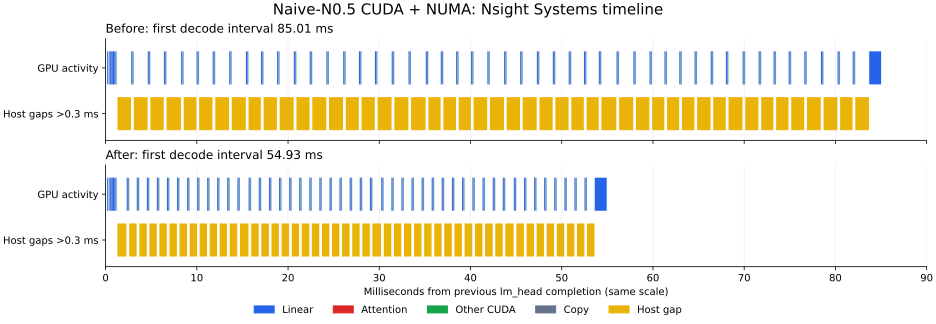

# Naive-N0.5-Flash-FP8 混合推理

## 编译与启动

```bash
bash install.sh
FT_NUMAS=1 numactl -C 0-31 -m 0 \
  ftllm server ~/hfmodels/Naive-N0.5-Flash-FP8 \
  --device cuda --moe_device numa
```

`-C` 指定 CPU 编号；小写 `-c` 指定 NUMA 节点，不能在这台双路机器上使用 `-c 0-31`。
默认线程数会考虑 `FT_NUMAS` 和进程 CPU affinity，并给推理控制线程预留 CPU。
本机使用上述命令时自动选择 28 个 NUMA 工作线程，也可以显式指定 `--threads 28`。
不要让忙等工作线程占满 `-C` 指定的全部 CPU；本机 32 个工作线程会造成严重调度争抢。
保持 `--dtype auto`，保留 checkpoint 的 FP8 专家权重。激活和 KV cache 默认使用 BF16。
完整的 `model-00001-of-00049.safetensors` 等分片可以直接加载，无需手动补索引文件。
长 prefill 默认自动分配 CPU/GPU 专家；如需关闭 GPU 专家 prefill，在启动前设置
`FT_GPU_PREFILL=0`。此开关在进程初始化时读取。

## 实现范围

- CUDA 执行稠密层、路由、注意力及输出投影；专家权重保存在 NUMA。decode 专家由 CPU 执行，长 prefill 按路由负载分给 CPU 与 GPU 并行执行。
- 支持 Q/K 192 维、V 128 维、前 64 维的部分 GPT-NeoX RoPE，以及不同全局/滑窗 RoPE 参数。
- 滑窗注意力保留 127 个历史 token，计入 attention sink 和 value scaling。
- 全局层支持 FP8 indexer、因果约束及稳定的 top-2048 选择；索引键保存在对应请求的 KV cache 中。
- NUMA 专家使用动态 W8A8：每 128 个激活使用独立 FP32 缩放系数，在 GEMM 中应用激活和权重的缩放，并对齐原始实现的 BF16 舍入顺序。参考 FP8 内核使用的 FP32 → FP16 向零截断 → FP8 舍入也在 NUMA 路径中保留。
- 默认以 2048 token 分块 prefill，可用 `--chunked_prefill_size` 覆盖；每次 Forward 处理一条序列，关闭通用历史前缀缓存。HTTP 请求由现有调度器处理。

当前稀疏索引在 GPU 计算分数、在 CPU 做稳定 top-k。超长上下文的索引开销还可以优化。本文的完整模型验证覆盖到 2057 token，不代表已经验证配置中的 1M 上下文。

## 服务验证

已验证完整模型预热、`/v1/models`、非流式和 SSE 流式 `chat/completions`。
关闭思考模式的算术请求返回 `42`；中文解释题能持续输出关于瑞利散射的回答。
短请求 → 2057 token 长请求 → 相同短请求的测试中，两次短请求的 logits 完全一致。
测试服务验证后已关闭。

## Logits 对照

工具 `tools/naive_n05_flash_logits.py` 导出未经采样处理的 logits，按相同 token 前缀比较。
`reference` 使用 checkpoint 自带的 Transformers 模型代码和原始 FP8 eager experts；专家逐层搬到 GPU，适合显存不足以容纳整个模型的机器。
参考环境验证使用 Transformers 5.17、PyTorch 2.10.0+cu128、kernels 0.16.0 和 accelerate。

先用模型 tokenizer 生成一份输入 token ID JSON，例如 `[151644, ...]`，两个后端使用同一文件：

```bash
FT_NUMAS=1 numactl -C 0-31 -m 0 \
  python3 tools/naive_n05_flash_logits.py fastllm \
  ~/hfmodels/Naive-N0.5-Flash-FP8 --device cuda --moe_device numa \
  --input-ids input.json --output fastllm.npz --steps 3

python3 tools/naive_n05_flash_logits.py reference \
  --model ~/hfmodels/Naive-N0.5-Flash-FP8 --device cuda:0 \
  --input-ids input.json --output reference.npz --steps 3 \
  --teacher-forcing fastllm.npz

python3 tools/naive_n05_flash_logits.py compare reference.npz fastllm.npz
```

两个采集命令均可增加 `--repeat-to 2057`，验证跨过 2048 个索引候选后的稀疏注意力。
比较输出包括 MAE、RMSE、最大绝对误差、余弦相似度、概率分布 KL、top-1 和 top-10 重合数。
如果生成 token 已分叉，必须使用 `--teacher-forcing` 对齐后续输入，工具会拒绝比较不同前缀的 logits。

## 实测 Logits 误差（2026-09-29）

使用原始 FP8 checkpoint 的全部 152576 维 logits；每一步比较相同输入前缀。
普通中文样例使用 teacher forcing，避免措辞分叉后比较不同上下文。
下表记录 32 线程基线；28 线程的数值复测结果见下方性能诊断章节。

| 输入 token / 场景 | 步数 | MAE 范围 | 最小余弦相似度 | 最大 KL(ref‖actual) | top-1 相同 |
| --- | ---: | ---: | ---: | ---: | ---: |
| 49 / 短提示（思考模式） | 3 | 0.2564–0.3763 | 0.987641 | 0.0128486 | 3/3 |
| 2057 / 长提示（稀疏注意力） | 2 | 0.3641–0.3837 | 0.978290 | 0.0019284 | 2/2 |
| 54 / 中文解释（相同前缀） | 5 | 0.0580–0.2221 | 0.994752 | 0.0216329 | 5/5 |

上述 10 个位置的最大绝对 logits 误差为 3.0625。CPU 和原始 CUDA FP8 GEMM 的累加存在数值差异，经过多层 MoE 后仍有残余误差。
表中 top-1 使用 `np.argmax`；中文样例第 3 步，两个后端均有 ID 100827 和 104401 两个候选并列最高分，运行时的 tie-breaking 顺序不同，因此使用相同前缀进行对照。
完整逐步 RMSE、最大绝对误差、top-10 重合数、输入 ID 和参考版本记录在 [验证数据](benchmarks/naive_n05_flash.json) 中。

## 性能诊断与线程数

在 EPYC 9374F、CPU 0–31、单 NUMA、RTX 4090 上，原先 32 个工作线程的生成速度为
0.43–0.45 token/s。开启同步逐算子计时后，7 步 decode 平均每步 2.308 秒，其中
`MergeMOE` 2.281 秒（98.85%），普通 `Linear` 合计仅 14.17 毫秒。
Nsight 采集的一次 54 token prefill 加 7 步 decode 中，GPU kernel 总时间 118.68 毫秒，
设备拷贝总时间 4.60 毫秒。

根因是 NUMA 工作线程忙等占满了指定的 32 个 CPU，推理控制线程需要与它们争抢执行时间。
原默认值未考虑 `FT_NUMAS=1`，按双 NUMA 计算出 56 个线程，再被 affinity 限制到 32。
现在按实际启用的 NUMA 数量计算，并在 affinity 范围内为控制线程预留 CPU；上述配置自动选择 28 个线程。
`install.sh` 也会在安装前同步 Python 工具文件，保证只改 Python 时不再安装旧副本。

相同完整尺寸的单层 MoE 微基准（hidden=4096、intermediate=2048、8 个 FP8 专家、
重复使用权重、12 轮）从 32 线程的 44.00 毫秒降至 28 线程的 1.25 毫秒。
这项微基准用于定位调度问题，完整模型速度应以独立端到端测试为准。

本文阶段耗时与固定专家数调参结果是优化期间的历史记录，对应的临时计时、张量导出和
手动分配入口已清理。当前版本的速度和 CUDA 波形可用下文的 benchmark/Nsight 命令复测。

### 完整模型复测（关闭 profiler）

| 输入 / 输出 token | 32 线程首 token | 28 线程首 token | 32 线程生成速度 | 28 线程生成速度 |
| --- | ---: | ---: | ---: | ---: |
| 54 / 32 | 6.75 s | 2.95 s | 0.433 token/s | 12.557 token/s |
| 54 / 16 | 6.69 s | 2.95 s | 0.449 token/s | 12.550 token/s |
| 2057 / 8 | 190.42 s | 110.74 s | 0.427 token/s | 11.463 token/s |

单进程、并发 1，直接记录运行时 token 返回时间；不包含模型加载时间，也没有开启 logits 导出、调试追踪或历史前缀缓存。
2057 token 为重复拼接的测试输入。本次数值复测覆盖 54 token 中文样例的 5 个输出位置，
与原始 FP8 参考比较：MAE 0.070–0.290，最大绝对误差 2.625，最大 KL 0.02489，top-1 一致 5/5。
与此前 32 线程基线相比，生成 token 相同，但 logits 不逐位一致，最大绝对差为 1.46875。
逐 token 时间、算子统计和微基准数据见 [性能诊断数据](benchmarks/naive_n05_flash_performance.json)。

## 回归测试

开启 CMake `UNIT_TEST` 后：

```bash
cmake -S . -B build-fastllm -DUNIT_TEST=ON
cmake --build build-fastllm --target naive_n05_attention_test numas_fp8_eager_moe_test -j16
ctest --test-dir build-fastllm -R 'naive_n05_attention|numas_fp8_eager_moe' --output-on-failure
```

CUDA 测试覆盖部分 RoPE、GQA、滑窗边界、attention sink、稀疏因果掩码、FP8/BF16 indexer 与分数相同时的稳定选择。
NUMA 测试以独立标量参考覆盖 W8A8 量化、FP8 次正规数、BF16 舍入、专家分组和请求规模变化，同时运行 AVX512 与 AVX2 路径。


## Nsight Systems 定位与算子优化（2026-09-29）

本轮对比使用相同的 28 线程、CPU 0–31、NUMA 0、RTX 4090。每次采集只包含
54 token prefill 和 7 步 decode，排除加载与预热；未开启逐算子 CUDA 同步。
下面的图来自 `.nsys-rep` 导出的实际 kernel/memcpy 起止时间，横轴保持相同比例。
黄色标出超过 0.3 ms 的 GPU 空档，主要对应 CPU 专家层。



7 步 decode 的平均间隔从 84.59 ms 降到 54.89 ms，GPU kernel 与拷贝的并集时间
约 14.66 → 14.57 ms；长空档合计从 68.04 ms 降到 38.67 ms。
这组数字来自 profiler；下面单独列出关闭 profiler 的生成速度。

### 热点与修改

| 每层 decode 阶段 | 优化前 | 优化后 | 修改 |
| --- | ---: | ---: | --- |
| 输入 FP8 量化 | 0.0720 ms | 0.0030 ms | SIMD amax、FP16 RTZ 和 E4M3 RNE 编码 |
| SwiGLU + 下投影输入量化 | 0.4623 ms | 0.0103 ms | BF16 SiLU 查表，按行分给现有 NUMA 线程 |
| gate/up GEMM | 0.5047 ms | 0.4481 ms | 激活只解码一次，避免每个输出列重复转换 |
| down GEMM | 0.2683 ms | 0.2440 ms | 同上；prefill 时 4 个 token 共用权重读取与转换 |
| NUMA MoE 合计 | 1.4164 ms | 0.7928 ms | 包含任务准备、调度、路由舍入与归并 |

- gate/up 与 down 每层、每个 decode token 的有效权重数据量约 207.6 MB，按上述
  时间计算约 **269 → 300 GB/s**。prefill 的分块复用同时减少了重复读取权重的次数。
- SwiGLU/量化按一次处理的逻辑读写量计算约 **0.75 → 33.34 GB/s**。
  原路径受到标量转换、逐元素 `exp` 和串行执行限制；新路径保留原模型的 BF16 舍入步骤。
- 短 full attention 与 128-token 滑窗 attention 的 score、softmax、value 合并成一个
  CUDA kernel，分数留在共享内存。该 trace 的 kernel launch 减少 768 次，attention
  GPU 总耗时约 **8.13 → 7.64 ms**，包含 prefill 和 decode。
- 原非融合 softmax 的共享内存存在先读 maximum、随后覆盖 denominator 的同步遗漏。
  独立 CUDA harness 的 racecheck 捕获该问题；补上屏障后 racecheck 为 0 hazards，
  memcheck 为 0 errors。长 full/sparse attention 继续保留独立算子路径。

大尺寸 GPU BF16 GEMV 已达到约 **0.94–0.96 TB/s** 的有效权重读取带宽：
`q_proj` 的 100.7 MB 约 107.5 µs，`lm_head` 的 1.25 GB 约 1.307 ms。
试验减少其 block 同步，对大矩阵没有明显收益，因此保留原实现。
RMSNorm、路由等小张量算子的 GB/s 主要受启动延迟和有限并行度影响，不能按大矩阵的带宽比例推算提速。

**带宽口径：** 当前驱动拒绝访问 GPU 性能计数器（`ncu: ERR_NVGPUCTRPERM`），
上述均为逻辑数据量除以实测时间，不是 DRAM 硬件计数器读数或实测峰值利用率；
CPU 数字也可能包含缓存命中，GEMM 阶段包含调度等待。

### 最终速度与数值验证

以下测试关闭 nsys 和所有算子计时，排除模型加载、预热与 logits 导出；并发 1。
硬件及启动配置与本节基线相同，2057 token 为重复拼接输入。

| 输入 / 输出 token | 优化前首 token | 优化后首 token | 优化前生成速度 | 优化后生成速度 |
| --- | ---: | ---: | ---: | ---: |
| 54 / 32 | 2.952 s | 1.010 s | 12.557 token/s | 18.318 token/s |
| 54 / 16 | 2.946 s | 1.008 s | 12.550 token/s | 18.290 token/s |
| 2057 / 8 | 110.738 s | 32.066 s | 11.463 token/s | 16.110 token/s |

短提示生成速度提升约 46%，长提示约 41%；长提示首 token 耗时缩短约 71%。
剩余主要时间在 NUMA 专家矩阵乘法和 GPU 稠密投影，当前线程数和单 NUMA 配置下仍有约
39 ms/token 的 CPU 阶段与约 15 ms/token 的 GPU 阶段。

性能计时结束后，另行导出全部 152576 维 logits，与原始 FP8 参考比较相同 token 前缀：

| 输入 / 场景 | 步数 | MAE 范围 | 最大绝对误差 | 最大 KL(ref‖actual) | top-1 相同 |
| --- | ---: | ---: | ---: | ---: | ---: |
| 54 / 中文解释 | 5 | 0.0699–0.2905 | 2.625 | 0.024890 | 5/5 |
| 49 / 短提示 | 3 | 0.2152–0.5446 | 4.375 | 0.002829 | 3/3 |
| 2057 / 稀疏注意力 | 2 | 0.3477–0.4279 | 3.6875 | 0.007812 | 2/2 |

其中中文解释的 5 步 logits 与优化前已保存的 **28 线程** capture 逐位相同；
49/2057 token 样例没有优化前的 28 线程 capture，表中直接比较原始 FP8 参考，
不声称这些样例与优化前逐位相同。10 个位置的 top-1 全部相同，最小余弦相似度 0.98025；
这些有限样例不能代表全量精度评估或更长上下文。

`bash install.sh` 已完成，安装库与构建库 SHA256 相同。NUMA 的 AVX512/AVX2 回归以及
CUDA 注意力回归均通过；测试增加了量化边界、不同 GEMM 行数与尾块、decode、54-token
prefill 和融合边界 256/257 等情况。

### 复现采集

`input.json` 为同一份 tokenizer 生成的输入 token ID 数组。测速工具只统计运行时返回的
生成 token；不导出 logits，不包含加载与预热时间，使用并发 1、greedy。

```bash
# 普通速度测试；不要同时运行其他模型或微基准。
FT_NUMAS=1 numactl -C 0-31 -m 0 \
  python3 tools/naive_n05_flash_bench.py \
  ~/hfmodels/Naive-N0.5-Flash-FP8 --device cuda --moe_device numa \
  --bench-input-ids input.json --bench-report speed.json

# 仅采集预热后的 54 token 输入和 8 token 输出（其中 7 步 decode）。
FT_NUMAS=1 numactl -C 0-31 -m 0 \
  /usr/local/cuda/bin/nsys profile --trace=cuda,nvtx --sample=none --cpuctxsw=none \
  --capture-range=cudaProfilerApi --capture-range-end=stop \
  --force-overwrite=true -o naive-profile \
  python3 tools/naive_n05_flash_bench.py \
  ~/hfmodels/Naive-N0.5-Flash-FP8 --device cuda --moe_device numa \
  --bench-input-ids input.json --bench-report profile.json \
  --bench-profile --bench-output-tokens 8 --bench-runs 1
```

长提示可增加 `--bench-repeat-to 2057`。原始 trace 保存在本机
`/tmp/naive-opt-baseline.nsys-rep` 和 `/tmp/naive-opt-final-profile.nsys-rep`。
完整测量数据、逐 token 时间和 logits 指标见
[Nsight 与优化验证数据](benchmarks/naive_n05_flash_nsys.json)。


## Prefill 专项优化（2026-09-29）

上一节的 32.1 秒首 token 使用 128-token 分块。256 个专家、每 token 选 8 个专家时，
每个分块平均只有 4 行分给同一专家，无法充分复用权重。原点积内核按输出列计算，
同一权重每处理 4 行还需重新转换，计算中有大量横向归约。

新增 AVX512 BF16 prefill 内核：

- 将当前 128 元素量化块中的 16 个输出列临时转置，让 SIMD 的 16 个 lane 分别累加不同输出列。
- 一次处理最多 8 个输入行，全部专家输入行共用已转换的权重；64 列任务仅需要 16 KiB 权重暂存。
- 每个 128 元素块依次应用 FP32 激活缩放和权重缩放，保持原 W8A8 的量化与 BF16 舍入步骤。
- 专家输入不足 16 行时沿用原点积内核，避免短提示承担权重转置开销。
- 路由乘法及输出 BF16 舍入按行交给现有 NUMA 线程池，消除大 prefill 中的串行遍历。
- 默认分块从 128 改为 2048，使专家 GEMM 能处理更多行，同时与稀疏注意力 top-2048 边界一致。

单改分块和改内核分别测量，排除模型加载和首次预热；以下是调参阶段的 2057-token
重复输入，输出 2 token。表中的 packed 内核尚未加入并行路由舍入，门槛为 4 行：

| 专家内核 | prefill 分块 | 首 token 时间 | 输入 token / 首 token 秒 |
| --- | ---: | ---: | ---: |
| 原 4 行点积 | 128 | 32.063 s | 64.15 |
| 原 4 行点积 | 512 | 27.446 s | 74.95 |
| 原 4 行点积 | 1024 | 26.676 s | 77.11 |
| 原 4 行点积 | 4096（整段） | 27.849 s | 73.86 |
| 新 packed GEMM | 128 | 31.965 s | 64.35 |
| 新 packed GEMM | 512 | 18.550 s | 110.89 |
| 新 packed GEMM | 1024 | 15.449 s | 133.15 |
| 新 packed GEMM | 2048 | 14.052 s | 146.38 |

这说明仅扩大分块收益有限；新内核需要足够的专家输入行才能发挥作用。
2048 分块随后重复测试为 13.296 秒（154.71 token/s）。此输入跨过稀疏索引边界，
4096 分块需要在整段中执行索引操作，因此不继续增大默认值。


### 最终默认配置

已通过 `bash install.sh` 编译并安装。仍使用单 NUMA、CPU 0–31、28 个工作线程和一张
RTX 4090；无需额外启动参数。下表关闭算子计时和 profiler，并发 1，排除加载和首次预热。
“prefill token/s”采用输入 token 数除以首 token 时间，包含输出首 token 所需的计算。

| 输入 / 输出 token | 首 token 时间 | prefill token/s | decode token/s |
| --- | ---: | ---: | ---: |
| 54 / 32 | 0.946 s | 57.07 | 18.43 |
| 54 / 16 | 0.949 s | 56.88 | 18.36 |
| 512 / 8，重复输入 | 4.209 s | 121.63 | 17.32 |
| 2057 / 8，重复输入，第一次 | 13.616 s | 151.07 | 15.81 |
| 2057 / 8，重复输入，第二次 | 12.841 s | 160.19 | 15.24 |
| 2057 / 8，自然技术文档 | 13.414 s | 153.34 | 15.79 |

相同的 2057-token 重复输入从上一版 **32.066 秒、64.15 token/s** 提升至
**12.84–13.62 秒、151–160 token/s**，约 2.4–2.5 倍。自然文档来自本说明的文本，
经模型 tokenizer 编码并加对话模板；精确输入 ID 保存在下面的 JSON 中。

另行开启 CPU 阶段计时：2048-token 分块每个 MoE 层的路由舍入由 12.258 ms 降至
1.545 ms，归并与输出转换由 3.141 ms 降至 2.398 ms。gate/up 和 down GEMM 合计
仍约 237 ms/层，是当前 prefill 的主要耗时；此计时包含线程调度等待，不能作为硬件带宽计数。

### 最终 logits 回归

仍使用原始 FP8 参考和全部 152576 维 logits，在相同输入与生成前缀下比较；未导出 logits
的速度测试和精度采集分开执行。新的 GEMM 改变了块内浮点累加顺序，结果不保证逐位相同。

| 输入 / 场景 | 步数 | MAE 范围 | 最大绝对误差 | 最小余弦相似度 | 最大 KL(ref‖actual) | argmax 相同 |
| --- | ---: | ---: | ---: | ---: | ---: | ---: |
| 54 / 中文解释 | 5 | 0.0706–0.2874 | 2.4375 | 0.995705 | 0.047084 | 4/5 |
| 49 / 短提示 | 3 | 0.2516–0.4199 | 2.9063 | 0.987962 | 0.011003 | 3/3 |
| 2057 / 稀疏注意力 | 2 | 0.3545–0.5151 | 3.3750 | 0.979773 | 0.002847 | 2/2 |

中文解释第 3 步，参考 token 100827 和 104401 的 logit 均为 21.0；新实现分别为
20.875 和 21.0，因此 `np.argmax` 不同，但选择的 104401 仍属于参考最高分候选集合。
10 个测试位置均满足这一条件；以上是有限样例的数值回归，不代表全量模型质量评估。

AVX512 和 AVX2 的 NUMA MoE 回归、CUDA 注意力回归均通过。GEMM 测试覆盖内核切换
门槛、8 行 tile 的所有尾行、非对齐输出列区间和不足 128 元素的量化尾块，并与 FP64 点积
参考比较；MoE 测试与独立标量量化、BF16 舍入参考比较。安装库与构建库 SHA256 一致。

[Prefill 测速、阶段计时与精度数据](benchmarks/naive_n05_flash_prefill.json) 保存了输入 ID、
逐 token 时间、分块对照、最终默认配置和各步 logits 指标。可用上面的测速工具增加
`--bench-repeat-to 2057 --bench-output-tokens 8` 复测，默认已采用 2048 分块。

## CPU/GPU 并行专家 prefill（2026-09-29）

### 实现与调度

进一步检查共享库反汇编发现，prefill CPU 内核循环中反复调用 `__tls_get_addr`。
现在在循环外取得临时矩阵指针。相同 64 行、8 专家、hidden=4096、intermediate=2048
的单层微基准由 8.05 ms 降到 6.93 ms；该微基准权重可以命中缓存，不代表完整模型速度。

长 prefill 新增 CPU/GPU 并行执行：

- 专家 FP8 权重仍驻留 NUMA；根据当前层的路由行数，把较忙的专家交给同一张 GPU。
  自动选择让 CPU 和 GPU 的预计完成时间接近的专家数，最多 96 个；输入不足 256 token
  时保持原 CPU 专家路径。没有使用第二个 NUMA 节点或第二张 GPU。
- GPU 临时接收选中专家的 FP8 权重，用 cuBLAS BF16 Tensor Core 计算各个独立的
  128 元素块。FP8 先转为**未缩放的 BF16**，每块点积后依次应用 FP32 激活缩放和权重缩放。
  保留 FP32 → FP16 RTZ → FP8 的量化边界、BF16 SiLU 查表及路由乘法的逐步舍入。
- GPU 工作线程与 NUMA 工作线程同时执行，写入互不重叠的路由结果。等待两边完成后，
  按专家 ID 升序进行 FP32 归并，最后统一舍入到 BF16，避免先舍入两个部分和造成额外误差。
- CUDA 暂存和页锁定输出缓冲区按容量复用，释放模型时显式清理；不额外常驻完整专家权重副本。
  CUDA 计算或分配失败时回退到完整 CPU 路径。启动前设置 `FT_GPU_PREFILL=0`
  可以关闭 GPU 专家 prefill；正常启动不需要新增参数。

相同 2057-token 输入的调参结果：GPU 固定处理 32／64／96 个专家时首 token 分别为
7.643／7.392／9.392 秒，自动分配为 **6.02 秒**。固定 32 的测试也是首次运行此长输入，
其缓存状态与后续测试不同；最终结论采用自动分配的连续两次测量。

### 最终整模型速度

仍使用 CPU 0–31、28 个工作线程、`FT_NUMAS=1`、单张 RTX 4090。以下计时关闭 profiler
和算子计时，排除加载与首次预热，并发 1；prefill 速度为输入 token 数除以首 token 时间。

| 输入 / 输出 token | 首 token 时间 | prefill token/s | decode token/s |
| --- | ---: | ---: | ---: |
| 54 / 32 | 0.924 s | 58.43 | 18.36 |
| 54 / 16 | 0.923 s | 58.52 | 18.36 |
| 512 / 8，重复输入 | 2.794 s | 183.22 | 17.23 |
| 2057 / 8，重复输入，第一次 | 6.023 s | 341.50 | 15.97 |
| 2057 / 8，重复输入，第二次 | 6.020 s | 341.70 | 15.96 |
| 2057 / 8，自然技术文档 | 6.847 s | 300.43 | 15.25 |

相对上一版 151–160 token/s，重复输入再提高 **2.1–2.3 倍**；自然文档由 153.34
提高到 300.43 token/s。相对最初 64.15 token/s 的 prefill 版本，重复输入约提高 5.3 倍。

独立开启阶段计时后，2048-token 分块平均每层约 39.2 个专家、10388 条路由交给 GPU。
CPU 工作约 99.27 ms，GPU 工作（包含传输、CUDA 调度及结果回传/散布）约 91.30 ms，
两边并行后的层耗时约 101.21 ms。这些是主机阶段时间，未将其解释为硬件带宽计数。

### 数值与回归

全部 152576 维 logits、相同输入和生成前缀下，与原始 FP8 参考比较：

| 输入 / 场景 | 步数 | MAE 范围 | 最大绝对误差 | 最大 KL(ref‖actual) | argmax 相同 |
| --- | ---: | ---: | ---: | ---: | ---: |
| 54 / 中文解释 | 5 | 0.0706–0.2874 | 2.4375 | 0.047084 | 4/5 |
| 49 / 短提示 | 3 | 0.2516–0.4199 | 2.9063 | 0.011003 | 3/3 |
| 2057 / 稀疏注意力 | 2 | 0.4015–0.4824 | 3.8750 | 0.000737 | 2/2 |

短提示的 logits 与上一版逐位相同。中文解释中 argmax 不同的位置仍是上节所述的参考
并列最高候选；10 个位置均选择了参考最高分候选之一。长输入的块内累加顺序不同，
不保证逐位一致。此处仍是有限输入的数值回归，不代表完整质量评估。

AVX512、AVX2、CUDA 注意力和新增的 CPU/GPU 混合 MoE 回归通过。新增测试直接调用
CUDA 专家函数，并逐路由与独立标量参考比较，防止自动回退掩盖 CUDA 错误；覆盖
256/257 token、不同激活与权重量化块缩放以及长输入后再运行短输入。

完整输入 ID、逐 token 时间、调参数据和逐步精度指标保存在
[CPU/GPU 并行 prefill 数据](benchmarks/naive_n05_flash_hybrid_prefill.json)。


### Nsight 波形对照

在同一个已预热的进程中，先关闭 GPU 专家、再启用自动分配，各采集 2057-token prefill。
这是清理临时开关前的采集；当前复测两种配置需分别启动进程，设置 `FT_GPU_PREFILL=0/1`。
CPU 对照已包含本轮的 TLS 指针优化；以下仅统计到第二个输入分块的 `lm_head` 完成，
排除了随后生成的 decode token。

| Nsight 区间 | 首 token 时间 | GPU 活动时间 | 活动时间 / 墙钟时间 |
| --- | ---: | ---: | ---: |
| CPU 专家，含 TLS 优化 | 11.700 s | 0.915 s | 7.8% |
| CPU/GPU 并行专家 | 6.063 s | 4.109 s | 67.8% |

GPU 活动时间是 kernel 与 memcpy 时间区间的并集，不是 SM 利用率或 DRAM 性能计数器。
并行路径的 H2D 传输量约 49.44 GB，DMA 活动时间 1.857 秒，有效传输速率约
26.62 GB/s；D2H 约 8.95 GB、0.394 秒、22.72 GB/s。此时计算与传输已填入原先
等待 CPU 的大段 GPU 空闲时间。CUDA 专家位于独立流，图中绿色表示专家 CUDA kernel。


原始采集位于 `/tmp/naive2-prefill-profile.nsys-rep`；对应 SQLite 路径和各 kernel 的统计已记录在
上述 JSON。带 profiler 的数字用于分析波形，最终速度采用前面关闭 profiler 的独立测量。

## 代码清理后的复测

移除了逐层张量导出、MoE 阶段计时、固定 GPU 专家数调参入口及重复的 prefill 开关，
统一使用现有 `FT_GPU_PREFILL`。同时清理了无用头文件、宏和计时变量；模型数值路径与
自动专家分配策略保持原样。测速、Nsight 采集和 logits 比较工具保留。

`bash install.sh` 编译安装成功，4 项 CPU/CUDA/混合 MoE 回归全部通过。
在相同的 28 线程、单 NUMA、单 GPU 配置下，54/49/2057 token 三组输入共 10 个输出位置
的全部 152576 维 logits 与清理前保存结果**逐位一致**。

| 输入 / 输出 token | 首 token 时间 | prefill token/s | decode token/s |
| --- | ---: | ---: | ---: |
| 54 / 32 | 0.927 s | 58.24 | 18.15 |
| 2057 / 8，重复输入 | 5.972 s | 344.46 | 14.79 |

这是关闭 profiler、排除加载和短/长输入预热后各一次测量。逐 token 时间、库校验值及
数值一致性记录见上述 JSON 的 `cleanup_verification`。
