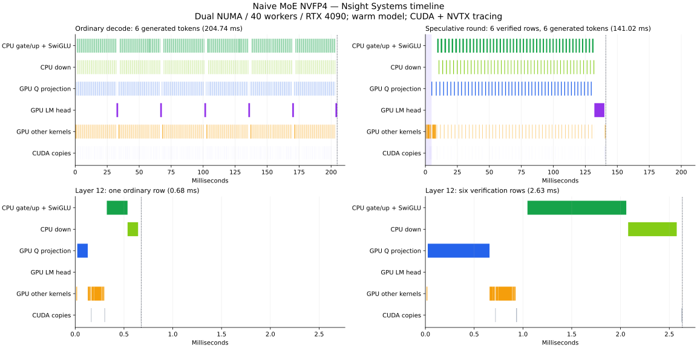
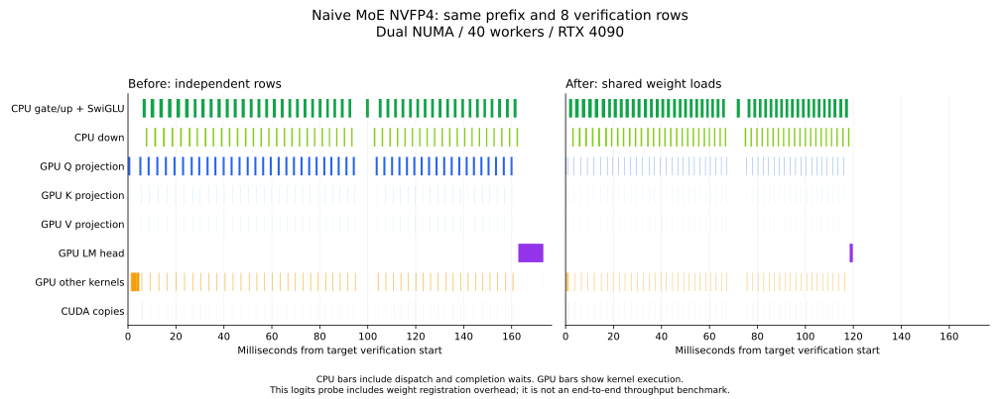
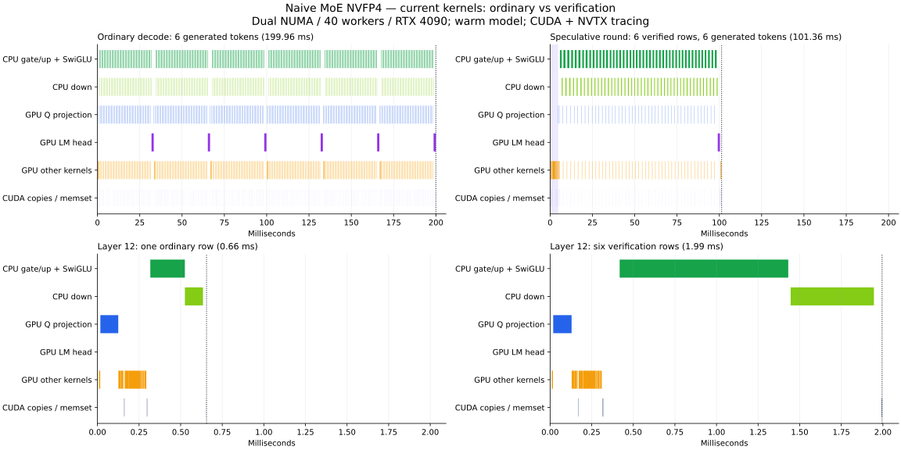

# Naive MoE NVFP4：普通解码与推测验证逐算子对比

测量日期：2026-09-29。双 EPYC 9374F、双 NUMA 共 40 个工作线程、RTX 4090。
模型为 `Naive-N0.5-Flash-MoE-NVFP4`，BF16 激活，专家在 CPU，其他层在 CUDA。
推测候选上限为 7，置信度阈值为 0.5，贪心解码，并发 1。

下文首先记录优化前的定位结果；已完成的投影优化及复测见文末
[投影优化实测](#投影优化实测)。当前普通解码与验证的比较及剩余瓶颈见
[优化后普通解码与验证的对比](#优化后普通解码与验证的对比)。

## 优化前定位结论

1. **优先优化验证阶段的 BF16 Q 投影和输出头**。一次 8 行验证与 8 次普通解码
   相比，这两个算子几乎没有批处理收益。验证路径为数值对齐强制使用 `PART=1`
   GEMV，每行重复读取大矩阵。独立算子测试中，已有的 `PART=8` kernel 分别快
   7.42 倍和 7.87 倍；该倍率尚未在整模型中验证。
2. **CPU NVFP4 MoE 是最大的耗时部分**。相同 8 个位置，gate/up 与 down 合计
   120.12 → 85.39 ms，只快 1.41 倍。需要进一步优化少量行的分组计算、反量化复用
   和任务分块；目前的 CPU 范围计时不足以区分这些因素各自的占比。
3. **草稿成本较小**：完整二分查找请求中每轮约 5.02 ms，占阶段总时间的 2.9%。
   注意力、RMSNorm、专家选择已经分别获得约 5.75、8.34、7.91 倍批处理收益。

定位阶段的插桩、微基准及分析脚本位于 `/tmp/naive-nvfp4-profile`，
没有向生产源码加入计时或调试环境变量。

## 波形



上图来自正常完成的 CUDA + NVTX 采集。上半部比较同一请求首 token 之后的
6 次普通解码（204.74 ms），以及产生相同 6 个 token 的第一个推测轮次
（141.02 ms）。该轮置信度筛选后有 5 个候选，加上锚点共验证 6 行。
紫色背景标出草稿阶段。下半部放大第 12 层，左右使用相同时间刻度；普通路径
单行约 0.68 ms，验证路径 6 行约 2.63 ms。绿色是 CPU 队列执行与完成等待范围，
其他色条为真实 CUDA kernel 或复制区间。

GPU Q 投影在验证阶段明显变长，随后 CPU gate/up 和 down 同样变长。
CPU 与 GPU 大体串行交替，这两部分的优化都能影响关键路径。

## 同一前缀、相同 8 个位置的对比

使用 140-token 前缀，复制相同 KV 状态，再分别做一次 8 行验证和 8 次单行前向。
全部 8 × 152576 维 logits **逐位一致**。下表累加全部层的耗时，单位 ms。
CPU 行为主线程派发及等待工作线程完成的墙钟时间；GPU 行为 CUDA kernel 时间。

| 算子 | 8 次普通前向合计 | 1 次 8 行验证 | 批处理加速 |
| --- | ---: | ---: | ---: |
| CPU MoE gate/up + SwiGLU + down 输入转换 | 78.812 | 57.246 | 1.38× |
| CPU MoE down | 41.309 | 28.142 | 1.47× |
| GPU Q 投影 | 41.806 | 40.537 | 1.03× |
| GPU 输出头 `lm_head` | 10.451 | 10.435 | 1.00× |
| GPU O 投影 | 27.647 | 8.169 | 3.38× |
| GPU K 投影 | 5.418 | 1.698 | 3.19× |
| GPU V 投影 | 3.819 | 1.165 | 3.28× |
| GPU 首层稠密 MLP：gate/up/down 合计 | 3.415 | 3.369 | 1.01× |
| GPU 注意力 `AttentionShort` | 7.880 | 1.370 | 5.75× |
| GPU RoPE | 1.281 | 0.170 | 7.53× |
| GPU RMSNorm | 5.740 | 0.688 | 8.34× |
| GPU FP32 router 投影 | 2.564 | 0.667 | 3.85× |
| GPU 专家选择 `SelectExpert` | 3.802 | 0.481 | 7.91× |
| GPU 残差 `AddTo` | 0.851 | 0.111 | 7.68× |

其余小算子、调用次数、CUDA API 及完整 kernel 名称见
[逐算子数据](benchmarks/naive_n05_nvfp4_profile.json)。
该固定前缀探针中另有 4 次 `cudaHostRegister`，合计 4.84 ms；逐 token 数值比较
也会在两次前向之间复制和检查 logits，因此其总墙钟时间不作为实际生成吞吐。
上图使用真实生成循环，避免把数值比较开销画成普通解码间隙。

## 主要原因与优化顺序

### 1. BF16 验证线性层：跨行权重复用

`src/models/naive_n05_flash.cpp` 的 `RunTarget` 在验证时将
`FastllmCudaSetLinearExactBatchThreshold` 设置为至少 `length + 1`。
`src/devices/cuda/linear/fastllm-linear-bf16.cu` 中的 exact 分支于是发射
`FastllmGemvBf16Bf16Kernel2MultiRow<256, 1>`，通过 `grid.y` 分别处理各行。
普通解码和验证在 Nsight 中均确认运行这个 kernel。

这样保留了普通解码的归约顺序，却失去了大矩阵的跨行复用。48 层 Q 权重合计
4.832 GB，8 行逻辑读取量约 38.65 GB。除以测得的 kernel 时间，普通和验证分别约
925、954 GB/s。因此，**这组 Q 投影的主要问题是重复读权重**。仅看耗时不能将其
归因于 DRAM 带宽利用率低。这里的 GB/s 是按矩阵尺寸估计的逻辑吞吐，未采集
DRAM 硬件计数器，也不能据此排除缓存影响。

输出头有 152576 × 4096 个 BF16 权重，约 1.25 GB，同样重复读取。
O/K/V 也走 exact kernel，但实测批处理收益较大；缓存与调度影响尚未通过硬件
计数器分离，优先级低于 Q 和输出头。

使用现有生产 CUDA 对象链接独立微基准，测试同尺寸 BF16 随机输入与权重。
20 次预热，每组 100 次调用，做 5 组取中位数，计时段末同步，关闭 profiler：

| 形状：行数 × 输入列 → 输出列 | exact PART=1 | 直接 PART=8 | 加速 | 输出逐位差异数 |
| --- | ---: | ---: | ---: | ---: |
| 8 × 4096 → 12288（Q） | 0.8433 ms | 0.1136 ms | 7.42× | 0 / 98304 |
| 8 × 4096 → 152576（输出头） | 10.4342 ms | 1.3255 ms | 7.87× | 0 / 1220608 |

7 行的 PART=7 测试也逐位一致，Q 和输出头分别快 3.00、6.91 倍。
直接放开阈值后，8 行普通分发会选择 cuBLAS；该随机测试的 Q 和输出头分别有
142 和 1909 个 BF16 元素不同，最大绝对差 0.015625、0.03125。

建议先为 BF16 验证接入保持归约顺序的多行 kernel，优先 Q 与输出头；保留
FP32 router 的数值约束。随机微基准的逐位一致只覆盖上述形状与输入，不能替代
整模型的 logits、专家选择和接受率验证。不能把独立算子的 7–8 倍直接当作整模型
加速，也不能仅因随机输入通过就全局撤掉 exact 约束。

### 2. CPU 分组 NVFP4：少量行的复用效率

普通解码每 token、每 MoE 层选择 8 个专家。8 次单行共有 64 次专家访问；一次
8 行验证平均访问 **34.45 个不同专家/层**，47 层共 1619 个不同专家矩阵组。
即使每个不同专家的权重只读一次，验证也需读取单 token 的约 4.31 倍权重。

按紧凑 NVFP4 gate/up/down 每专家合计 13.5 MiB 计算，普通 8 次与验证 1 次的
逻辑权重流量比为 3008:1619，减少 46.2%；CPU 阶段耗时仅减少 28.9%。
用该逻辑流量除以队列墙钟时间，约为 354.5 → 268.4 GB/s。这是含反量化、计算、
调度等待的有效吞吐估计，**不是内存控制器实测带宽**。

源码入口为 `src/devices/numas/numasdevice.cpp` 中的
`NumasMoeGemmQueueContext`、`MultiThreadNumasMoeGemmQueueOp` 和
`ScheduleNumasMoeGemmQueue`。优先检查每专家 1–几行时的 packed E4M3
反量化复用、行分块和列任务粒度。gate/up 占这两段合计的 67%，应先测它。
当前采集未获得 CPU 指令采样，不能断言反量化或任务队列中的某一项已被证实为
单独瓶颈。

### 3. 分配与同步：有待剥离真实开销

完整二分查找请求的验证阶段，每轮 `cudaFree` 的主线程耗时约 27.87 ms，
`cudaStreamSynchronize` 约 19.20 ms，`cudaMalloc` 约 2.76 ms。
前两者包含等待前面 GPU 工作完成的时间，与 kernel 时间重叠；不能相加，也不能
认为移除 API 就能省掉这些时间。可在前两项优化后检查缓冲区复用和必要的同步点。

## 真实生成循环的阶段分解

第一次长采集正常完成的二分查找请求输出 105 token，普通和推测 token ID 一致。
普通解码有 104 次目标前向；推测有 14 轮、107 行目标验证，接受 91 / 93 个候选
（97.85%）。下表是每轮主线程 NVTX 范围均值：

| 阶段 | 平均 ms/轮 | 阶段合计占比 |
| --- | ---: | ---: |
| 草稿 | 5.02 | 2.9% |
| 目标验证 | 157.22 | 89.6% |
| 接受判定及 KV 截断 | 12.26 | 7.0% |
| 草稿上下文提交 | 0.98 | 0.6% |

目标验证中的 CUDA 工作异步提交，因此最后的输出头仍可在后续接受阶段执行。
接受阶段的 12.26 ms 包含这种 GPU 等待，不能理解为纯 CPU 接受判定耗时。

该次带 profiler 的普通/推测速度为 27.85 / 42.33 token/s；正常完成的短采集为
27.59 / 41.36 token/s。此前关闭 profiler、完整请求第二轮的对应数字为
29.15 / 42.93 token/s。采集数据用于定位算子成本，生产速度仍采用关闭 profiler
的测量。

## 采集方式与文件

Nsight Systems 2024.6.2、CUDA 12.8。临时插桩覆盖 Executor 算子、层、目标前向、
草稿/验证/接受/提交以及 CPU gate/up、down 队列。没有在每个算子末强制 CUDA
同步。GPU kernel 通过 CUDA runtime correlation ID 归属到提交它的算子。

```bash
CUDA_VISIBLE_DEVICES=GPU-489a90b1-f9de-f058-29fe-4fafcbc7cf01 \
FT_NUMAS=2 FT_THREADS=40 numactl -C 0-63 -m 0,1 \
  /usr/local/cuda-12.8/bin/nsys profile \
  --trace=cuda,nvtx --sample=none --cpuctxsw=none \
  --capture-range=cudaProfilerApi --capture-range-end=stop \
  --force-overwrite=true --output=/tmp/naive-nvfp4-profile/short \
  /tmp/naive-nvfp4-profile/naive_profile \
  ~/hfmodels/Naive-N0.5-Flash-MoE-NVFP4 \
  ~/hfmodels/Naive-N0.5-Flash-FP8-Draft \
  /tmp/naive-nvfp4-profile/short-cases.json \
  /tmp/naive-nvfp4-profile/short-results.json
```

原始采集：`/tmp/naive-nvfp4-profile/short.nsys-rep`、`short.sqlite`。
完整二分查找范围来自同目录 `nvfp4.nsys-rep`、`nvfp4.sqlite`；这次长采集额外启用
OS runtime 跟踪，在后续拓扑排序普通解码中停滞并被手动终止。该未完成 case
全部排除，停滞原因未确定。第二次关闭 OS runtime 跟踪的短采集正常结束。
系统不允许 CPU perf 采样，因此本次没有 CPU 指令热点和硬件带宽利用率数据。

构建及分析脚本同目录下的 `build_profile.py`、`analyze.py`、`plot.py`，微基准为
`linear_probe.cpp`，稳定测量日志为 `linear-probe-steady.log`。仓库中的 JSON 保存
输入、结果、有效范围的全部算子统计、微基准结果及原始采集的 SHA256。

## 投影优化实测

随后优化了 Q/K/V 与输出头使用的 BF16 小批量公共路径：2–8 行 exact 验证
使用已有的 `PART=2..8` kernel，将向量权重加载移到行循环外。每行的 FP32
累加与归约树保持相同，FP32 router 继续走原来的 exact 路径；大于 8 行的 exact
批次继续使用独立行回退。相同公共路径中的 O 投影和首层稠密 MLP 也获得收益。
没有新增运行环境变量。

### 四个投影的实际耗时

再次用 Nsight Systems 采集相同 140-token 前缀、相同 8 个验证位置。以下比较
优化前后每次 8 行验证中，全部目标层的 GPU kernel 累计时间。

| 算子 | 优化前 | 优化后 | 加速 |
| --- | ---: | ---: | ---: |
| Q 投影 | 40.537 ms | 5.548 ms | 7.31× |
| K 投影 | 1.698 ms | 0.941 ms | 1.80× |
| V 投影 | 1.165 ms | 0.640 ms | 1.82× |
| `lm_head` | 10.435 ms | 1.323 ms | 7.89× |

Nsight 确认这次 8 行验证的 205 次 BF16 Linear 均使用 `PART=8`，总 kernel
时间由 65.42 ms 降至 12.77 ms。CPU MoE gate/up 与 down 合计为
85.39 → 85.07 ms，其计算路径没有改动。



这是固定续写的 logits 探针，前后分别有约 4.84、4.60 ms 的权重注册开销。
图用于展示各阶段在时间线上的变化，生成吞吐采用下面关闭 profiler 的实测。

### 完整请求速度

同一 RTX 4090、双 NUMA、共 40 个工作线程、CPU 0–63、内存节点 0/1。
优化前后分别启动进程，每个任务先预热普通和推测路径，再交替运行两轮；
两轮推测速度一致，表中采用第二轮。吞吐不含首 token。

| 编程任务 | 优化前推测 token/s | 优化后推测 token/s | 提升 | 普通 token/s：前 → 后 |
| --- | ---: | ---: | ---: | ---: |
| 区间合并 | 36.12 | 49.83 | 38.0% | 27.53 → 27.46 |
| 二分查找 | 42.84 | 60.22 | 40.6% | 27.57 → 27.51 |
| 拓扑排序 | 33.28 | 45.98 | 38.2% | 28.77 → 28.85 |

普通解码吞吐变化均在 0.3% 以内。接受率前后分别为 83/100、91/93、133/179，
每任务两轮的候选数、接受数、轮数和生成 token ID 均相同。

### 数值与安装验证

- 扩展并通过 `regressionOps --cuda-exact-small-batch-linear`：BF16 2–9 行、
  带/不带偏置、对齐及非对齐输入、多轮累加、混合指数值；与逐行结果逐位一致。
  该测试还运行现有 FP32/BF16/FP8 exact 回归。
- 87、127、140、2057-token 前缀共 32 个位置，每个位置比较全部 152576 维
  logits。优化前后，普通推理和整块验证的输出分别**逐位一致**。
- 2057-token 前缀原有的整块验证与逐 token 推理差异仍为 max_abs=1.125、
  max_KL=0.01504，没有因此次投影优化增加。上述逐位一致指优化前后对比。
- `bash install.sh -DUNIT_TEST=OFF` 编译安装成功，已安装的
  `libfastllm_tools.so` 与构建产物字节一致，`ftllm --help` 正常。

算子回归在 RTX 4090 D、整模型及测速在 RTX 4090 上完成，两者均为 SM89；
未在其他 CUDA 架构上验证此次优化。

原始测量和临时验证程序位于 `/tmp/naive-projection-opt`；优化后采集为
`/tmp/naive-projection-opt/profile/after.nsys-rep`。完整输入、两轮速度、前后
logits 校验、接受率和逐算子数据见
[投影优化测量数据](benchmarks/naive_n05_nvfp4_projection.json)。

## 优化后普通解码与验证的对比

本节重新分析刚完成的优化后采集
`/tmp/naive-projection-opt/profile/after.nsys-rep`，对应当前已安装版本。
比较双方均为 NVFP4 模型，使用同一 140-token 前缀和相同的 8 个续写位置；
全部 8 × 152576 维普通/验证 logits 逐位一致。

### 当前波形



上图使用真实生成循环：左边连续产生 6 个 token，199.96 ms；右边一轮验证
6 行、产生相同 6 个 token，101.36 ms。紫色背景为草稿阶段。下方第 12 层
使用同一时间刻度，普通单行 0.66 ms，验证 6 行 1.99 ms。
Q 的长条已经缩短，验证阶段的大段时间主要落在 CPU gate/up 和 down。
此处的 6-token 波形示例与下表的固定 8-position 算子探针分开统计。

### 逐算子比较

下表累加全部目标层，单位 ms。CPU 行为队列派发与等待完成时间，gate/up
包含 SwiGLU 和 down 输入转换；GPU 行为实际 kernel 时间。加速比为相同
8 个位置的普通合计耗时除以整块验证耗时。

| 算子 | 8 次普通推理 | 1 次 8 行验证 | 批处理加速 |
| --- | ---: | ---: | ---: |
| CPU MoE gate/up + SwiGLU | 80.050 | 56.938 | **1.41×** |
| CPU MoE down | 41.439 | 28.134 | **1.47×** |
| GPU Q 投影 | 41.821 | 5.548 | 7.54× |
| GPU O 投影 | 27.658 | 3.809 | 7.26× |
| GPU K 投影 | 5.437 | 0.941 | 5.78× |
| GPU V 投影 | 3.836 | 0.640 | 5.99× |
| GPU 输出头 | 10.451 | 1.323 | 7.90× |
| GPU 首层稠密 MLP：gate/up/down | 3.415 | 0.452 | 7.56× |
| GPU 注意力 | 8.088 | 1.404 | 5.76× |
| GPU RoPE | 1.315 | 0.172 | 7.63× |
| GPU RMSNorm | 5.861 | 0.706 | 8.30× |
| GPU FP32 router 投影 | 2.581 | 0.693 | 3.72× |
| GPU 专家选择 | 3.912 | 0.491 | 7.97× |
| GPU 残差加法 | 0.873 | 0.114 | 7.69× |

CPU 两段合计 **121.49 → 85.07 ms，仅 1.43×**；GPU kernel 合计
**117.12 → 16.64 ms，7.04×**。这两种计时口径不能直接与包含异步等待的
Executor/CUDA API 耗时相加。

### 当前优化优先级

**第一优先级：CPU NVFP4 gate/up，其次 down。** 固定 8 行探针中，gate/up
占 CPU 两段的 66.9%。真实生成循环的 5 轮验证共 509.27 ms，其中 CPU 队列
执行及完成等待为 380.51 ms，占 **74.7%**；GPU kernel、复制及 memset 活动
占约 15.0%，与 CPU 队列范围没有重叠。这里是时间占比，不是 SM 占用率或
内存带宽利用率。

专家分散限制了批处理复用：每层 64 条路由落到平均 **34.45 个不同专家**，
每专家平均仅 **1.86 行**。源码确认当前已使用
`FastllmGemmBFloat16NVFP4Block16E4M3Packed_AVX512BF16`；其内层在同一专家
的多行之间复用已解码权重与缩放值。因此后续应针对 1–几行的小组提高计算效率。

具体可先测 `src/devices/cpu/avx512bf16.cpp` 中
`FastllmGemmBFloat16NVFP4Block16FullBlocks_AVX512BF16_Run`：目前外层逐输出列
处理，可尝试 2–4 输出列的寄存器分块，复用输入加载、交错独立的累加链，同时
保留各输出的归约次序。这是依据源码提出的优化方向，尚未用指令采样证明某一条
指令是单独瓶颈。

按 packed 权重、E4M3 scale 和每行 FP32 scale header 的逻辑字节数估算，CPU
有效吞吐约 **351 → 270 GB/s**。该值包含计算、反量化和线程等待，且存在缓存
影响；本次没有硬件 DRAM 计数器，不能解释为实测内存利用率。

**第二优先级：MoE 周围的主线程处理。** 真实生成循环每轮 `MergeMOE` 的
主线程范围平均 91.60 ms。通过时间区间求交，扣除 CPU 队列的 76.10 ms 和
范围内 GPU 活动的 7.49 ms，仍有约 **8.01 ms/轮**。它包括输入重排、结果归并、
分配、派发及其他主线程等待等候选项，现有插桩不能将其继续分开，也不能将其
全部当作可消除的开销。固定 logits 探针还有额外权重注册，因此使用生成循环
估算这一项。

当前分组队列已采用动态取任务和大组优先排序；8 行探针的 gate/up 每节点
160–204 个任务、每任务 320–512 输出列。可在后续测量中结合工作线程尾部等待
调节粒度，避免把已有优化当作尚未实现。

**第三优先级：剩余 GPU Q/O 投影。** 两者在 8 行验证中合计 9.36 ms，仍是
最大的 GPU 部分，但批处理加速已超过 7 倍。普通单 token 的 Q/O 合计约
8.68 ms，CPU 两段约 15.19 ms；CPU 优化也能改善普通推理。
router 的加速比偏小，但验证总耗时只有 0.69 ms；注意力 1.40 ms、RMSNorm
0.71 ms、专家选择 0.49 ms，优先级均低于 CPU MoE。

真实生成循环中，草稿/目标验证/接受及截断/上下文提交的均值分别为
4.71 / 101.86 / 2.57 / 0.93 ms。5 轮合计验证 33 行，平均每轮 6.6 行，
不能把该阶段均值当作固定 8 行的耗时；接受阶段仍包含等待异步输出头结束。

完整表格、时间区间交集、队列粒度和估算公式数据已写入
[投影优化数据](benchmarks/naive_n05_nvfp4_projection.json) 的
`current_ordinary_vs_verify` 字段。分析和画图脚本位于
`/tmp/naive-projection-opt/current-analysis`。
