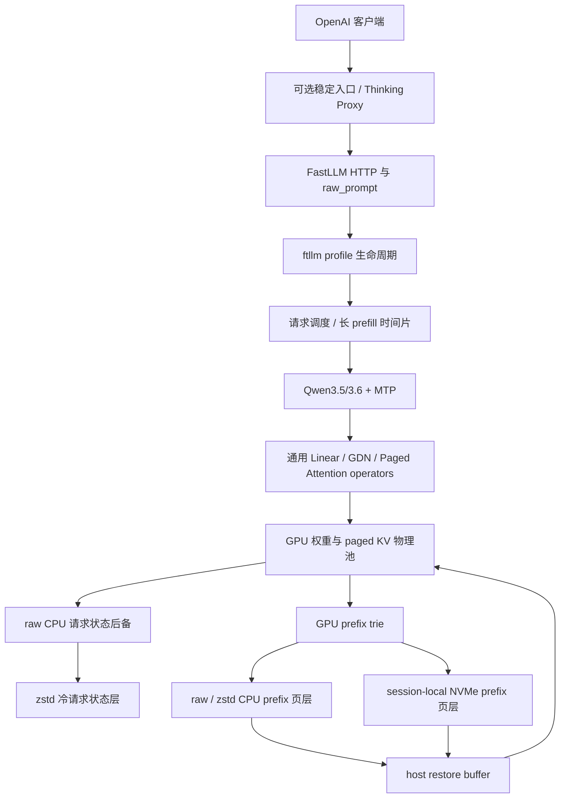

# Qwen3.5/3.6 单卡分层本地部署

本文说明如何把 FastLLM 的模型执行、paged KV、前缀缓存、MTP、命名 profile、HTTP 协议和外层代理组合成一套可维护的本地部署。参考硬件是 Tesla V100 32GB（SM70），但分层边界不绑定 Qwen 或 V100；只有具体 CUDA kernel 和容量参数需要按设备能力调整。

## 核心原则

1. **逻辑上下文与 GPU 物理池分离。** `max_context_length` 是单请求逻辑上限；`tokens` 是同时驻留在 GPU 的共享 KV token 池。两者不能混为“服务总上下文”。
2. **容量、速度和缓存命中率分别配置。** 不用一个 profile 同时承担互相冲突的目标。
3. **模型层只描述 shape 和递推语义。** 通用 operator 负责 dispatch；SM70 特化留在 CUDA backend，并保留完整 fallback。
4. **实验门控默认关闭。** 不支持的 architecture、dtype、shape 或运行失败必须回退已验证路径。
5. **切换必须可回滚。** profile 先验证 `/health` 和 `/v1/models`，成功后才成为 active；失败时恢复前一 profile。

## 分层结构



各层可以独立替换：协议层不需要理解 Turbo3，profile 层不需要理解 GDN，CUDA backend 也不负责 HTTP 生命周期。这样才能在一张显存有限的卡上同时保留速度、容量和故障恢复能力。

## 当前交付状态

| 层 | 已实现并有回归 | 默认关闭的实验 | 尚未交付 |
|---|---|---|---|
| 协议 | OpenAI 风格 chat/stream；`/health`、`/version`、`/props`、`/v1/models`；C++/Python `raw_prompt`；缺省输出上限；JSON 400/404/405 | 无 | 无 |
| 生命周期 | 命名 profile；校验、启动、停止、切换、日志、PID/start-time 身份检查、readiness、失败回滚、环境隔离 | 无 | profile 本身不提供反向代理；切换窗口的稳定 503 需要外层代理 |
| Qwen 执行 | Qwen3.5/3.6 GGUF、IQ4_XS、FP16 activation、SM70 线性路径、full-attention/GDN、MTP | 若干算子 A/B gate，见下文 | 无 |
| KV/cache | FP8 E4M3 KV；Turbo3 packed KV（K=`Q8_0_KV`，V=`TURBO3_KV`）；paged attention；前缀页和 GDN/MTP snapshot | SM70 paged/GDN 微优化 | 无 |
| 调度 | 容量感知 resident plain CUDA batch；长 prefill 分 quantum 让出；完整请求状态 CPU swap；生成 token 粗时间片轮转；客户端断连立即 `AbortResponse` | 无 | 无 |
| 冷缓存 | GPU prefix trie；frequency/LRU 淘汰；raw/zstd CPU 页层；带 checksum、空间上限和动态成本门控的 session-local 磁盘页层 | 无 | 跨进程持久 prefix 索引 |

CPU request swap 与 prefix tier 是两套不同机制。前者完整保存 packed K/V、GDN recurrent/conv state、MTP state 和请求元数据，使每个暂停请求仍可独立达到 262,144 token；后者按 page-aligned token prefix 保存可复用页，并用 Qwen 线性/GDN/MTP snapshot 补齐非 paged 状态。GPU `tokens` 只限制同时驻留容量。磁盘 prefix store 每个服务进程使用独立目录和锁，正常退出时删除，因此是 NVMe 冷层，不是跨重启持久缓存。

## 三类可叠加 profile

### 1. 速度 profile

适合冷 prefill 和单路低延迟：

- FP16 activation；
- FP8 E4M3 KV；
- 单请求 MTP2；多请求优先 plain batch；
- CUDA embedding；
- 8,192-token prefill quantum；
- 64-page prefix snapshot interval；
- 262,144-token GPU pool。

V100 实测参考：32K prompt TTFT 约 34.40s，约 954 prompt tok/s；短 decode C1 约 50.85 tok/s，C4 约 81.13 tok/s aggregate。

### 2. 缓存驻留 profile

适合在相同显存预算下保留更多热前缀：

- FP16 activation；
- Turbo3 packed KV；
- MTP2；
- 2,048-token prefill quantum；
- 16-page prefix snapshot interval；
- 262,144-token GPU pool；
- `max_batch=5`，但每个请求的逻辑上限仍可设为 262,144。

V100 实测参考：稳定 32K TTFT 约 40.38–40.57s，即约 807–811 prompt tok/s。Turbo3 相对 FP16 KV 在相同预算下可保留约 2.75 倍 full-attention 前缀页，相对 FP8 约多 37.6%。这类 profile 的价值主要是热前缀命中率，不是最低 cold TTFT。

### 3. 容量 profile

适合多个逻辑 256K 会话共享一张 32GB V100：

- Turbo3 packed KV；
- 262,144-token GPU 物理池；
- 每请求 `max_context_length=262144`；
- MTP2 用于当前单路 resident 请求，多路 resident 使用 plain CUDA batch；
- 2,048-token prefill quantum；
- `FASTLLM_CPU_REQUEST_SWAP=1`；
- 生成 16 token 后，在存在暂停请求时执行粗时间片轮转；
- raw CPU 热后备，可选 zstd 冷层。

当前策略是“能同时驻留就 batch，超出物理池才 swap”，不会每 token 搬运完整状态。历史 524,288-token/MTP0 profile 已验证两个独立请求各 exact 256K；它是双路全驻留压力参考，不是当前推荐配置。

## 启动与切换

### 直接启动缓存驻留 profile

```bash
FASTLLM_QWEN35_TURBO3_KV=1 \
FASTLLM_QWEN35_ENABLE_MTP=2 \
FASTLLM_QWEN35_INTERLEAVE_LONG_PREFILL=1 \
FASTLLM_CUDA_SM70_PAGED_XQA=1 \
FASTLLM_PREFIX_CACHE=1 \
FASTLLM_PREFIX_CACHE_SNAPSHOT_INTERVAL_PAGES=16 \
FASTLLM_PREFIX_CACHE_CPU_TIER=1 \
FASTLLM_PREFIX_CACHE_CPU_MAX_BYTES=2147483648 \
FASTLLM_PREFIX_CACHE_DISK_DIR=/path/to/fast/nvme/fastllm-prefix \
FASTLLM_PREFIX_CACHE_DISK_MAX_BYTES=8589934592 \
FASTLLM_PREFIX_CACHE_MIN_HITS=2 \
FASTLLM_PREFIX_CACHE_MIN_TOKENS=65536 \
FASTLLM_PREFIX_CACHE_DISK_MIN_HITS=2 \
FASTLLM_PREFIX_CACHE_DISK_MIN_TOKENS=65536 \
FASTLLM_PREFIX_CACHE_ZSTD=1 \
FASTLLM_PREFIX_CACHE_ZSTD_LEVEL=1 \
FASTLLM_CPU_REQUEST_SWAP=1 \
FASTLLM_CPU_REQUEST_SWAP_QUANTUM_TOKENS=16 \
FASTLLM_CPU_REQUEST_SWAP_ZSTD=1 \
FASTLLM_CPU_REQUEST_SWAP_ZSTD_COLD_MS=30000 \
FASTLLM_CPU_REQUEST_SWAP_ZSTD_LEVEL=1 \
ftllm server /path/to/qwen3.5-or-qwen3.6.gguf \
  --device cuda \
  --atype float16 \
  --kv_cache_dtype turbo3 \
  --tokens 262144 \
  --max_batch 5 \
  --max_context_length 262144 \
  --chunked_prefill_size 2048 \
  --default_max_tokens 16384 \
  --model_name qwen-local \
  --port 8002
```

Turbo3 必须同时满足 `--kv_cache_dtype turbo3` 与 `FASTLLM_QWEN35_TURBO3_KV=1`。缺任一门控都不得静默进入 packed 路径。

### 命名 profile 生命周期

先用 `ftllm` TUI 保存多个 `server` 配置，再通过同一生命周期命令管理：

```bash
ftllm profile list
ftllm profile show qwen-v100-cache
ftllm profile validate qwen-v100-cache
ftllm profile start qwen-v100-cache
ftllm profile switch qwen-v100-speed
ftllm profile status
ftllm profile logs qwen-v100-speed -n 200
ftllm profile stop --grace 30
```

子进程环境只继承允许项，再叠加 profile 声明的变量；未声明的旧 `FASTLLM_*` gate 不应从启动 shell 泄漏。readiness 同时要求 `/health.ready=true` 且 `/v1/models` 包含预期模型名。

若需要固定客户端入口，把外层代理绑定到稳定端口，后端指向当前 profile 端口。切换期间代理应返回结构化 503，而不是直接关闭 TCP；profile 启动失败后继续指向已回滚的前一实例。

## GPU、CPU 与 zstd 请求状态层

`FASTLLM_CPU_REQUEST_SWAP=1` 默认关闭。开启后，调度器只在请求位于已提交的 prefill quantum 边界或安全 decode 边界时换出；snapshot 包含每层 paged K/V、线性注意力状态、conv state、MTP state、token/history 和调度游标。换出先完整复制到 CPU，成功后才释放 GPU 页；恢复任一段失败会清理已分配的目标页，不继续使用半恢复状态。

`FASTLLM_CPU_REQUEST_SWAP_QUANTUM_TOKENS` 控制一个恢复请求至少生成多少 token 后才可再次让出。值 `16` 用于避免每 token 搬运长状态；没有暂停请求时不触发时间片换出。恢复的 long-prefill snapshot 可能带回超过当前空闲页的未来 reservation，调度器会先换出另一个安全 resident 请求，再运行下一个 quantum，避免所有 continued prefill 相互等待。

冷压缩是独立门控：

| 环境变量 | 含义 | 建议起点 |
|---|---|---|
| `FASTLLM_CPU_REQUEST_SWAP_ZSTD` | 启用后台冷 snapshot 压缩；需要构建时找到 libzstd | `1` |
| `FASTLLM_CPU_REQUEST_SWAP_ZSTD_COLD_MS` | snapshot 暂停多久后可压缩 | `30000` |
| `FASTLLM_CPU_REQUEST_SWAP_ZSTD_LEVEL` | zstd level，当前接受 1–19 | `1` |

压缩只在结果严格小于原始字节流时替换 raw buffer；不可压缩数据保持 raw。zstd frame 启用 content checksum，恢复时要求解压长度精确等于页布局声明。没有 libzstd、压缩失败、分配失败或不支持的 snapshot 都保留 raw CPU 状态，不影响基础 swap。实机 32K 物理池三请求轮转中，两份 packed snapshot 分别从 48,758,784 B 降至 39,222,565 B（节省 19.56%），以及从 670,433,280 B 降至 524,885,104 B（节省 21.71%）；三请求与 zstd-off 的 fixed-greedy 输出 SHA-256、usage、`finish_reason` 和 `[DONE]` 完全一致。

## GPU、CPU 与 NVMe prefix 页层

`FASTLLM_PREFIX_CACHE_CPU_TIER=1` 是分级 page-out 的总门控，默认关闭。被淘汰的 trie 页只有满足 `FASTLLM_PREFIX_CACHE_MIN_HITS` 或 `FASTLLM_PREFIX_CACHE_MIN_TOKENS` 才进入冷层；磁盘还要求独立的 `FASTLLM_PREFIX_CACHE_DISK_MIN_HITS` 和 `FASTLLM_PREFIX_CACHE_DISK_MIN_TOKENS`。短而高频的系统提示词通过访问频率和最近访问时间保留在 GPU，长而冷的前缀才成为 page-out 候选。

磁盘候选先计算恢复成本。实际 prefill 会更新 `prefix_cache_recompute_tokens_per_second`，实际磁盘读取会更新 `prefix_cache_disk_read_mib_per_second`；尚无样本时分别使用 800 token/s 与 300 MiB/s。只有估算的读取加解压时间小于重算时间才写入或恢复冷页。需要固定实验条件时可用 `FASTLLM_PREFIX_CACHE_RECOMPUTE_TPS`、`FASTLLM_PREFIX_CACHE_DISK_READ_MBPS`、`FASTLLM_PREFIX_CACHE_ZSTD_DECOMPRESS_MBPS` 覆盖估计值。磁盘空间还受 `FASTLLM_PREFIX_CACHE_DISK_MAX_BYTES` 和 `FASTLLM_PREFIX_CACHE_DISK_MIN_FREE_BYTES` 约束；任一检查、checksum、I/O、解压或 GPU materialization 失败都按 cache miss 回退重算。

`FASTLLM_PREFIX_CACHE_ZSTD=1` 只保留严格小于原页的压缩结果。`/props` 暴露 GPU/CPU/disk hit、live/read/write bytes、实测读取与重算速率，以及 prefix zstd 的 calls、input/output bytes 和 seconds，可直接计算压缩比与吞吐。V100 的 12,128-token page-aligned 场景实测：

| 路径 | TTFT | 相对 cold seed |
|---|---:|---:|
| cold seed | 12.414s | 1.00× |
| GPU shared-prefix partial hit | 2.009s | 6.18× faster |
| 压力淘汰后的 NVMe restore | 2.840s | 4.37× faster |

该次验证累计 3,584 GPU page hits、1,536 disk hits、233,442,550 B 写入和 116,542,691 B 读取；zstd 把 292,552,704 B 降至 233,442,550 B（stored ratio 0.79795），压缩 0.427s / 652.86 MiB/s，解压 0.117s / 1,097.31 MiB/s。seed 与 restore 的输出 hash、usage、`finish_reason` 和 SSE 完全一致。

## 2K snapshot 与 8K compute 的性能边界

当前 Qwen3.5/3.6 线性前缀 snapshot interval 会限制 `GetChunkedPrefillSize()`：16 页 × 128 token/page = 2,048 token。这个设计能每 2K 保存 GDN recurrent/conv/MTP 状态，但也让 32K prompt 重复执行 16 次完整模型 quantum。

IQ4_XS 的大 batch prefill 走“量化权重反量化到 FP16 scratch + cuBLAS tensor-core GEMM”。因此更大的 compute quantum 能摊薄权重反量化、调度和 launch 开销；现有 8K FP8 profile 比 2K Turbo3 profile 更快，但其中同时混有 KV dtype 差异，仍需同二进制、同 prompt、同 MTP2 A/B 才能定量归因。

推荐的下一步不是把 snapshot interval 粗暴改成 8K，而是解耦两个概念：

- `compute_quantum`：一次完整 forward 处理 4K/8K；
- `snapshot_stride`：仍每 2K 产生可复用状态。

通用 `ChunkGatedDeltaRulePrefill` 可选输出 stride 边界的 recurrent state；conv、MTP 和 paged KV 同步记录对应边界。这样既保留 2K 前缀命中粒度，又减少大线性权重的重复反量化。该设计尚未实现，必须经过 state/output bit-exact、短 decode、VRAM 和 32K TTFT A/B 后才能进入 profile。

## 算子优化优先级

1. **先量化 IQ4_XS 大 N 线性。** 已加入 SM70 wide-N tiled prefill 路径，并用 N=2048/4096/8192 microbenchmark 与完整 32K 请求共同门控；不支持的 shape 保留原 GEMM fallback。
2. **实现 compute/snapshot 解耦。** 这是保持 2K 缓存粒度同时减少大权重重复反量化的最高杠杆候选，当前仍未实现。
3. **只保留正确的通用小优化。** SM70 GDN pre-core 从约 0.637ms 降至 0.446ms/层/2K，但整机仅约 0.4%，因此仍默认关闭。
4. **不启用负结果。** SM70 fused H/O 为约 8.05ms，对比 cuBLAS fallback 约 1.88ms；GQA batched cuBLAS、async gather、fused preprocess 和 persistent scratch 也没有稳定收益。
5. **容量优化与算子优化分别记账。** resident batch、CPU state swap、zstd 请求状态层和成本门控的 NVMe prefix 页层已经交付，解决多会话容量与热前缀命中，不代表 cold prefill 算子本身变快。

当前实验 gate 均默认关闭：

- `FASTLLM_CUDA_SM70_GDN_PRECORE`
- `FASTLLM_CUDA_SM70_FUSED_CHUNK_GDN_PREFILL`
- `FASTLLM_CUDA_CHUNK_GDN_ASYNC_GATHER`
- `FASTLLM_CUDA_CHUNK_GDN_FUSED_PREPROCESS`
- `FASTLLM_CUDA_CHUNK_GDN_PERSISTENT_SCRATCH`
- `FASTLLM_CUDA_PAGED_CUBLAS_BATCH_GQA`
- `FASTLLM_CUDA_PAGED_CUBLAS_FUSED_STATE_COMMIT`

这些 gate 用于保留可复现的实验和 fallback，不代表生产推荐配置。

## 验收清单

组合部署至少验证以下边界：

- 同 prompt 的 fixed-greedy token 序列和输出 hash；
- Turbo3、FP8 及 fallback dtype 的短/长请求；
- 32K cold prefill 三次中位数与峰值显存；
- 单请求和并发请求的 MTP acceptance、usage、stop、`[DONE]`；
- exact 256K 的 `finish_reason=length` 与总 token 精确值；
- resident 总页数在池内时组成 CUDA batch，超过池时完成 raw/zstd CPU 换出、粗时间片恢复且无调度停顿；
- zstd-on/off fixed-greedy 输出 hash 一致；内容 checksum 损坏、不可压缩输入和无 libzstd 构建安全失败或保持 raw；
- page-aligned shared prefix 必须命中 GPU；压力淘汰后必须出现 disk write/read/hit，恢复输出与 seed 完全一致且 TTFT 小于重算；
- prefix zstd 必须报告 calls、input/output bytes 和 seconds；压缩结果不更大，损坏 checksum 或成本门控失败时安全 miss；
- 客户端 FIN/RST 后立即 abort，不留下幽灵生成；
- profile A→B→A、错误目标自动回滚、PID 重用保护；
- 切换窗口由代理返回 JSON 503，不出现 `RemoteProtocolError`；
- 所有实验 gate 关闭时默认行为保持不变。
